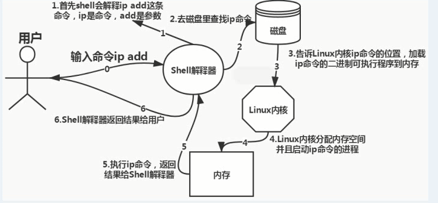

# 一、Shell 概念

​	shell 是一种解释器，也是一种脚本语言，每个 shell 脚本中包含一个或多个命令。多数系统默认使用的 shell 为 bash。

## 1.1 Shell 的作用

​	shell 是指为使用者提供使用界面的软件。接收来自用户的命令，然后调用相应的应用程序处理用户键入的命令。

​	同时 shell 也是一种程序设计语言，作为程序设计语言的 shell，使用交互或非交互的方式执行预先设定好的一连串指令。

​	简单来说，shell 是 Linux 内核与用户之间的接口，为用户提供使用操作系统的界面，如下图所示：


## 1.2 使用 Shell 的原因

​	shell 是用户登录后执行的第一个程序，用户是无法与计算机进行交流的，这就需要一个中间角色来负责将用户的输入命令传达给计算机，使得计算机能够完成各种指令的操作。

## 1.3 Shell 模式

​	shell 的模式可分为交互模式和非交互模式。交互模式下的 shell，通常在用户终端读取输入；非交互模式下的 shell，则可自动完成读取而不需要用户输入。

​	**1、交互模式**

​		处于交互模式下的 shell，会等待用户的输入，然后读取并执行用户所提交的命令。

```bash
#!/bin/bash
CAT(){
	cat /etc/passwd | head -$line
}
echo -n "Input the number of lines:"
read line
limit=6

if [ $limit -gt $line ]
then 
  while [ -n $line ]
  do
    CAT
    break 2
  done
  
  echo -n "Continue?(answer yes/no):"
  read answer
  if [ $answer = 'yes' ]
  then
    let line=line+1
    CAT
  fi
fi
exit 0
```

​	**2、非交互模式**

​	非交互模式下，shell 不与用户进行交互，二十读取并执行预先在文件中设定的命令。当命令执行完成后，shell 即终止并退出。

```bash
#!/bin/bash

CAT(){
    cat /etc/passwd | head -$line
}
limit=6
line=2
if [ $limit -gt $line ]
then
	while [ -n $line ]
	do 
	  CAT
	  break 2
	done
	
	echo
	let line=line+1
	CAT
fi
exit 0
```

# 二、Shell 工作原理

​	shell 是 Linux 系统提供给用户最为重要的命令解释程序，它以用户态方式在内核之外运行，其最基本的功能就是解释并执行用户输入的各种命令，实现用户与 Linux 系统内核之间的信息交流。

​	用户在 shell 提示符下输入命令后，shell 会将读取的命令翻译成内核能够识别的代码，之后将这些代码传送到内核中去执行，以此来控制计算机硬件进行工作。并在执行完成后将结果输送到标准输出上显示出来。



# 三、Shell 类型

## 3.1 常见的 Shell

​	目前，在多数 Linux 系统中默认都使用 bash（Bourne Again shell）。在用户登陆系统后，要使用的 shell 是由 `/etc/passwd` 中对应的记录字段来决定的。

```bash
[root@192 ~]# cat /etc/passwd | head -1
root:x:0:0:root:/root:/bin/bash
```

​	若要了解系统中都有那些 shell。可以通过查看 `/etc/shells` 来获取相关信息。

```bash
[root@192 ~]# cat /etc/shells 
/bin/sh
/bin/bash
/usr/bin/sh
/usr/bin/bash
```

​	目前除了 Bash，最长久的 shell 有三种：Bourne shell（sh）、C shell（csh）、Korn shell（ksh）

​	**1、Bourne shell 概述**

​	Bourne shell 是 UNIX 系统上最初使用的 shell，而且在不同版本的 UNIX 系统上都可以使用。Bourne shell 虽然在 shell 编程方面相当优秀，不过在与用户的交互方面不如其他几种 shell。bash 就是 bourne shell 的扩展，与 bourne shell 完全兼容。

​	bash 位于 /bin 目录中，他增加了许多 Bourne shell 不具备的功能，包括命令补全、命令编辑和命令历史表等。而事实上，bash 也具备了 C shell 和 korn shell 的许多优点，二他在拥有灵活和强大的编程接口外，同时也有很好的用户的界面。

​	**2、C shell 概述**

​	Linux C shell 是一种比 Bourne shell 更适合编程的 shell，C shell 的名称来源与其语法与 C 语言相似。

​	与 Bourne shell 相比，C shell 新增了不少特别的功能，包括命令行编辑、别名、命令行补全、拼写矫正、历史命令替换、作业控制等语法。

​	**3、Korn shell 概述**

​	Korn shell 是一个交互式的命令解释器和命令编程语言，他可以使用交互式的方式从终端或文件中执行命令。Korn shell 集合了 C shell 和 Bourne shell 的优点和其他的功能，而且与 Bourne shell 完全兼容。

## 3.2 Shell 切换

通过查看 `/etc/default/useradd` 文件，查看创建用户的默认 shell

```bash
cat /etc/default/useradd 
# useradd defaults file
GROUP=100
HOME=/home
INACTIVE=-1
EXPIRE=
SHELL=/bin/bash
SKEL=/etc/skel
CREATE_MAIL_SPOOL=yes
```

还可通过 env 查看环境变量，获取当前用户的 shell

```bash
[root@192 ~]# env | grep SHELL
SHELL=/bin/bash
```

切换其他 shell，直接输入 shell 名称即可，如切换 sh 环境

```bash
[root@192 ~]# sh
sh-4.2#
```

# 四、Shell 环境平台构造

## 4.1 命令编修能力

​	bash 能够记忆使用过的命令，只需要使用方向键上下查找即可，对于默认记忆指令的数量为 1000 个，被记录的指令均放在家目录下的 `.bash_history` 中

```bash
[root@192 ~]# cat ~/.bash_history 
od
env
env | grep SHELL
shell
csh
ksh
```

## 4.2 命令补全功能

​	bash 具有命令补全功能，使其在使用命令操作时非常方便，例如，若要执行某个长命令时，只需输入前几个字符，然后使用 Tab 键补全。如果前半部分有相同的命令，则按两次 Tab 键，会列出这些命令

```bash
[root@192 ~]# tail
tail   tailf
[root@192 ~]# vi
vi         view       vigr       vim        vimdiff    vimtutor   vipw       virt-what  visudo  
```

## 4.3 命令别名设置

​	bash 命令别名，其实就是将系统命令改成一个适合自己的名字，定义别名使用 `alias` 指令。

```bash
[root@192 ~]# alias rm='rm -i'
```

## 4.4 bash 升级

查看当前 bash 版本

```bash
[root@192 ~]# bash --version
GNU bash, version 4.2.46(2)-release (x86_64-redhat-linux-gnu)
Copyright (C) 2011 Free Software Foundation, Inc.
License GPLv3+: GNU GPL version 3 or later <http://gnu.org/licenses/gpl.html>

This is free software; you are free to change and redistribute it.
There is NO WARRANTY, to the extent permitted by law.
```

bash 软件包官网：http://ftp.gnu.org/gnu/bash/，下载软件包

```bash
[root@192 ~]# wget http://ftp.gnu.org/gnu/bash/bash-5.1.16.tar.gz
```

解压安装包

```bash
[root@192 ~]# tar -zxvf bash-5.1.16.tar.gz 
```

使用 gcc 工具执行编译安装

```bash
[root@192 ~]# cd bash-5.1.16/
[root@192 bash-5.1.16]# yum install -y gcc make
[root@192 bash-5.1.16]# ./configure
[root@192 bash-5.1.16]# make
[root@192 bash-5.1.16]# make install
```

查看升级后的 bash 版本

```bash
[root@192 bash-5.1.16]# bash --version
GNU bash, version 5.1.16(1)-release (x86_64-pc-linux-gnu)
Copyright (C) 2020 Free Software Foundation, Inc.
License GPLv3+: GNU GPL version 3 or later <http://gnu.org/licenses/gpl.html>

This is free software; you are free to change and redistribute it.
There is NO WARRANTY, to the extent permitted by law.
```

# 五、Shell 脚本包装

​	对脚本进行包装，可以保证脚本在传递参数时的完整性。对脚本进行包装后，可以使原先很复杂的脚本简单化。

## 5.1 用 awk 包装

​	通过管道输出到 awk 命令中的内容，会被保存为可执行文件，此可执行文件可以通过修改其调用的格式来实现重复调用，而不必在提示符下对此输入同样的命令。

```bash
#!/bin/bash

echo "decimal hex character"
for ((i=20;i<=36;i++))
  do
    echo $i | awk '{printf("%3d %2x %c\n",$1,$1,$1)}'
  done
exit 0
```

## 5.2 用 sed 包装

```bash
#!/bin/bash

sed -e '/^$/d' $1
exit 0
```

