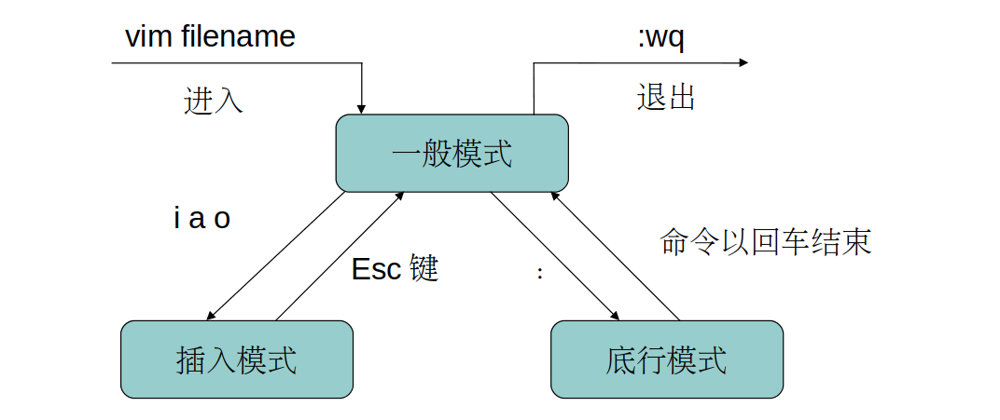

# 一、Linux 编辑器

## 1.1 使用编辑器的益处

​	在 Linux 操作系统中，虽然系统提供文本环境和图形环境两种不同的系统工作环境。但是对于系统管理员，文本环境下工作效率更高，节省大量系统资源。

## 1.2 主要的 Linux 编辑器

​	**1、NEdit 编辑器**

​	NEdit 编辑器的界面非常整洁，几乎是为专业程序员设计的。功能强大，但不适用于文本编辑。

​	**2、Gedit 编辑器**

​	Gedit 编辑器是 Linux GNOME 桌面上的文本编辑器，支持多种文件类型的彩色编码语句，也可以自定义特性和拼写检查。

​	**3、Emacs 编辑器**

​	Emacs 是一款可拓展、可定制、自定义文档化的实时显示编辑器。

​	**4、vi 编辑器**

​	在 Linux 操作系统中，vi 是一款在自负模式下运行的最为基本的文本编辑器。由于没有图形界面，使得它在处理文本时具有很高的效率。同时 vi 附有多个快捷操作命令。

# 二、vi 编辑器

## 2.1 vi 与 vim

​	在大多数 Linux 系统中，都有 vi 编辑器。在各种编辑器中 vi 用户最多，而且 vi 拥有升级版 vim，使得使用更为方便。

​	vim 是 vi 的改良版，在 vi 的基础上增加了很多新特性，如根据程序代码显示不同的颜色。

​	vi（vim）的使用方法非常简单，只需输入 vi 加上要编辑的文件名即可。如果文件不存在，则新建一个文件编辑。

## 2.2 工作模式

vi 的基本工作模式有三种：一般模式、插入（编辑）模式、底行模式

- 一般模式：vi 打开文件后的默认模式
- 插入模式：也叫编辑模式，可以对文本进行修改操作
- 底行模式：可以用于反馈编辑结果

​	**1、一般模式**

​	也叫命令行模式，在该模式下可以控制光标、字符和行的删除，以及对某段落的复制剪切等操作。在命令行模式下，可以通过各种命令来修改文件的内容，同时显示在屏幕上。

​	**2、插入模式**

​	也叫编辑模式，是用来编辑、存盘和退出文件内容的模式，在该模式下的任何操作都会保存并显示在屏幕上。

​	**3、底行模式**

​	也叫末尾模式，是指在屏幕底部的一行，用于反馈编辑操作结果，各种状态都会在此显示。是以 ":"和"/"命令为标志。

# 三、vi 操作命令

## 3.1 光标移动

当前处于一般模式：

| 命令     | 功能说明                   |
| -------- | -------------------------- |
| ctrl + f | 向后翻一页                 |
| ctrl + d | 向后翻半页                 |
| ctrl + b | 向前翻一页                 |
| ctrl + u | 向前翻半页                 |
| e        | 光标跳到下一个字符串的末尾 |
| G        | 光标移动到文本末尾         |
| gg       | 光标移动到文本的开始处     |
| h        | 光标向左移动一个字符       |
| l        | 光标向右移动一个字符       |
| k        | 光标想上移动一个字符       |
| j        | 光标向下移动一个字符       |
| H        | 光标移至文本的顶部         |
| L        | 光标移至文本的底部         |
| M        | 光标移至文本的中部         |
| $        | 光标移至所在行的末尾处     |
| ^        | 光标移至所在行的行首处     |

## 3.2 文本插入

当前处于一般模式：

| 命令        | 功能说明                 |
| ----------- | ------------------------ |
| A           | 在光标所在行尾插入       |
| a（append） | 在光标所在后插入         |
| I           | 在光标所在行首插入       |
| i（insert） | 在光标所在处插入         |
| O           | 在当前所在行上面一行插入 |
| o           | 在当前所在行下面一行插入 |

## 3.3 删除字符

当前处于一般模式：

| 命令 | 功能说明                           |
| ---- | ---------------------------------- |
| x    | 每按一次删除光标所在处的后一个字符 |
| nx   | 删除光标所在处的后 n 个字符        |
| X    | 每按一次删除光标所在处的前一个字符 |
| dd   | 删除光标所在行                     |
| ndd  | 从光标所在行往下删除 n 行          |

## 3.4 复制操作

当前处于一般模式：

| 命令 | 功能说明                                 |
| ---- | ---------------------------------------- |
| p    | 将缓冲区内的字符，粘贴到光标所在处的位置 |
| yw   | 将光标所在处的字符复制到缓冲区           |
| yy   | 将光标所在行复制到缓冲区                 |
| nyy  | 包含光标所在行的下 n 行，复制到缓冲区    |

## 3.5 保存退出

当前处于一般模式：

| 命令         | 功能说明                     |
| ------------ | ---------------------------- |
| :x           | 退出 vi 并保存               |
| :m           | 保存退出，忽略拥有者的只读权 |
| :q           | 不保存并退出                 |
| :q!          | 不保存并强制退出             |
| :w           | 将当前内容保存               |
| :w file_name | 将当前内容保存到指定文件中   |
| :wq          | 保存退出                     |
| :wq!         | 保存并强制退出               |

