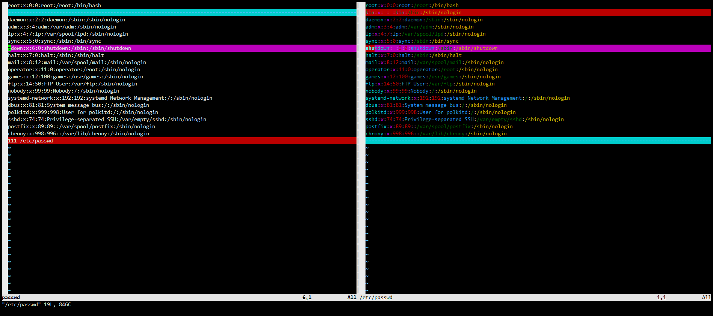

# 一、系统的文件类型

​	Linux 设计思想为 Linux 下一切皆文件。Linux 文件系统由四类基本文件组成，分别是普通文件、目录文件、链接文件、特殊文件。

## 1.1 普通文件

​	普通文件以 "-" 为标识，后接该文件的权限。格式如下

```bash
[root@192 ~]# ls -l test.sh 
-rw-r--r--. 1 root root 224 Jul 30 10:44 test.sh
```

​	普通文件包括文本文件、程序代码文件以及可执行文件等。系统中大部分文件都是普通文件。

## 1.2 目录文件

​	目录文件以 "d" 为标识，Linux 系统的最高目录为（/）目录。Linux 系统的众多目录和其子目录构成了一棵倒置的目录树，理论上子目录的创建是不受限制的，格式如下

```bash
[root@192 ~]# ls -l
drwxr-xr-x. 2 root root   6 Jul 30 11:57 a
drwxr-xr-x. 2 root root   6 Jul 30 11:57 dir
```

## 1.3 链接文件

​	链接文件可以分为软连接和硬连接。所谓链接文件，实际就是指向文件的指针，在读取软连接文件的时候，实际是读取指针所指向的源文件。

```bash
[root@192 ~]# ls -l /bin/sh
lrwxrwxrwx. 1 root root 4 Jul 29 23:10 /bin/sh -> bash
```

​	链接文件都是以 "l"，为标识的，-> 所指的即为源文件，箭头左边的就是链接文件。

## 1.4 特殊文件

​	特殊文件包括设备文件、套接字文件、以及命名管道文件。

- 块设备文件 "b"

```bash
[root@192 ~]# ls -l /dev/sda
brw-rw----. 1 root disk 8, 0 Jul 29 23:18 /dev/sda
```

- 字符设备文件 "c"

```bash
[root@192 ~]# ls -l /dev/tty
crw-rw-rw-. 1 root tty 5, 0 Jul 29 23:18 /dev/tty
```

- 套接字文件  "s"

```bash
[root@192 ~]# ll /var/run/systemd/journal/socket 
srw-rw-rw-. 1 root root 0 Jul 29 23:18 /var/run/systemd/journal/socket
```

- m命名管道文件 "p"

```bash
[root@192 ~]# ls -l /var/run/dmeventd-server 
prw-------. 1 root root 0 Jul 29 23:18 /var/run/dmeventd-server
```

# 二、文件存在性测试

## 2.1 内置式测试

​	对于文件系统中的文件，可以通过输出真假值来判断是否存在，也可以通过直接输出提示信息来判断文件是否存在。

​	判断文件是否存在，一般使用判断式进行判断，最常使用的判断式是单元判断式。

```bash
#!/bin/bash

if [ -f /etc/passwd ]
then
    echo "The file is exist"
else
	echo "No such file"
fi

exit 0
```

​	运行结果

```bash
[root@192 ~]# bash test.sh 
The file is exist
```

## 2.2 交互式测试

​	在实际工作中，可以写一个可复用的测试脚本，实现灵活的判断文件是否存在功能。

```bash
#!/bin/bash

echo -n "Input a name of file: "
read f_name

if [ -z $f_name ]
then
	echo "No input file name."
	exit
fi

if [ -f $f_name ]
then
	echo "$f_name is exist."
else
	echo "No such file"
fi

exit 0
```

​	运行结果

```bash
[root@192 ~]# bash test.sh 
Input a name of file: /etc/passwd
/etc/passwd is exist.
[root@192 ~]# bash test.sh 
Input a name of file: abc.txt
No such file
[root@192 ~]# bash test.sh 
Input a name of file: 
No input file name.
```

# 三、文件应用操作

​	文件属于系统非常重要的组成部分之一，它们有这不可忽略的作用，特别是对于一切设备均有文件构成的 Linux 系统。

## 3.1 创建文本文件

​	在 Linux 系统下的同一个目录中，不能存在名称相同的文件。创建文件可以使用 touch 命令创建一个空文件

```bash
[root@192 ~]# touch test
[root@192 ~]# ls -l test
-rw-r--r--. 1 root root 0 Jul 30 12:21 test
[root@192 ~]# touch test1 test2 test3 test4
[root@192 ~]# ls
test  test1  test2  test3  test4
```

## 3.2 文件备份

​	可以使用 cp 命令来复制文件，达到备份的目录。

```bash
[root@192 ~]# cp test test_bak
```

## 3.3 重命名与删除

​	文件重命名可以使用 mv 命令，mv 命令可以理解为移动文件到某个位置，并可以重名。

```bash
[root@192 ~]# mv test /root/test_mv
[root@192 ~]# ls test_mv 
test_mv
```

​	文件删除可以使用 rm 命令，使用 -f 可以自动确认删除，使用 -r 可以递归删除目录中的所有文件

```bash
[root@192 ~]# rm test1 
rm: remove regular empty file ‘test1’? y
[root@192 ~]# rm -f test2 
[root@192 ~]# rm -rf /root/*
```

## 3.4 完整性检查

​	在对文件内容完整性检查是，经常使用 MD5 工具。用法如下：

```bash
[root@192 ~]# md5sum /etc/passwd
4022cc06f1f2fa60d0eecb807417c1c4  /etc/passwd
```

​	使用 md5 对文件进行校验是，将为所检查的文件产生一个校验码，而且这些被校验的文件，内容产生变动，校验码就会跟着改变。

```bash
[root@192 ~]# echo 1 > test
[root@192 ~]# md5sum test 
b026324c6904b2a9cb4b88d6d61c81d1  test
[root@192 ~]# echo 2 >> test 
[root@192 ~]# md5sum test 
6ddb4095eb719e2a9f0a3f95677d24e0  test
[root@192 ~]# echo 1 > test 
[root@192 ~]# md5sum test 
b026324c6904b2a9cb4b88d6d61c81d1  test
```

# 四、编辑文本

## 4.1 查阅文本内容

​	文本文件的主要作用就是存储数据。存储于文本中的数据，包括用户信息，系统配置信息。对于查看文本中的信息，可以使用很多方式。

- cat 命令查看文本全部内容

```bash
[root@192 ~]# cat /etc/passwd
root:x:0:0:root:/root:/bin/bash
bin:x:1:1:bin:/bin:/sbin/nologin
daemon:x:2:2:daemon:/sbin:/sbin/nologin
adm:x:3:4:adm:/var/adm:/sbin/nologin
lp:x:4:7:lp:/var/spool/lpd:/sbin/nologin
sync:x:5:0:sync:/sbin:/bin/sync
shutdown:x:6:0:shutdown:/sbin:/sbin/shutdown
halt:x:7:0:halt:/sbin:/sbin/halt
mail:x:8:12:mail:/var/spool/mail:/sbin/nologin
operator:x:11:0:operator:/root:/sbin/nologin
games:x:12:100:games:/usr/games:/sbin/nologin
ftp:x:14:50:FTP User:/var/ftp:/sbin/nologin
nobody:x:99:99:Nobody:/:/sbin/nologin
systemd-network:x:192:192:systemd Network Management:/:/sbin/nologin
dbus:x:81:81:System message bus:/:/sbin/nologin
polkitd:x:999:998:User for polkitd:/:/sbin/nologin
sshd:x:74:74:Privilege-separated SSH:/var/empty/sshd:/sbin/nologin
postfix:x:89:89::/var/spool/postfix:/sbin/nologin
chrony:x:998:996::/var/lib/chrony:/sbin/nologin
```

​	执行 cat 后，会将文本的全部内容输出到屏幕上，如果文本内容太多的话，使用 cat 是个不明智的选择。这样我们就需要用其他命令来实现分页阅读。

- more、less 命令分页阅读

```bash
[root@192 ~]# more /var/log/messages 
Jul 29 23:18:46 192 kernel: gran_size: 64K #011chunk_size: 64K #011num_reg: 2  #011lose cover RAM: 0G
Jul 29 23:18:46 192 kernel: found SMP MP-table at [mem 0x000f6a70-0x000f6a7f] mapped at [ffffffffff200a70]
Jul 29 23:18:46 192 kernel: Using GB pages for direct mapping
Jul 29 23:18:46 192 kernel: RAMDISK: [mem 0x3569c000-0x36b45fff]
Jul 29 23:18:46 192 kernel: Early table checksum verification disabled
Jul 29 23:18:46 192 kernel: ACPI: RSDP 00000000000f6a00 00024 (v02 PTLTD )
Jul 29 23:18:46 192 kernel: ACPI: XSDT 000000003fee965b 0005C (v01 INTEL  440BX    06040000 VMW  01324272)
Jul 29 23:18:46 192 kernel: ACPI: FACP 000000003fefee73 000F4 (v04 INTEL  440BX    06040000 PTL  000F4240)
Jul 29 23:18:46 192 kernel: ACPI: DSDT 000000003feeaa08 1446B (v01 PTLTD  Custom   06040000 MSFT 03000001)
Jul 29 23:18:46 192 kernel: ACPI: FACS 000000003fefffc0 00040
Jul 29 23:18:46 192 kernel: ACPI: BOOT 000000003feea9e0 00028 (v01 PTLTD  $SBFTBL$ 06040000  LTP 00000001)
Jul 29 23:18:46 192 kernel: ACPI: APIC 000000003feea29e 00742 (v01 PTLTD  ? APIC   06040000  LTP 00000000)
--More--(2%)
```

```bash
[root@192 ~]# less /var/log/messages
Jul 29 23:18:46 192 kernel: gran_size: 64K #011chunk_size: 64K #011num_reg: 2  #011lose cover RAM: 0G
Jul 29 23:18:46 192 kernel: found SMP MP-table at [mem 0x000f6a70-0x000f6a7f] mapped at [ffffffffff200a70]
Jul 29 23:18:46 192 kernel: Using GB pages for direct mapping
Jul 29 23:18:46 192 kernel: RAMDISK: [mem 0x3569c000-0x36b45fff]
Jul 29 23:18:46 192 kernel: Early table checksum verification disabled
Jul 29 23:18:46 192 kernel: ACPI: RSDP 00000000000f6a00 00024 (v02 PTLTD )
Jul 29 23:18:46 192 kernel: ACPI: XSDT 000000003fee965b 0005C (v01 INTEL  440BX    06040000 VMW  01324272)
Jul 29 23:18:46 192 kernel: ACPI: FACP 000000003fefee73 000F4 (v04 INTEL  440BX    06040000 PTL  000F4240)
Jul 29 23:18:46 192 kernel: ACPI: DSDT 000000003feeaa08 1446B (v01 PTLTD  Custom   06040000 MSFT 03000001)
Jul 29 23:18:46 192 kernel: ACPI: FACS 000000003fefffc0 00040
Jul 29 23:18:46 192 kernel: ACPI: BOOT 000000003feea9e0 00028 (v01 PTLTD  $SBFTBL$ 06040000  LTP 00000001)
Jul 29 23:18:46 192 kernel: ACPI: APIC 000000003feea29e 00742 (v01 PTLTD  ? APIC   06040000  LTP 00000000)
```

- head 、tail 查看文件的首尾十行

```bash
[root@192 ~]# head /etc/passwd
root:x:0:0:root:/root:/bin/bash
bin:x:1:1:bin:/bin:/sbin/nologin
daemon:x:2:2:daemon:/sbin:/sbin/nologin
adm:x:3:4:adm:/var/adm:/sbin/nologin
lp:x:4:7:lp:/var/spool/lpd:/sbin/nologin
sync:x:5:0:sync:/sbin:/bin/sync
shutdown:x:6:0:shutdown:/sbin:/sbin/shutdown
halt:x:7:0:halt:/sbin:/sbin/halt
mail:x:8:12:mail:/var/spool/mail:/sbin/nologin
operator:x:11:0:operator:/root:/sbin/nologin
[root@192 ~]# tail /etc/passwd
operator:x:11:0:operator:/root:/sbin/nologin
games:x:12:100:games:/usr/games:/sbin/nologin
ftp:x:14:50:FTP User:/var/ftp:/sbin/nologin
nobody:x:99:99:Nobody:/:/sbin/nologin
systemd-network:x:192:192:systemd Network Management:/:/sbin/nologin
dbus:x:81:81:System message bus:/:/sbin/nologin
polkitd:x:999:998:User for polkitd:/:/sbin/nologin
sshd:x:74:74:Privilege-separated SSH:/var/empty/sshd:/sbin/nologin
postfix:x:89:89::/var/spool/postfix:/sbin/nologin
chrony:x:998:996::/var/lib/chrony:/sbin/nologin
```

## 4.2 文本内容比较

 	要比较两个文本内容可以使用 diff 和 cmp 命令。如果两个文件相同，状态码则返回 0，否则就返回 1。

​	另外 vim 自带一个简单好用的文本比较工具，可以可视化的看到那一行文本有区别

```bash
[root@192 ~]# vimdiff passwd /etc/passwd
```



## 4.3 文本内容重定向

​	默认情况下系统有三个文件一直处于打开状态，stdin（键盘）、stdout（屏幕）、stderr（错误消息），与其他文本文件一样，他们的内容也可以重定向。

```bash
[root@192 ~]# ls -l /dev/std*
lrwxrwxrwx. 1 root root 15 Jul 29 23:18 /dev/stderr -> /proc/self/fd/2
lrwxrwxrwx. 1 root root 15 Jul 29 23:18 /dev/stdin -> /proc/self/fd/0
lrwxrwxrwx. 1 root root 15 Jul 29 23:18 /dev/stdout -> /proc/self/fd/1
```

​	简单来说，重定向就是捕捉一个文本文件、命令、程序或脚本，将这些输出作为输入发送到另一个文件中。这些打开的文本文件，分别被分配一个文件描述符，系统默认使用的文件描述符有 0（stdin 标准输入），1（stdout 标准输出），2（stderr 错误消息）。

​	对于文件的重定向，我们可以使用重定向操作符 >（覆盖重定向）、 >> （追加重定向）来完成。

```bash
[root@192 ~]# date > date.txt
[root@192 ~]# cat date.txt 
Sat Jul 30 12:59:01 EDT 2022
[root@192 ~]# date >> date.txt 
[root@192 ~]# cat date.txt 
Sat Jul 30 12:59:01 EDT 2022
Sat Jul 30 12:59:13 EDT 2022
[root@192 ~]# date >> date.txt 
[root@192 ~]# cat date.txt 
Sat Jul 30 12:59:01 EDT 2022
Sat Jul 30 12:59:13 EDT 2022
Sat Jul 30 12:59:19 EDT 2022
[root@192 ~]# date > date.txt
[root@192 ~]# cat date.txt 
Sat Jul 30 12:59:25 EDT 2022
```

​	重定向的操作还有另一种方式，就是使用 exec 命令。使用 exec 命令进行重定向操作时， 会将 stdin 重新定向到文本中，而 stdin 中的内容都来自使用 exec 命令指定的文本而不是标准输入。

```bash
#!/bin/bash

LOGFILE=logfile
# 将 fd#6 与 stdout 相连
exec 6>&1
# 用 logfile 代替 stdout 输出
exec > $LOGFILE

echo -n "logfile:"
date
echo
echo "Output of \"ls -al\" command.";echo
ls -al
echo
echo "Output of \"df -h\" command.";echo
df -h
# 恢复 stdout，之后关闭文件描述符 #6
exec 1>&6 6>&-
echo
echo "======stdout restored to default======"
ls -al
echo
```

​	运行结果

```bash
[root@192 ~]# bash test.sh 

======stdout restored to default======
total 20
dr-xr-x---.  2 root root  82 Jul 30 13:08 .
dr-xr-xr-x. 17 root root 224 Jul 29 23:14 ..
-rw-r--r--.  1 root root  29 Jul 30 12:59 date.txt
-rw-r--r--.  1 root root 886 Jul 30 13:09 logfile
-rw-r--r--.  1 root root 826 Jul 30 12:50 passwd
-rw-r--r--.  1 root root 265 Jul 30 13:08 test.sh
-rw-------.  1 root root 973 Jul 30 13:08 .viminfo

[root@192 ~]# cat logfile 
logfile:Sat Jul 30 13:09:30 EDT 2022

Output of "ls -al" command.

total 20
dr-xr-x---.  2 root root  82 Jul 30 13:08 .
dr-xr-xr-x. 17 root root 224 Jul 29 23:14 ..
-rw-r--r--.  1 root root  29 Jul 30 12:59 date.txt
-rw-r--r--.  1 root root  67 Jul 30 13:09 logfile
-rw-r--r--.  1 root root 826 Jul 30 12:50 passwd
-rw-r--r--.  1 root root 265 Jul 30 13:08 test.sh
-rw-------.  1 root root 973 Jul 30 13:08 .viminfo

Output of "df -h" command.

Filesystem               Size  Used Avail Use% Mounted on
devtmpfs                 475M     0  475M   0% /dev
tmpfs                    487M     0  487M   0% /dev/shm
tmpfs                    487M  7.7M  479M   2% /run
tmpfs                    487M     0  487M   0% /sys/fs/cgroup
/dev/mapper/centos-root   17G  1.7G   16G  10% /
/dev/sda1               1014M  138M  877M  14% /boot
tmpfs                     98M     0   98M   0% /run/user/0
```

# 五、特殊用途文件

## 5.1 /dev 目录

​	/dev 目录下文件主要是一些硬件和非硬件的物理设备。我们系统挂载的磁盘就是以文件形式存放在 /dev 目录中

```bash
[root@192 ~]# ls /dev/sda
/dev/sda
```

​	在Linux 系统中，还有一些设备被称为 loopback devices（回环设备），这种设备使得普通文件也能具备像块设备一样来进行存取的机制。回环设备存放于 /dev 目录下。

​	在 /dev 目录下，还有一些用于特殊用途的伪设备，这些设备都是虚拟存在而非真实存在的物理设备。如 /dev/null、/dev/zero、/dev/tcpdiag 等。

### 5.1.1 /dev/null 

​	/dev/null 文件相当于一个只写文件，凡事写到该文件下的数据信息都会永远丢失，而且也很难从它读取任何信息，所以通常将 /dev/null 文件成为"黑洞文件"。我们可以将所有不需要的信息、日志丢进黑洞文件，节省空间。

​	通过黑洞文件的特性，可以禁止内容输出到 stdout 上，或是进制 stderr 的输出。例如使用重定向符，将 stdout、stderr 导入到 /dev/null 中，就可以禁止显示信息。

```bash
[root@192 ~]#  echo "hello linux"
hello linux
[root@192 ~]#  echo "hello linux" > /dev/null
```

### 5.1.2 /dev/zero

​	我们可以通过 /dev/zero 文件创建一个指定长度且用于初始化的空文本。例如生成一个 10 G 大小的空文件。

```bash
[root@192 ~]# dd if=/dev/zero of=/root/file_10GB bs=10M count=1024
1024+0 records in
1024+0 records out
10737418240 bytes (11 GB) copied, 16.2237 s, 662 MB/s
[root@192 ~]# du -sh file_10GB 
10G	file_10GB
```

## 5.2 /proc 目录

​	实际上，/proc 是一个伪文件系统，在该目录下存放的是当前系统运行和内核进程以及他们相关信息和统计的文本文件。各种数字目录名称都是一个个的 pid 进程信息。

- 查看系统的分区信息

```bash
[root@192 ~]# cat /proc/partitions 
major minor  #blocks  name

   8        0   20971520 sda
   8        1    1048576 sda1
   8        2   19921920 sda2
  11        0    1048575 sr0
 253        0   17821696 dm-0
 253        1    2097152 dm-1
```

- 查看各种设备信息

```bash
[root@192 ~]# cat /proc/devices 
Character devices:
  1 mem
  4 /dev/vc/0
  4 tty
  4 ttyS
  5 /dev/tty
  5 /dev/console
  5 /dev/ptmx
  7 vcs
 10 misc
 13 input
 14 sound
Block devices:
259 blkext
  8 sd
  9 md
 11 sr
 65 sd
 66 sd
 67 sd
 68 sd
 69 sd
 70 sd
 71 sd
128 sd
129 sd
130 sd
131 sd
```

- 查看 CPU 相关信息

```bash
[root@192 ~]# cat /proc/cpuinfo 
processor	: 0
vendor_id	: GenuineIntel
cpu family	: 6
model		: 142
model name	: Intel(R) Core(TM) i7-8550U CPU @ 1.80GHz
stepping	: 10
microcode	: 0xb4
cpu MHz		: 1991.998
cache size	: 8192 KB
physical id	: 0
siblings	: 1
core id		: 0
cpu cores	: 1
apicid		: 0
initial apicid	: 0
fpu		: yes
fpu_exception	: yes
cpuid level	: 22
wp		: yes
flags		: fpu vme de pse tsc msr pae mce cx8 apic sep mtrr pge mca cmov pat pse36 clflush mmx fxsr sse sse2 ss syscall nx pdpe1gb rdtscp lm constant_tsc arch_perfmon nopl xtopology tsc_reliable nonstop_tsc eagerfpu pni pclmulqdq ssse3 fma cx16 pcid sse4_1 sse4_2 x2apic movbe popcnt tsc_deadline_timer aes xsave avx f16c rdrand hypervisor lahf_lm abm 3dnowprefetch invpcid_single ssbd ibrs ibpb stibp fsgsbase tsc_adjust bmi1 avx2 smep bmi2 invpcid rdseed adx smap clflushopt xsaveopt xsavec xgetbv1 arat md_clear spec_ctrl intel_stibp flush_l1d arch_capabilities
bogomips	: 3983.99
clflush size	: 64
cache_alignment	: 64
address sizes	: 45 bits physical, 48 bits virtual
power management:
```

