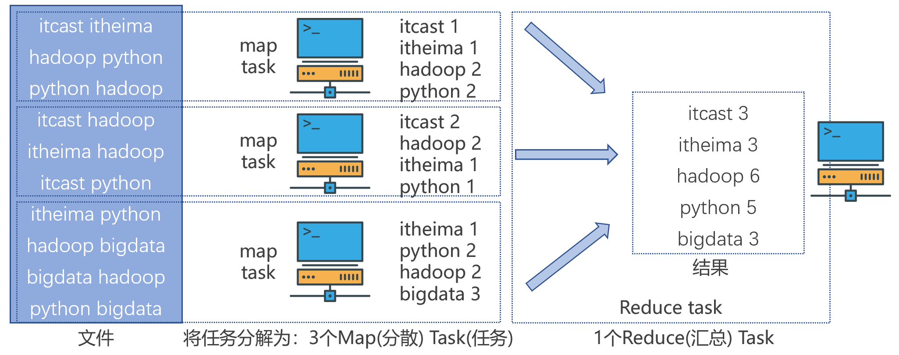

# 一、MapReduce 概述

## 1.1 分布式计算模式

- 分散->汇总模式

  1. 将数据分片，多台服务器各自负责一部分数据处理

  2. 然后将各自的结果，进行汇总处理

  3. 最终得到想要的计算结果

- 中心调度->步骤执行模式
  1. 由一个节点作为中心调度管理者
  2. 将任务划分为几个具体步骤
  3. 管理者安排每个机器执行任务
  4. 最终得到结果数据

MapReduce 是"分散->汇总"模式的分布式计算框架，可供开发人员开发相关程序进行分布式数据计算。

- Map 功能接口提供了"分散"的功能， 由服务器分布式对数据进行处理。

- Reduce功能接口提供了"汇总（聚合）"的功能，将分布式的处理结果汇总统计。

## 1.2 MapReduce 执行原理

假定有4台服务器用以执行 MapReduce 任务，可以3台服务器执行 Map，1台服务器执行 Reduce。

*注：MapReduce 尽管可以通过 Java、Python 等语言进行程序开发，但当下年代基本没人会写它的代码了，因为太过时了。  尽管MapReduce 很老了，但现在仍旧活跃在一线，主要是 Apache Hive 框架非常火，而 Hive 底层就是使用的 MapReduce。*

# 二、YARN 概述

## 2.1 资源规划与调度

对于资源的利用，有规划、有管理的调度资源使用，是效率最高的方式。服务器会运行多个程序， 每个程序对资源（CPU、内存等）的使用都不同，程序没有节省的概念，有多少就会用多少，所以，为了提高资源利用率，进行调度就非常有必要了。

对于服务器集群亦可使用这种思路，调度整个服务器集群的资源统一管理。调度整个集群的资源这就是 Hadoop YARN 框架的作用。

YARN 管控整个集群的资源进行调度， 那么应用程序在运行时，就是在 YARN 的监管（管理）下去运行的。

## 2.2 MapReduce 与 YARN 配合

## 2.3 YARN 架构

YARN 与 HDFS 一样，也是主从架构，有 2 个核心角色与 2 个辅助角色：

- 主（Master）角色：ResourceManager，整个集群的资源调度者， 负责协调调度各个程序所需的资源。

- 从（Slave） 角色：NodeManager，单个服务器的资源调度者，负责调度单个服务器上的资源提供给应用程序使用。

当收到 ResourceManager 下发的资源请求任务后，各节点上的 NodeManager 在服务器上构建一个容器，会预先占用这一部分资源，然后将这一部分资源提供给程序使用，程序运行在容器内，无法突破容器的资源限制。

- 代理服务器（ProxyServer）：Web Application Proxy Web 应用程序代理。
  - 代理服务器，即Web应用代理是 YARN 的一部分。默认情况下，它将作为资源管理器(RM)的一部分运行，但是可以配置为在独立模式下运行。使用代理的原因是为了减少通过 YARN 进行基于网络的攻击的可能性。
  - 这是因为， YARN在运行时会提供一个WEB UI站点（同HDFS的WEB UI站点一样）可供用户在浏览器内查看YARN的运行信息。
  - 开启代理服务器，可以提高YARN在开放网络中的安全性。
- 历史服务器（JobHistoryServer）： 应用程序历史信息记录服务。
  - 提供WEB UI站点，供用户在浏览器上查看程序日志
  - 可以保留历史数据，随时查看历史运行程序信息

