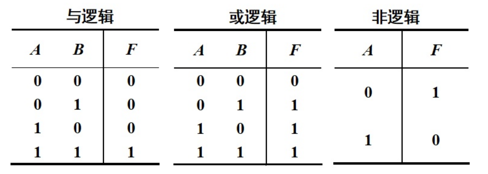

# 一、注释

- `//` ：单行注释
-  `/* xxxx */`：编译器忽略该区间，其间都被认为是注释内容。

```go
// 这是包注释
package main

import "fmt"

/*
 x int
 y int
 returns: int
 函数说明
*/
func add(x, y int) int {
	return x + y
}

// 函数注释也可以这样多行
// 写在上面
func main() {
	fmt.Println(add(4, 5)) // 打印
	// TODO 之后完成某某功能
}
```

其他注释：

```go
// TODO: 将来完成，推荐
// NOTE: 请注意
// Deprecated: 告知已经过期，建议不要使用。未来某个版本可能移除
```

# 二、行

Go 语言把**行分隔符**作为一条语句的结尾。也就是说，一般情况下，一行结束，敲回车即可。

如果你打算将多个语句写在同一行，它们则必须使用`;`人为区分，但在实际开发中我们并不鼓励这种做法。

# 三、命名规范

- 标识符采用 CamelCase 驼峰命名法

  -  如果仅在包内可用，就采用小驼峰命名

  - 如果要在包外可见，就采用大驼峰命名

- 简单循环变量可以使用i、j、k、v等
- 条件变量、循环变量可以是单个字母或单个单词，Go 倾向于使用单个字母。Go 建议使用更短小的单词
- 常量驼峰命名即可
- 函数/方法的参数、返回值应是单个单词或单个字母
- 函数可以是多个单词命名
- 类型可以是多个单词命名
- 方法由于调用时会绑定类型，所以可以考虑使用单个单词
- 包以小写单个单词命名，包名应该和导入路径的最后一段路径保持一致
- 接口优先采用单个单词命名，一般加 er 后缀。Go 语言推荐尽量定义小接口，接口也可以组合

# 四、关键字

关键字：在开发过程中绝对不可使用的单词，是go语言预留给自己的。

关键字清单：https://golang.google.cn/ref/spec#Keywords

```go
break        default      func         interface    select
case         defer        go           map          struct
chan         else         goto         package      switch
const        fallthrough  if           range        type
continue     for          import       return       var
```

# 五、预定义标识符

预定义标识符：go语言中表示类型、函数等标识的单词，可以被开发者使用，但是一般防止混淆，也不会使用。

预定义标识符清单：https://golang.google.cn/ref/spec#Predeclared_identifiers

```go
Types:
	any bool byte comparable
	complex64 complex128 error float32 float64
	int int8 int16 int32 int64 rune string
	uint uint8 uint16 uint32 uint64 uintptr

Constants:
	true false iota

Zero value:
	nil

Functions:
	append cap clear close complex copy delete imag len
	make max min new panic print println real recover
```

# 六、标识符

- 一个名字，本质上是个字符串，用来指代一个值。
- 可以是大小写字母、数字、下划线，也可以是 Unicode 字符。
- 不能以数字开头。
- 不能是 Go 语言的关键字。
- 尽量不要使用”预定义标识符”，否则后果难料。
- 大小写敏感。

标识符建议：

- 支持中文，但是非必要不使用。
- 非必要不要使用拼音。
- 尽量遵守上面的命名规范，或形成一套行之有效的命名规则。

## 6.1 字面常量

字面常量是值，不是标识符，但本身就是常量，不能被修改。

Go 语言中，boolean、rune、integer、float、complex、string 类型的**值**都是**字面常量**。其中，rune、 integer、float、complex 常量被称为**数值常量**。

```go
// 数值  int、float64、complex128
100	
0x6162 0x61_62_63
3.14
3.14e2
3.14E-2

// 字符 rune
'测'
'\u6d4b'
'\x31'
'1'
'\n'

// 字符串 string
"abc" "\x61b\x63"
"测试" "\u6d4b试"
"\n"

# 布尔值 bool
true
false

# 预定义标识符
iota
```

以上字面常量在 Go 中也被称为**无类型常量** untyped constant。

无类型常量的缺省类型为 bool、rune、 int、float64、complex128 或字符串。

## 6.2 常量

常量：使用 const 定义一个标识符，与它所对应的值，**不允许**被修改。

```go
// 赋值等式右边用 “无类型常量 untyped constant” 来赋值
const a int = 100 // 指定类型定义常量并赋值
const (           // 定义常量，等式左边未给出类型，将进行类型推导
    b = "abc"
    c = 12.3
    d = 'T'
)
```

<font color='red'>注意：Go语言的常量定义，必须是能在编译期就要完全确定其值，所以，值只能使用**字面常量**。</font>

## 6.3 iota

Go 语言提供了一个预定义标识符 iota[aɪˈoʊ.t̬ə]。

一般在给常量批量初始化值时使用，不可用于变量。

```go
// 单独写 iota 每次从 0 开始
const a = iota // iota = 0
const b = iota // iota = 0
```

```go
// 批量写每次加 1
const (
	SUN = iota // 0,iota = 0
	MON = iota // 1,iota = 1
	TUE = iota // 2,iota = 2
)
// 简化写法
const (
	SUN = iota // 0
	MON        // 1
	TUE        // 2
)
```

```go
// 批量写 iota 从 0 开始，即使第一行没有写 iota，iota 也从第一行开始从 0 开始增加
const (
	x = 10   //    iota = 0
	a = iota // 1, iota = 1
	b = iota // 2, iota = 2
	c = iota // 3, iota = 3
	d = 10   // 10,iota = 4
	_        //    iota = 5
	e = iota // 6, iota = 6
	f        // 7, iota = 7
)
```

```go
// 批量写 iota 从 0 开始，智能重复上一行公式
const (
	a = 2 * iota // 0  = 2 * 0
	b            // 2  = 2 * 1
	c            // 4  = 2 * 2
	d            // 6  = 2 * 3
	_            //
	e = iota     // 5  = 5
	f            // 6  = 6
)
```

```go
const (
	a = 0        // 0
	b            // 0
	c = 2 * iota // 4, iota = 2
	d            // 6, iota = 3
	e            // 8, iota = 4
	f            // 10,iota = 5
)
```

`_` 下划线为匿名（空白）标识符，无法使用。类似Linux中的黑洞，可以往里面塞东西，无法读取。

由此可见，一旦在**成批定义**时用到了 iota，它就相当于**行索引**。

## 6.4 变量

Go 语言变量名由字母、数字、下划线组成，其中首个字符不能为数字。

定义变量可分为两步：声明（var 关键字）、赋值（= 赋值）

```go
// var 变量声明，如果没有初始化，则变量默认为零值。
// 格式：var 标识符 类型
var a int    // 单个声明
var b, c int // 多个声明
var (        // 批量声明
	d int
	e string
	f float32
)

func main() {
	a = 100       // 单个赋值
	b, c = 50, 60 // 多个赋值
}
```

也可以声明的时候一并赋值

```go
var a int = 100       // 单个声明并赋值
var b, c int = 40, 50 // 多个声明并赋值
var (                 // 批量声明并赋值
	d int     = 10
	e string  = "hello"
	f float32 = 1.33
)
```

如果不给类型，go 语言可以进行字面常量推导，赋予变量类型

```go
var a = 100				// int
var b, c = 40, 50       // int,int
var (
	d = 10				// int
	e = "hello"			// string
	f = 1.33			// float64
)
```

go 语言有自己的`:=`短格式声明赋值方法，可以声明变量的同时直接赋值，不过只能在函数中赋值，不能用来定义全局变量

```go
var j = 2
var k = 4

func main() {
	a := 1       // int
	b := "abc"   // string
	c := 3.3     // float64
	d, e := 4, 6 // int,int
	j, k := k, j  // j = 4,k = 2
}
```

## 6.5 零值

变量已经被声明，但是未被显式初始化，这是变量将会被设置为零值。

- int 为 0
- float 为 0.0
- bool 为 false
- string 为 空串 " "
- 指针类型为 nil

```go
func main() {
	var a int     // 0
	var b string  // " "
	var c float32 // 0.000000
	var d bool    // false
	var e *int    // <nil>
	fmt.Printf("%d %s %f %v %v \n", a, b, c, d, e)
}
```

## 6.6 变量可见性

### 6.6.1 包级标识符

在 Go 语言中，在 .go 文件中的顶层代码中，定义的标识符称为包级标识符。如果首字母大写，包内可见，包外也可见。如果首字母小写，则包内可见。

- 顶层代码中定义包级标识符
  - 首字母大写作为包导出标识符，首字母小写作为包内可见标识符
  - const 定义包级常量，必须在声明时初始化
  - var 定义包级变量
    - 可以指定类型，也可以使用无类型常量定义
    - 延迟赋值必须指定类型，不然没法确定零值
- 有相关关系的，可以批量定义在一起
- 一般声明时，还是考虑“就近原则”，尽量靠近第一次使用的地方声明
- 不能使用短格式定义

### 6.6.2 局部标识符

定义在函数中，包括 main 函数，这些标识符就是局部标识符。

- 在函数中定义的标识符
- const 定义局部常量
- var 定义局部变量
  - 可以指定类型，也可以使用无类型常量定义
  - 延迟赋值必须指定类型，不然没法确定零值
- 有相关关系的，可以批量定义在一起
- 在函数内，直接赋值的变量多采用短格式定义

# 七、操作符

## 7.1 逻辑运算真值表

把与想象成乘法运算，或想象成加法运算。



```go
package main

import "fmt"

func main() {
	var a bool = true
	var b bool = false
	fmt.Println(a && b)
	fmt.Println(a || b)
	fmt.Println(!b)
}
```

运算结果

```go
false
true
true
```

## 7.2 算数运算符

`+`、`-`、`*`、`/`、`%`、`++`、`--` 

- 5 / 2、-5 / 2 
- +、- 还可以当做正负用，就不是算数运算符了，例如 -s 。

- 类C语言语法没有Python `//` 的除法符号，因为它是注释

- ++、-- 只能是 i++、i--，且是语句，不是表达式。也就是说，语句不能放到等式、函数参数等地方。
- Go语言没有 ++i、--i。

## 7.3 位运算符

`&`与、`|`位或、`^`异或、`&^`位清空、<<、>>

```go
fmt.Println(2&1, 2&^1, 3&1, 3&^1)       // 0 2 1 2
fmt.Println(2|1, 3^3, 1<<3, 16>>3, 2^1) // 3 0 8 2 3
```

`x&y`，位与本质就是按照y有1的位把x对应位的值保留下来。

`x&^y`，位清空本质就是先把y按位取反后的值，再和x位与，也就是y有1的位的值不能保留，被清空，原来是0的位被保留。换句话说，就是按照y有1的位清空x对应位。

## 7.4 比较运算符

`==`、`!=`、`>`、`<`、`>=`、`<=`

较运算符组成的表达式，返回bool类型值。成立返回true，不成立返回false。

## 7.5 逻辑运算符

`&&` 与、`||` 或、`!` 非

由于Go语言对类型的要求，逻辑运算符操作的**只能**是bool类型数据，那么结果也只能是bool型。

## 7.6 赋值运算符

`=`、`+=`、`-=`、`*=`、`/=`、`%=`、`>>=`、`<<=`、`&=`、`&^=`、`^=`、`|=`

`:=` 短格式赋值。

```go
package main

import "fmt"

func main() {
	a := 100
	b := 100
	a += 100 + 200 // a = a + (100+200)
	b -= 100 + 200 // b = b - (100+200)
	fmt.Println(a, b)
}
```

运算结果

```go
400 -200
```

## 7.7 三元运算符

Go语言中没有三元运算符。

## 7.8 指针操作

数据是放在内存中，内存是线性编址的。任何数据在内存中都可以通过一个地址来找到它。

- `&变量` 表示取变量地址，是一个大整数
- `*指针变量` 表示通过指针取值

```go
package main

import "fmt"

func main() {
	a := 100
	b := &a // 将a变量的指针地址赋给b

	fmt.Printf("%T %+[1]v\n", a)
	fmt.Printf("%T %+[1]v\n", &a)
	fmt.Printf("%T %+[1]v\n", b)
	fmt.Printf("%T %+[1]v\n", *b) // 使用*b取出这个指针地址对应的数据
}
```

运算结果

```go
int 100
*int 0xc000096068
*int 0xc000096068
int 100
```


## 7.9 优先级

- 表中优先级由高到低

```go
Precedence    Operator
    5             *  /  %  <<  >>  &  &^
    4             +  -  |  ^
    3             ==  !=  <  <=  >  >=
    2             &&
    1             ||
```

- 单目 > 双目
- 算数 > 移位 > 比较 > 逻辑 > 赋值

- 具有相同优先级的二元运算符从左到右关联

