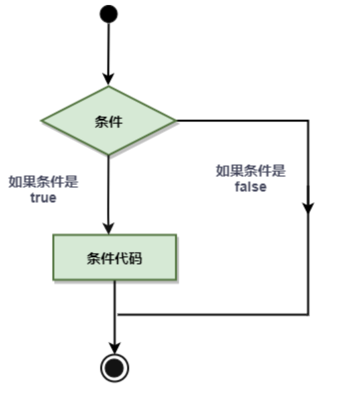
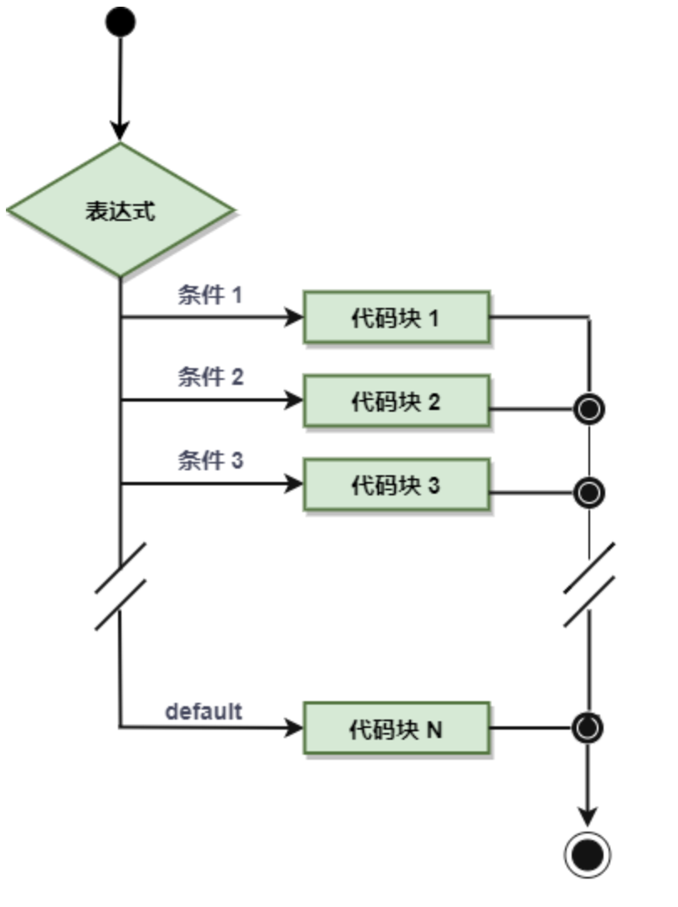
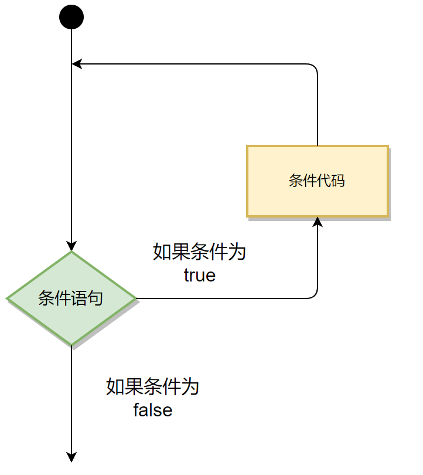
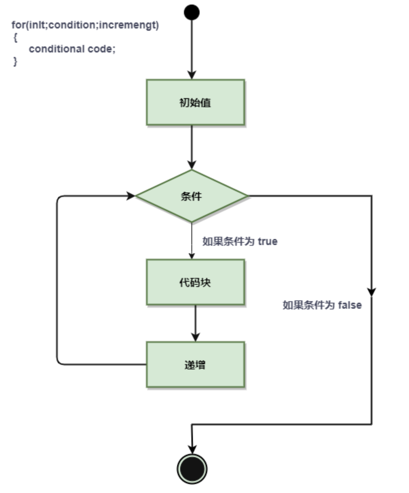
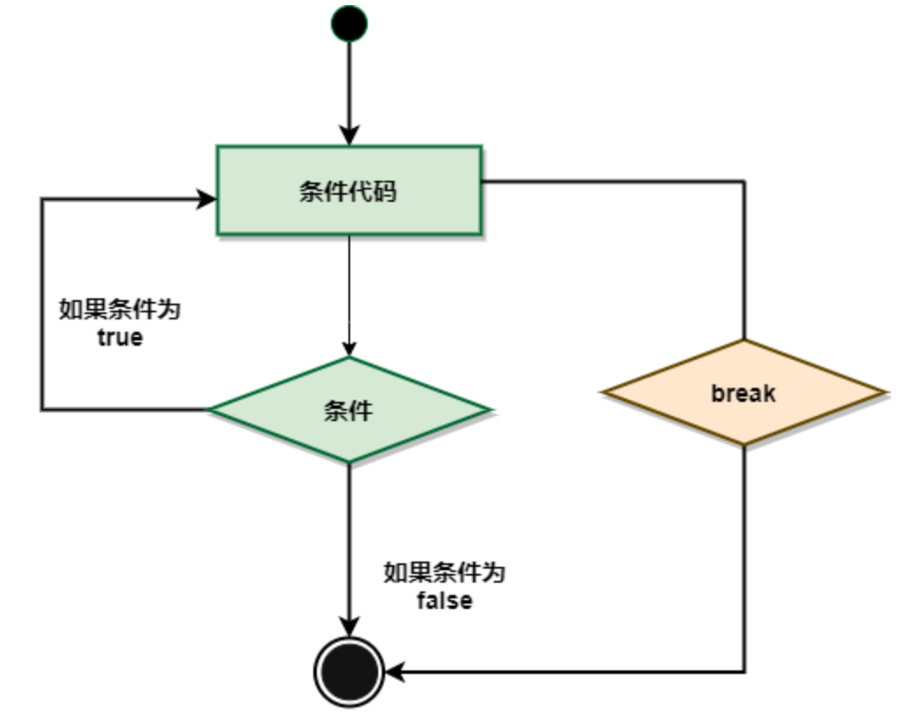
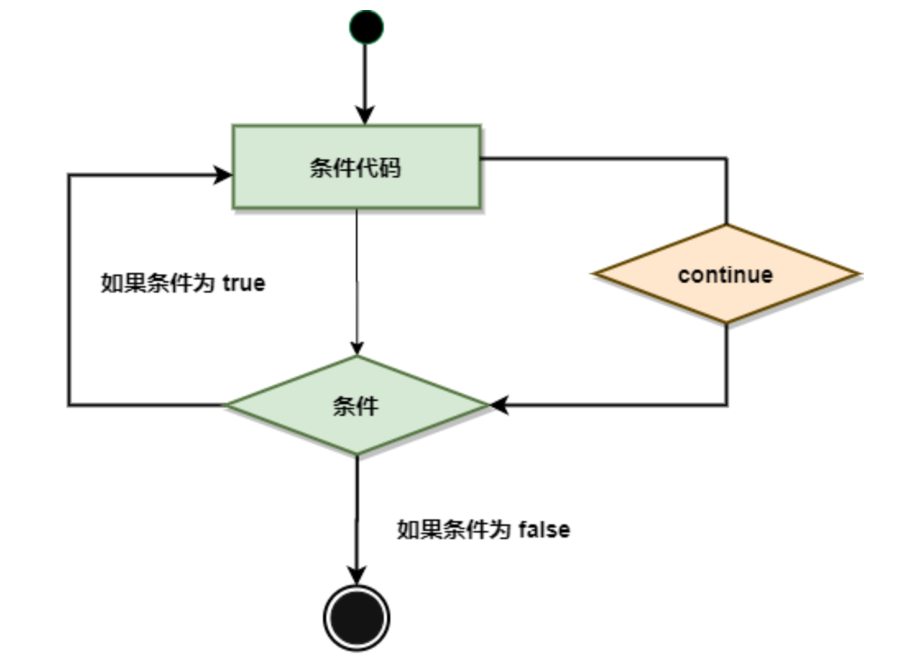
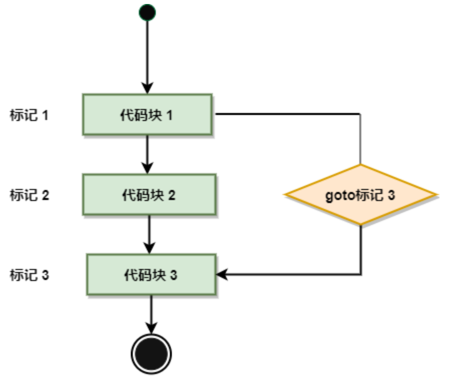

# 一、条件分支语句

条件语句需要开发者通过指定一个或多个条件，并通过测试条件是否为 true 来决定是否执行指定语句，并在条件为 false 的情况在执行另外的语句。

## 1.1 if 单分支语句



基础语法
```go
if condition {
   // 在布尔表达式为 true 时执行代码块
}
```
- condition 必须是一个 bool 类型，在 Go 中，不能使用其他类型等效为布尔值。 if 1 { } 是错误的
- 只有当 condition 表达式为 true 时，才能执行代码块
- 注意：Go语言中，花括号一定要跟着if、for、func等行的最后，否则语法出错。

## 1.2 if 嵌套语句

```go
if condition 1 {
   // 在布尔表达式 1 为 true 时执行
   if condition 2 {
      // 在布尔表达式 2 为 true 时执行
   }
}
```

## 1.3 if...else 语句

if 语句后可以使用可选的 else 语句, else 语句中的表达式在布尔表达式为 false 时执行。

```go
if condition 1 {
   // 在布尔表达式 1 为 true 时执行
} else if condition 2{
  // 在布尔表达式 2 为 true 时执行
} else {
  // 之前条件都不满足，则执行
}
```

Go 的 if 还有一个强大的地方就是条件判断语句里面允许声明一个变量，这个变量的**作用域只能在该条件逻辑块内**，其他地方就不起作用了，如下所示:

```go
if num := 9; num < 0 {
    fmt.Println(num, "is negative")
} else if num < 10 {
    fmt.Println(num, "has 1 digit")
} else {
    fmt.Println(num, "has multiple digits")
}
```
- 多分支结构，从上向下依次判断分支条件，只要一个分支条件成立，其后语句块将被执行，那么其他条件都不会被执行
- 前一个分支条件被测试过，下一个条件相当于隐含着这个条件
- 一定要考虑一下 else 分支是有必要写，以防逻辑漏洞

## 1.4 switch 语句



```go
// 基本格式
switch expression {
    case condition1:
        ...
    case condition2:
        ...
    default:
        ...
}

// 例子
//swtich 赋值语句;表达式 {}
func main() {
	switch a, b := 10, 20; a + b {
	case 10:
		fmt.Println("值是 10")
	case 20:
		fmt.Println("值是 20")
	case 30:
		fmt.Println("值是 30")
	}
}

// 范围判断
func main() {
    // a的作用域在switch内部
	switch a := 100; /*默认带true*/ {
	case a == 0:
		fmt.Println("zero")
	case a > 0:
		fmt.Println("positive")
	case a < 0:
		fmt.Println("negative")
	}
}
```

switch 语句还可以被用于 type-switch 来判断某个 interface 变量中实际存储的变量类型。

Type Switch 语法格式如下：

```go
switch x.(type){
    case type:
       statement(s);      
    case type:
       statement(s); 
    // 你可以定义任意个数的case
    default: // 可选
       statement(s);
}
```

### fallthrough

使用 fallthrough 会强制执行后面的 case 语句，fallthrough 不会判断下一条 case 的表达式结果是否为 true。

```go
package main

import "fmt"

func main() {

    switch {
    case false:
            fmt.Println("1、case 条件语句为 false")
            fallthrough
    case true:
            fmt.Println("2、case 条件语句为 true")
            fallthrough
    case false:
            fmt.Println("3、case 条件语句为 false")
            fallthrough
    case true:
            fmt.Println("4、case 条件语句为 true")
    case false:
            fmt.Println("5、case 条件语句为 false")
            fallthrough
    default:
            fmt.Println("6、默认 case")
    }
}
```

从以上代码输出的结果可以看出：switch 从第一个判断表达式为 true 的 case 开始执行，如果 case 带有 fallthrough，程序会继续执行下一条 case，且它不会去判断下一个 case 的表达式是否为 true。

# 二、循环语句

## 2.1 for 循环语句

for 循环是一个循环控制结构，可以执行指定次数的循环。



Go 语言的 For 循环有 3 种形式，只有其中的一种使用分号。

- C  for 风格的形式

```go
for init; condition; post { 
	// 执行的语句
}

for [初始操作];[循环条件];[循环后操作] {
    循环体
}

- init：初始操作，一般为赋值表达式，给控制变量赋初值；第一次进入循环前执行，语句只能执行一次，之后不再执行
- condition：循环条件，关系表达式或逻辑表达式，循环控制条件；要求返回布尔值，每次进入循环体前进行判断。如果每次条件满足返回true，就进入循环执行一次循环体；否则，循环结束；
- post：循环后操作，一般为赋值表达式，给控制变量增量或减量。每次循环体执行完，在执行下一趟循环条件判断之前，执行该操作一次

// 循环打印十次 i 的值
for i := 0; i < 10; i++ {  // 初始操作中的短格式定义的i的作用域只能在for中
    fmt.Println(i)
}
```

- C  while 风格的形式

```go
for condition {
	// 执行的语句
}
```

- C for( ; ; ) 风格的形式

```go
for { 
	// 执行的语句
}
```

for语句执行过程如下：

- 1、先对表达式 1 赋初值；
- 2、判别赋值表达式 init 是否满足给定条件，若其值为真，满足循环条件，则执行循环体内语句，然后执行 post，进入第二次循环，再判别 condition；否则判断 condition 的值为假，不满足条件，就终止for循环，执行循环体外语句。



## 2.2 for 嵌套循环语句

以下为 Go 语言嵌套循环的格式：

```go
for [condition |  ( init; condition; increment ) | Range]
{
   for [condition |  ( init; condition; increment ) | Range]
   {
      statement(s);
   }
   statement(s);
}
```

## 2.3 for range 语句

for range 循环是高级封装 for 循环，对字符串更加友好，帮我们遍历出每一个字符， 类型都是 rune

```go
for i, v := range "abcd测试" {
    fmt.Printf("%d, %[2]T, %[2]d, %[2]c, %#[2]x\n", i, v)
}	

运行结果：
0, int32, 97, a, 0x61
1, int32, 98, b, 0x62
2, int32, 99, c, 0x63
3, int32, 100, d, 0x64
4, int32, 27979, 测, 0x6d4b
7, int32, 35797, 试, 0x8bd5
```

## 2.4 break 语句

在 Go 语言中，break 语句用于终止当前循环或者 switch 语句的执行，并跳出该循环或者 switch 语句的代码块。

break 语句可以用于以下几个方面：。

- 用于循环语句中跳出循环，并开始执行循环之后的语句。
- break 在 switch 语句中在执行一条 case 后跳出语句的作用。
- break 可应用在 select 语句中。
- 在多重循环中，可以用标号 label 标出想 break 的循环。
- 除了 break，函数的return结束函数执行，当然也能把函数中的循环打断。



```go
for i := 0; i < 10; i++ {
    fmt.Println(i)
    for j := 0; j < 5; j++ {
        fmt.Println(j)
        if j == 3 {
            break  // j = 3，则跳出当前循环体，只能跳出当前的循环体
        }
    }
}
```


## 2.5 continue 语句

Go 语言的 continue 语句 有点像 break 语句。但是 continue 不是跳出循环，而是跳过当前循环执行下一次循环语句。

```go
for i := 0; i < 10; i++ {
    if i%2 == 0 {
        continue
    }
    fmt.Println(i)
}
```




## 2.6 goto 语句

Go 语言的 goto 语句可以无条件地转移到过程中指定的行。goto需要配合标签label使用，label就像代码中的锚点，goto将无条件跳到那里开始向后执行代码。

```go
func main() {
	for i := 0; i < 10; i++ {
		if i == 7 {
			goto RES // goto 到 RES 标签的语句
		}
		fmt.Println(i)
	}
	// 给语句打标签，可以是任意名词
RES:
	fmt.Println("幸运数字是7")
}
```




## 2.7 无限循环

如果循环中条件语句永远不为 false 则会进行无限循环，我们可以通过 for 循环语句中只设置一个条件表达式来执行无限循环：

```go
package main

import "fmt"

func main() {
    for true  {
        fmt.Printf("这是无限循环。\n");
    }
}
```

