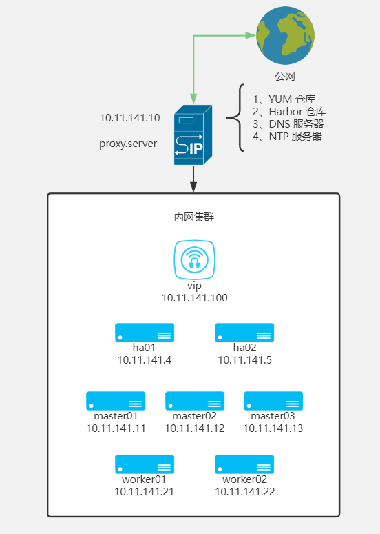

# 集群架构

如图：



环境说明：

- 服务器系统均采用 CentOS 7.9 2009 版本。
- 由于内网环境无法上外网，所以需要在外部搭建一个代理服务器用于提供 YUM 仓库、容器镜像仓库等。
- kubernetes 集群采用 keepalived + haproxy + vip 搭建 3 master + 2 worker 的高可用集群。
- 由于需要内网域名解析，所以在 proxy.server 安装 dnsmasq 服务进行内网域名解析。

# 机器配置

| Hostname     | IP            | CPU     | MEM  | DISK      |
| ------------ | ------------- | ------- | ---- | --------- |
| proxy.server | 10.11.141.10  | 4C      | 8GB  | 40G，200G |
| vip          | 10.11.141.100 | 虚拟 IP |      |           |
| ha01         | 10.11.141.4   | 2C      | 4GB  | 40G       |
| ha02         | 10.11.141.5   | 2C      | 4GB  | 40G       |
| master01     | 10.11.141.11  | 4C      | 8GB  | 40G       |
| master02     | 10.11.141.12  | 4C      | 8GB  | 40G       |
| master03     | 10.11.141.13  | 4C      | 8GB  | 40G       |
| worker01     | 10.11.141.21  | 8C      | 16GB | 40G       |
| worker02     | 10.11.141.22  | 8C      | 16GB | 40G       |

配置说明：

- proxy.server  由于需要存储镜像和数据，除了系统盘外需要再挂一张数据盘
- ha 节点只运行 haproxy、keepalived 用于高可用的代理
- master 节点满足 kubernetes 最小配置要求即可，不运行工作负载
- worker 节点为实际运行 pod 的节点，需要多分配些内存

# 机器挂盘

查看当前可用的硬盘

```shell
[root@localhost ~]# lsblk 
NAME            MAJ:MIN RM  SIZE RO TYPE MOUNTPOINT
sda               8:0    0   40G  0 disk 
├─sda1            8:1    0    1G  0 part /boot
└─sda2            8:2    0   39G  0 part 
  ├─centos-root 253:0    0   35G  0 lvm  /
  └─centos-swap 253:1    0    4G  0 lvm  [SWAP]
sdb               8:16   0  200G  0 disk 
sr0              11:0    1  4.4G  0 rom  
```

不用分区，直接格式化 sdb 盘

```shell
mkfs.ext4 /dev/sdb
```

挂载到 /data/ 目录

```shell
mkdir /data
mount /dev/sdb /data
```

查看 sdb 盘的 uuid

```shell
[root@localhost ~]# blkid 
/dev/sda1: UUID="b58b1c6d-841c-453a-acdc-f67b1d654fbc" TYPE="xfs" 
/dev/sda2: UUID="mbinJ2-8iIK-aPs7-XBHk-iCCV-Sdm8-bxdRfq" TYPE="LVM2_member" 
/dev/sr0: UUID="2020-11-04-11-36-43-00" LABEL="CentOS 7 x86_64" TYPE="iso9660" PTTYPE="dos" 
/dev/mapper/centos-root: UUID="9c00df64-5864-49c2-9874-9ece2bb8c35b" TYPE="xfs" 
/dev/mapper/centos-swap: UUID="a583aa25-2afe-4818-84ed-14811e83f1f8" TYPE="swap" 
/dev/sdb: UUID="25e170b1-02b4-4bf4-925d-0763d40ded33" TYPE="ext4" 
```

添加到 fstab 文件，实现开机挂盘操作

```shell
echo 'UUID="25e170b1-02b4-4bf4-925d-0763d40ded33" /data ext4 defaults 0 0' >> /etc/fstab
```

查看分区情况

```shell
[root@localhost ~]# mount -a
[root@localhost ~]# df -Th
文件系统                类型      容量  已用  可用 已用% 挂载点
devtmpfs                devtmpfs  3.9G     0  3.9G    0% /dev
tmpfs                   tmpfs     3.9G     0  3.9G    0% /dev/shm
tmpfs                   tmpfs     3.9G  8.8M  3.9G    1% /run
tmpfs                   tmpfs     3.9G     0  3.9G    0% /sys/fs/cgroup
/dev/mapper/centos-root xfs        35G  1.3G   34G    4% /
/dev/sda1               xfs      1014M  151M  864M   15% /boot
tmpfs                   tmpfs     783M     0  783M    0% /run/user/0
/dev/sdb                ext4      197G   61M  187G    1% /data
```

