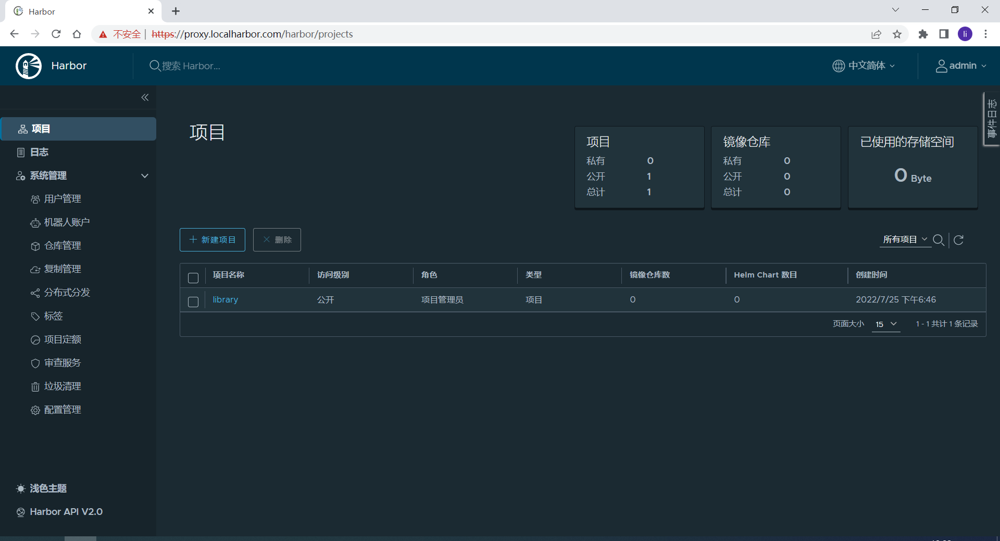

# 一、软件信息

| 软件名称       | 版本   | 下载地址                                                     |
| -------------- | ------ | ------------------------------------------------------------ |
| docker         | v20.10 | http://mirrors.aliyun.com/docker-ce/linux/centos/7.9/x86_64/stable/ |
| docker-compose | v2.6.1 | https://github.com/docker/compose/releases/download/v2.6.1/docker-compose-linux-x86_64 |
| harbor         | v2.5.3 | https://github.com/goharbor/harbor/releases/download/v2.5.3/harbor-offline-installer-v2.5.3.tgz |
| openssl        | v1.0.2 | CentOS 7.9 系统自带                                          |

# 二、主机初始化

## 2.1 主机名设置

```bash
hostnamectl set-hostname xxxx
```

## 2.2 配置 DNS 服务器

在网卡的配置文件 `/etc/sysconfig/network-scripts/ifcfg-ens33` 中修改或添加一个 DNS 服务器地址即可：

```shell
DNS1=10.11.141.10
```

重启网卡

```shell
systemctl restart network
```

## 2.3 关闭防火墙、Selinux

```bash
systemctl stop firewalld.service && systemctl disable firewalld.service
```

```bash
setenforce 0 && sed -i 's/enforcing/disabled/g' /etc/selinux/config
```

## 2.4 配置 YUM 源

```bash
mv /etc/yum.repos.d/* /tmp/
```

```bash
cat > /etc/yum.repos.d/local.repo << EOF
[base]
name=CentOS-Base
baseurl=http://10.11.141.10/base/Packages/
enabled=1
gpgcheck=0
 
[epel]
name=CentOS-Epel
baseurl=http://10.11.141.10/epel/Packages/
enabled=1
gpgcheck=0
 
[extras]
name=CentOS-Extras
baseurl=http://10.11.141.10/extras/Packages/
enabled=1
gpgcheck=0

[updates]
name=CentOS-Updates
baseurl=http://10.11.141.10/updates/Packages/
enabled=1
gpgcheck=0
EOF
```

```bash
yum clean all && yum makecache
```

## 2.5 配置时间同步

根据当前主机角色选择配置

- 服务端配置

```bash
cat > /etc/chrony.conf << EOF
server cn.ntp.org.cn iburst
driftfile /var/lib/chrony/drift
makestep 1.0 3
rtcsync
allow 0.0.0.0/0
logdir /var/log/chrony
EOF
```

- 客户端配置

```bash
cat > /etc/chrony.conf << EOF
server 10.11.141.10 iburst
driftfile /var/lib/chrony/drift
makestep 1.0 3
rtcsync
logdir /var/log/chrony
EOF
```

```bash
systemctl restart chronyd && systemctl enable chronyd && systemctl status chronyd
```

验证是否连接到自建 NTP 服务器

```bash
chronyc sourcestats -v
```

# 三、软件安装

## 3.1 安装 docker

- 配置 YUM 源

```bash
cat > /etc/yum.repos.d/docker.repo << EOF
[other]
name=other
baseurl=http://proxy.server/other/
enabled=1
gpgcheck=0
EOF
```

```yum
yum clean all && yum makecache
```

- 查看可安装版本

```bash
$ yum list | grep docker-ce
docker-ce.x86_64                         3:20.10.17-3.el7              other    
docker-ce-cli.x86_64                     1:20.10.17-3.el7              other    
docker-ce-rootless-extras.x86_64         20.10.17-3.el7                other 
```

安装 `20.10` 版本

```bash
yum install -y docker-ce-20.10.17-3.el7
```

- 启动

```bash
systemctl enable --now docker.service
```

- 查看版本

```bash
$ docker version
Client: Docker Engine - Community
 Version:           20.10.17
 API version:       1.41
 Go version:        go1.17.11
 Git commit:        100c701
 Built:             Mon Jun  6 23:05:12 2022
 OS/Arch:           linux/amd64
 Context:           default
 Experimental:      true

Server: Docker Engine - Community
 Engine:
  Version:          20.10.17
  API version:      1.41 (minimum version 1.12)
  Go version:       go1.17.11
  Git commit:       a89b842
  Built:            Mon Jun  6 23:03:33 2022
  OS/Arch:          linux/amd64
  Experimental:     false
 containerd:
  Version:          1.6.6
  GitCommit:        10c12954828e7c7c9b6e0ea9b0c02b01407d3ae1
 runc:
  Version:          1.1.2
  GitCommit:        v1.1.2-0-ga916309
 docker-init:
  Version:          0.19.0
  GitCommit:        de40ad0
```

## 3.2 安装 docker-compose

将下载的二进制文件放入 `/usr/local/bin/`

```bash
mv docker-compose-linux-x86_64 /usr/local/bin/docker-compose
```

```bash
chmod +x /usr/local/bin/docker-compose
```

查看版本

```bash
$ docker-compose version
Docker Compose version v2.6.1
```

## 3.3 安装 harbor

将下载的安装包解压到 `/opt` 目录

```bash
tar -zxvf harbor-offline-installer-v2.5.3.tgz -C /opt/
```

# 四、配置 HTTPS

- 公网生产环境可以购买服务商提供的 SSL 证书

- 内网环境可以用工具生成自签 SSL 证书

## 4.1 配置域名解析

```shell
# 确保 harbor 域名已经解析到该服务器，没有的话需要在 dnsmasq 添加对应域名解析
ping proxy.localharbor.com
```

创建存放证书目录

```bash
mkdir /opt/ca/
cd /opt/ca/
```

## 4.2 生成证书颁发机构证书

生成 CA 证书私钥

```shell
openssl genrsa -out ca.key 4096
```

生成 CA crt 证书，修改 `CN` 为自己的域名

```shell
openssl req -x509 -new -nodes -sha512 -days 3650 \
 -subj "/C=CN/ST=Beijing/L=Beijing/O=example/OU=Personal/CN=proxy.localharbor.com" \
 -key ca.key \
 -out ca.crt
```

## 4.3 生成服务端证书

生成 CA 证书私钥

```bash
openssl genrsa -out proxy.localharbor.com.key 4096
```

生成证书签名请求（CSR），修改 `CN` 为自己的域名

```shell
openssl req -sha512 -new \
    -subj "/C=CN/ST=Beijing/L=Beijing/O=example/OU=Personal/CN=proxy.localharbor.com" \
    -key proxy.localharbor.com.key \
    -out proxy.localharbor.com.csr
```

生成 x509 v3 扩展文件，`DNS.1` 写解析的域名，`DNS.2` 写当前主机名

```shell
cat > v3.ext << EOF
authorityKeyIdentifier=keyid,issuer
basicConstraints=CA:FALSE
keyUsage = digitalSignature, nonRepudiation, keyEncipherment, dataEncipherment
extendedKeyUsage = serverAuth
subjectAltName = @alt_names

[alt_names]
DNS.1=proxy.localharbor.com
DNS.2=proxy.server
EOF
```

```shell
openssl x509 -req -sha512 -days 3650 \
    -extfile v3.ext \
    -CA ca.crt -CAkey ca.key -CAcreateserial \
    -in proxy.localharbor.com.csr \
    -out proxy.localharbor.com.crt
```

## 4.4 提供证书给 Harbor 和 Docker

- Docker

将 crt 转换成 cert，供 docker 使用

```bash
openssl x509 -inform PEM -in proxy.localharbor.com.crt -out proxy.localharbor.com.cert
```

将证书放入 docker 证书目录

```bash
mkdir -p  /etc/docker/certs.d/proxy.localharbor.com
cp ca.crt /etc/docker/certs.d/proxy.localharbor.com/
cp proxy.localharbor.com.cert /etc/docker/certs.d/proxy.localharbor.com/
cp proxy.localharbor.com.key /etc/docker/certs.d/proxy.localharbor.com/
```

重启 docker

```bash
systemctl restart docker
```

- Harbor

修改配置文件

```bash
cd /opt/harbor/
cp harbor.yml.tmpl harbor.yml
vim harbor.yml
```

修改内容如下，其他默认即可

```yaml
# 解析到该主机的域名
hostname: proxy.localharbor.com

# http 访问端口，如果默认 80 被其他程序占用，则需要修改，如果没有则忽略
http:
  port: 8080

# 配置 https 证书
https:
  port: 443
  certificate: /opt/ca/proxy.localharbor.com.crt
  private_key: /opt/ca/proxy.localharbor.com.key

# 默认的数据卷位置，改到大一点的数据盘中
data_volume: /data/harbor
```

# 五、启动 harbor

使用脚本直接安装启动 harbor 服务

```bash
# 默认安装，无额外需求选择默认
./install.sh

# 附带其他功能安装
./install.sh --with-notary
./install.sh --with-trivy
./install.sh --with-chartmuseum
```

查看是否全部启动

```bash
$ docker-compose ps
NAME                COMMAND                  SERVICE             STATUS              PORTS
harbor-core         "/harbor/entrypoint.…"   core                running (healthy)   
harbor-db           "/docker-entrypoint.…"   postgresql          running (healthy)   
harbor-jobservice   "/harbor/entrypoint.…"   jobservice          running (healthy)   
harbor-log          "/bin/sh -c /usr/loc…"   log                 running (healthy)   127.0.0.1:1514->10514/tcp
harbor-portal       "nginx -g 'daemon of…"   portal              running (healthy)   
nginx               "nginx -g 'daemon of…"   proxy               running (healthy)   0.0.0.0:8080->8080/tcp, :::8080->8080/tcp, 0.0.0.0:443->8443/tcp, :::443->8443/tcp
redis               "redis-server /etc/r…"   redis               running (healthy)   
registry            "/home/harbor/entryp…"   registry            running (healthy)   
registryctl         "/home/harbor/start.…"   registryctl         running (healthy)
```

## 5.1 浏览器登陆

可以通过域名 `https://proxy.localharbor.com/` 登陆 harbor，默认账号：`admin/Harbor12345`。（windows 需提前配置域名解析）



## 5.2 docker 登陆

```bash
$ docker login https://proxy.localharbor.com
Username: admin
Password: 
WARNING! Your password will be stored unencrypted in /root/.docker/config.json.
Configure a credential helper to remove this warning. See
https://docs.docker.com/engine/reference/commandline/login/#credentials-store

Login Succeeded
```

## 5.3 conrainerd 配置

```toml
      [plugins."io.containerd.grpc.v1.cri".registry.auths]
        [plugins."io.containerd.grpc.v1.cri".registry.configs."proxy.localharbor.com".auth]
          username = "admin"
          password = "Harbor12345"
          
      [plugins."io.containerd.grpc.v1.cri".registry.configs]
        [plugins."io.containerd.grpc.v1.cri".registry.configs."proxy.localharbor.com".tls]
          insecure_skip_verify = true

      [plugins."io.containerd.grpc.v1.cri".registry.mirrors]
        [plugins."io.containerd.grpc.v1.cri".registry.mirrors."proxy.localharbor.com"]
         endpoint = ["https://proxy.localharbor.com"]

    [plugins."io.containerd.grpc.v1.cri".x509_key_pair_streaming]
      tls_cert_file = "/etc/containerd/cert/proxy.localharbor.com.cert"
      tls_key_file = "/etc/containerd/cert/proxy.localharbor.com.key"
```


## 5.4 管理 Harbor 服务

- 停止 Harbor

```bash
docker-compose stop
```

- 重启 Harbor

```bash
docker-compose start
```

- 重新配置

```bash
docker-compose down -v
vim harbor.yml
prepare --with-notary --with-trivy --with-chartmuseum
docker-compose up -d
```

- 卸载 harbor

```bash
docker-compose down -v
rm -r /data/harbor
```

# 六、利用阿里云镜像服务同步海外镜像

日常使用中经常会遇到一些海外镜像仓库 `k8s.gcr.io` ，国内无法访问下载，导致软件无法正常安装使用。一些常用的镜像国内有开源镜像库可以使用，但是遇到一些新版本、自定义镜像，很难找到国内开源镜像库，这时候就需要自建一个仓库来同步海外镜像。

以下使用阿里云 `容器镜像服务` 同步海外镜像流程图：


## 6.1 dockerfile 创建

构建镜像需要 dockerfile，我们将 dockerfile 放在 github 上托管，内容只需一个 from 指令即可，将需要构建的海外镜像写入（我这里构建 ingress）

```dockerfile
from registry.k8s.io/ingress-nginx/controller:v1.2.1@sha256:5516d103a9c2ecc4f026efbd4b40662ce22dc1f824fb129ed121460aaa5c47f8
```

```dockerfile
from registry.k8s.io/ingress-nginx/kube-webhook-certgen:v1.1.1@sha256:64d8c73dca984af206adf9d6d7e46aa550362b1d7a01f3a0a91b20cc67868660
```

dockerfile 文件路径，路径可以自己规划的，只要后面构建时能找到即可


## 6.2 容器镜像服务配置

1. 创建命名空间


2. 创建镜像仓库

   第一步：这里一个仓库名称就是一个镜像名

   

   第二步：连接自己的 github 仓库，勾选使用海外机器构建、不使用缓存


3. 构建→添加规则→确定

   构建上下文路径一直写到 Dockerfile 所在目录

   

4. 立即构建


## 6.3 harbor 同步配置

1. 新建目标仓库，系统管理 → 仓库管理 → 新建目标

- 提供者：Alibaba ACR
- 目标名：自定义一个标识
- 目标 URL：下拉选择镜像仓库所在区
- 访问 ID：阿里云 RAM 的 AccessKey ID
- 访问密码：阿里云 RAM 的 AccessKey Secret
- 验证远程证书：如果是自签或者非信任的证书不要勾选


2. 新建复制规则，系统管理 → 复制管理 → 新建规则

- 名称：自定义一个名称即可
- 复制模式：Pull-based 就是将阿里云上的镜像拉到 Harbor，Push则相反
- 源仓库：下拉选择刚才新建的目标
- 资源过滤器：全量同步的规则可以为空
- 目标：指定目标名称空间，不填则放到和源端相同的名称空间下
- 触发模式：定时，Cron 表达式根据需求编写
- 带宽：-1 表示不限制
- 覆盖：相同名称则覆盖


3. 手动复制


# 七、镜像迁移

安装 image-syncer 

```shell
wget https://github.com/AliyunContainerService/image-syncer/releases/download/v1.3.1/image-syncer-v1.3.1-linux-amd64.tar.gz
tar -zxvf image-syncer-v1.3.1-linux-amd64.tar.gz
mv image-syncer /usr/local/bin/
```

`auth.json` 包含了所有镜像仓库的认证信息

```json
{
    "harbor.test.digitalchina.com": {    
        "username": "harboradmin",               
        "password": "P@ssw0rd",
        "insecure": true                 
    },
    "proxy.localharbor.com": {
		"username": "admin",
        "password": "Harbor12345",
        "insecure": true  
    }
}
```

`images.json` 镜像同步清单

```json
{
    "harbor.test.digitalchina.com/test2/nfs-client-provisioner": "proxy.localharbor.com/repo/nfs-client-provisioner",
    "harbor.test.digitalchina.com/test2/anhx/nginx": "proxy.localharbor.com/repo/nginx"
}
```

同步命令

```shell
# --proc       并发数，进行镜像同步的并发goroutine数量，默认为5
# --retries    失败同步任务的重试次数，默认为 2，重试会在所有任务都被执行一遍之后开始，并且也会重新尝试对应次数生成失败任务的生成。一些偶尔出现的网络错误比如io timeout、TLS handshake timeout，都可以通过设置重试次数来减少失败的任务数量
# 

image-syncer --auth=./auth.json --images=./images.json --retries=3 --proc=6
```
