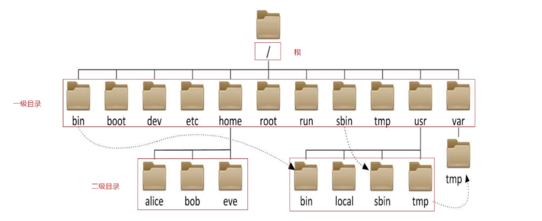

# 一、 Linux 系统使用注意

## 1.1 严格区分大小写

Linux 和 Windows 不同， Linux 严格区分大小写的，包括文件名和目录名、命令、命令选项、配置文件设置选项等。

例如，Win7 系统桌面上有文件夹叫做 Test，当我们在桌面上再新建一个名为 test 的文件夹时，系统会提示文件夹命名冲突：

-  Windows 演示：


-  Linux 演示：


由以上图解可知： Linux 是一个非常严谨的操作系统，严格区分大小写。

## 1.2 文件扩展名

> 在 Linux 操作系统中，与 Windows 不同，其文件的类型不是通过扩展名来进行区分的！

我们都知道， Windows 是依赖扩展名区分文件类型的，比如，".txt" 是文本文件、". exe " 是执行文件，但 Linux 不是。

Linux 系统通过**权限位标识**来确定文件类型，常见的文件类型有普通文件、目录、链接文件、块设备文件、字符设备文件等几种。 Linux 的可执行文件就是普通文件被赋予了可执行权限。


Linux 中的一些特殊文件还是要求写 "扩展名" 的，但 Linux 不依赖扩展名来识别文件类型，写这些扩展名是为了帮助运维人员来区分不同的文件类型。这样的文件扩展名主要有以下几种：

- 压缩包：Linux 下常见的压缩文件名有 \*.gz、\*.bz2、\*.zip、\*.tar.gz、\*.tar.bz2、\*.tgz 等。
- 二进制软件包：CentOS 中所使用的二进制安装包是 RPM 包，所有的 RPM 包都用".rpm"扩展名结尾，目的同样是让管理员一目了然。=> 类似 Windows 中的 exe 文件
- 程序文件：Shell 脚本一般用 ".sh" 扩展名结尾。=> check_network.sh
- 网页文件：网页文件一般使用 ".php" 等结尾，不过这是网页服务器的要求，而不是 Linux 的要求。例如：.html/.css/.js/.jsp/.php/.py =>网页文件

> Linux 操作系统不以"扩展名"来判断文件的类型，而是通过权限位标识符来进行判断。
>
> 有一些特殊的文件，有扩展名称=>压缩包、二进制软件包、程序文件、网页文件。

## 1.3 一切皆文件

在 Linux 系统中，一切皆文件！

在 Windows 是文件的，在 Linux 下也是文件。在 Windows 中不是文件的，在 Linux 系统中也是文件。

普通文件：通过 ls 命令查看时，如果显示<font color="red">黑色</font>，代表其是一个普通的文件。

文件夹：通过 ls 命令查看时，如果显示<font color="red">天蓝色</font>，代表是一个文件夹。

## 1.4 设备须挂载后才可用


 Windows ：分区+格式化

 Linux 操作系统：分区+格式化+挂载，存储设备必须挂载后才能使用（硬盘、光盘、U盘）

```bash
mount /dev/sda1 /mnt/file
```

# 二、Linux 系统的目录结构

## 2.1 Linux 与 Windows 分区

 Linux 系统不同于 Windows ，没有 C 盘、D 盘、E 盘那么多的盘符，只有一个**根目录（/）**，所有的文件（资源）都存储在以**根目录（/）**为树根的**树形**目录结构中。

 Windows ：


 Linux ：


## 2.2 Linux 系统文件架构



在 Linux 根目录（/）下包含很多的子目录，称为一级目录。例如 bin、boot、dev 等。

同时，各一级目录下还含有很多子目录，称为二级目录。例如 /bin/bash、/bin/ed 等。

## 2.3 Linux 系统的文件目录

| 目录   | 用途                                                         |
| ------ | ------------------------------------------------------------ |
| /bin   | 系统命令目录                                                 |
| /sbin  | 超级命令目录，只能超级管理员可以执行的命令                   |
| /boot  | 系统目录，类似于 Windows 中的 C 盘                           |
| /dev   | 设备文件目录，硬盘、光驱、U盘都属于设备文件，/dev/sr0 代表光驱设备。注意，次目录下的文件没有办法直接使用，必须先挂载 |
| /etc   | 非常重要，代表系统的配置文件目录。大部分软件安装完成后，其配置文件都存放在此目录 |
| /home  | 普通用户的家目录，用户登录后会自动切换到此目录               |
| /root  | 超级管理员的家目录，超级管理员登录后会自动切换到此目录       |
| /media | 挂载目录，早期 Linux 挂载目录，用于挂载光盘以及软盘          |
| /mnt   | 挂载目录，用来挂载额外的设备，如 U 盘、移动硬盘和其他操作系统的分区 |
| /opt   | 第三方软件目录，这个目录是放置和安装其他软件的位置，手工安装的源码包软件都可以安装到这个目录中。不过笔者还是习惯把软件放到 /usr/local/ 目录中，也就是说，/usr/local/ 目录也可以用来安装软件 |
| /usr   | 系统程序目录，类似 Windows 中的Program Files                 |
| /proc  | 虚拟文件系统。该目录中的数据并不保存在硬盘上，而是保存到内存中。主要保存系统的内核、进程、外部设备状态和网络状态等。 |
| /tmp   | 临时文件目录，在该目录下，所有用户都可以访问和写入。建议此目录中不能保存重要数据，最好每次开机都把该目录清理 |
| /var   | 经常变化的文件目录，网页文件、数据文件、日志文件             |

# 三、Linux 入门级命令

## 3.1 Linux 命令格式

一个完整的命令的标准格式： Linux 通用的格式

```bash
命令（空格）[选项]（空格）[参数]
```

选项：用于启用或关闭命令的某个或某些功能，选项有以下几种风格。

- 短选项：UNIX 风格选项，-c 例如：-l, -h 

  ```bash
  [root@centos8 ~]#free -h
  ```

- 长选项：GNU风格选项，--word 例如：--all, --human

  ```bash
  [root@centos8 ~]#free --human
  ```

- BSD风格选项： 一个字母，例如：a，使用相对较少

  ```bash
  [root@centos8 ~]#ps a
  ```

但是有些命令比较特殊，可能没有选项也没有参数

```bash
pwd
```

还有一些命令，有命令有选项，但是没有参数

```bash
ls -l
```

还有一些命令，命令+选项+参数全都有

```bash
tail -n 3 readme.txt
```

## 3.2 Linux 下的命令补全

键盘上有一个按键：Tab 键


当我们在 Linux 系统的终端中，输入命令时，可以无需完整的命令，只需要记住命令的前几个字母即可，然后按 Tab 键，系统会自动进行补全操作。

```bash
syste + Tab 或 systemc + Tab
# 自动补全为 systemctl
```

有些命令可能都以某几个字母开头，这个时候，只需要按两次Tab键，其就会显示所有命令。

```bash
# clea + Tab + Tab
```

> Tab 键的功能特别强大：其不仅可以补全命令还可以补全 Linux 的文件路径

## 3.3 切换用户

基本语法：`su [选项] [-] [用户名]`

```bash
[root@localhost ~]# su - zhangsan
```

> `-` 横杠代表切换用户的同时，切换到家目录，并且新启动一个终端 shell ，加载用户的全部环境变量。

## 3.4 uname 命令

主要功能：获取计算机操作系统相关信息

基本语法：`uname [选项]`

选项说明：

- -a：all 缩写，代表显示所有信息，获取全部的系统信息（类型、全部主机名、内核版本、发布时间、开源计划）

```bash
# uname -a
Linux centos.novalocal 3.10.0-1160.83.1.el7.x86_64 #1 SMP Wed Jan 25 16:41:43 UTC 2023 x86_64 x86_64 x86_64 GNU/Linux
```

## 3.5 ls 命令

主要功能：ls（list show），以平铺的形式显示当前目录下的文件信息

基本语法：`ls [选项] [路径]`

选项说明：

- -l：ls -l，代表以详细列表的形式显示当前或其他目录下的文件信息(简写命令=>ll)
- -h：ls -lh，通常与-l结合一起使用，代表以较高的可读性显示文件的大小(kb/mb/gb)
- -a：ls -a，a是all缩写，代表显示所有文件（也包含隐藏文件=>大部分以.开头）

> ls 后面跟的路径既可以是绝对路径也可以是相对路径
>
> 绝对路径必须以左斜杠开头，一级一级向下访问，不能越级

## 3.6 pwd 命令

主要功能：pwd（print working directory），打印当前工作目录（告诉我们当前所处位置）

基本语法：`pwd`

## 3.7 cd 命令

主要功能：cd（change directory），切换目录（从一个目录跳转到另外一个目录）

基本语法：`cd [路径]`

选项说明：

- 路径既可以是绝对路径，也可以是相对路径

```bash
# 切换到 /usr/local 这个程序目录
cd /usr/local

# 当我们在某个路径下，如何快速回到自己的家目录
cd  
# 或者
cd ~
```

## 3.8 clear 命令

主要功能：清屏

基本语法：`clear`

快捷键 `Ctrl + L`

## 3.9 reboot 命令

主要功能：立即重启计算机

基本语法：`reboot`

## 3.10 shutdown 命令

主要功能：立即关机或延迟关机

立即关机基本语法：`shutdown -h 0 或者 shutdown -h now`

选项说明：

- -h ：halt 缩写，代表关机

> 在 Linux 系统中，立即关机除了使用 shutdown -h 0 以外还可以使用 halt -p 命令

延迟关机基本语法：

```bash
# 10分钟后自动关机
shutdown -h 10
# 后悔了，取消关机
# 光标一直不停的闪，取消关机
# 按 Ctrl + C（CentOS6，中断关机。CentOS7 中还需要使用 shutdown -c 命令）
shutdown -c
```

## 3.11 type 命令

主要功能：主要用来结合 help 命令，用于判断命令的类型（属于内部命令还是外部命令）

基本语法：`type 命令`

内部命令：命令 is a shell builtin

外部命令：没有显示以上信息的就是外部命令

## 3.12 history 命令

主要功能：显示系统以前输入的前1000条命令

基本语法：`history`

## 3.13 hostnamectl 命令

主要功能：用于设置计算机的主机名称（给计算机起个名字），此命令是 CentOS 7 新增的命令。

- 获取计算机的主机名称

```bash
hostname	 --CentOS 6
hostnamectl  --CentOS 7
```

- 设置计算机的主机名称

CentOS 7 中主机名分 3 类，静态的（static）、瞬态的（transient）、和灵活的（pretty）。

① 静态 static 主机名称：电脑关机或重启后，设置的名称亦然有效

② 瞬态 transient 主机名称：临时主机名称，电脑关机或重启后，设置的名称就失效了

③ 灵活 pretty 主机名称：可以包含一些特殊字符

CentOS 7 中和主机名有关的文件为 `/etc/hostname`，它是在系统初始化的时候被读取的，并且内核根据它的内容设置瞬态主机名。

<font color='green'>更改主机名称，让其永久生效？① 使用静态的 ② 改 `/etc/hostname`文件</font>

### 瞬态主机名称

```bash
hostnamectl --transient set-hostname 主机名称
# 主机名称 建议遵循 FQDN协议（功能+公司域名）
# web01.baidu.com
# web02.baidu.com
```

案例：临时设置主机名称为 yunwei.baidu.com

```bash
hostnamectl --transient set-hostname yunwei.baidu.com
su
# su 命令立即生效
```

### 静态主机名称

```bash
hostnamectl --static set-hostname 主机名称
# 温馨提示：--static 也可以省略不写
```

案例：把计算机的主机名称永久设置为 yunwei.baidu.com

```bash
hostnamectl --static set-hostname yunwei.baidu.com
su
# su 命令立即生效
```

### 灵活主机名称

```bash
hostnamectl --pretty set-hostname 主机名称（包含特殊字符）
```

案例：把计算机的主机名称通过灵活设置，设置为 yunwei's server01

```bash
hostnamectl --pretty set-hostname "yunwei's server01"
# 查看灵活的主机名称
hostnamectl --pretty
```

## 3.14 echo 命令

主要功能：echo 命令可以将后面跟的字符进行输出

基本语法：`echo [-neE][字符串]`

选项：

- -E （默认）不支持 \ 解释功能 
- -n 不自动换行 
- -e 启用 \ 字符的解释功能

**echo 控制输出颜色**

格式：`echo -e "\e[31m Hello World \e[0m"`

```bash
# 字符背景颜色范围: 40--47                   
40:黑                       
41:红                        
42:绿
43:黄
44:蓝
45:紫
46:深绿                      
47:白色
# 字体颜色: 30--37
30: 黑
31: 红
32: 绿
33: 黄
34: 蓝
35: 紫
36: 深绿
37: 白色
```

