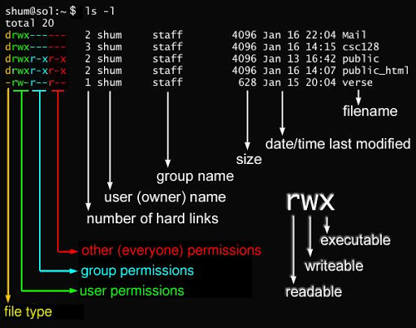
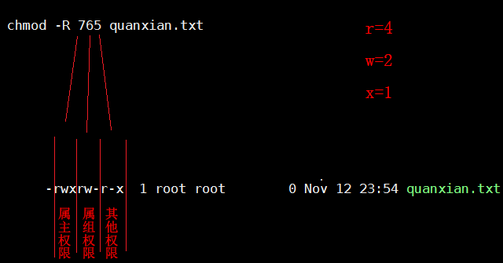
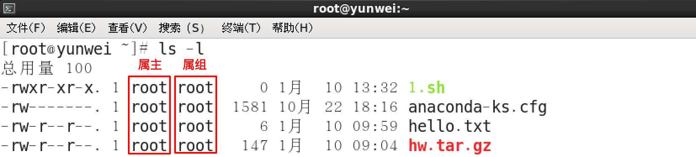

# 一、权限概述

## 1.1 什么是权限

在 Linux 中分别有读、写、执行权限：

|        | 权限针对文件                                             | 权限针对目录                                                 |
| ------ | -------------------------------------------------------- | ------------------------------------------------------------ |
| 读 r   | 表示可以查看文件内容；cat                                | 表示可以(ls)查看目录中存在的文件名称                         |
| 写 w   | 表示可以更改文件的内容；vim 修改，保存退出               | 表示是否可以删除目录中的子文件或者新建子目录(rm/touch/mkdir) |
| 执行 x | 表示是否可以开启文件当中记录的程序,一般指二进制文件(.sh) | 表示是否可以进入目录中(cd)                                   |

## 1.2 为什么要设置权限

1）服务器中的数据价值

2）员工的工作职责和分工不同

3）应对自外部的攻击

4）内部管理的需要

## 1.3 Linux 中的权限类别

- **普通权限**rwx

  用户正常情况去操作文件所具有的权限

- **高级权限**st

  用户对某个文件操作有特殊需求，而普通权限不能满足，需要给文件设置高级权限

- **默认权限**umask

  用户在系统中创建一个文件，该文件默认都会有一个权限，该权限是默认有的

## 1.4 Linux 中文件所有者

### 1.4.1 所有者分类（谁）

对于文件的所有者，又分为3类：

- **user（属主）**：文件的创建者或拥有者，换句话说，某个账户对这个文件有的权限。
- **group（属组）**：文件所属的用户组，换句话或，某个用户组对这个文件有的权限。
- **other（其他用户）**：除了上面提到的属主和属组之外的所有用户，对这个文件有的权限

### 1.4.2 所有者的表示方法

- u (the user who owns it)：属主权限

用==u==表示，文件所有者，默认为文档的创建者

- g (other users in the file's group)：属组权限

用==g==表示，在文件所属组（默认是创建文件的用户的主组）里的用户

- o (other user not in the file's group)：其他权限

用==o==表示，既不是文件的创建者，也不在文件属组里的用户，称为其他人

- root 用户：超级管理员

在 Linux 中，还有一个神一样的用户，这就是 root 用户，因为在所有用户中它拥有最大的权限 ，可以管理着普通用户。因此以后在设置文档的权限的时候不必考虑 root 用户。 

# 二、普通权限管理

## 2.1 查看文件权限

要设置权限，就需要知道文件的一些基本属性和权限的分配规则。在Linux 中，ls 命令常用来查看文档的属性，用于显示文件的文件名和相关属性。

```bash
# 查看当前文件夹下的所有目录和文件的详细信息
[root@centos ~]# ls -l
total 6024
-rw-------. 1 root root    1546 Feb 27  2023 anaconda-ks.cfg
-rwxr-xr-x. 1 root root 6126648 Aug 18 15:28 bench
-rw-r--r--. 1 root root       0 Feb 27  2023 deploy.log
-rw-r--r--. 1 root root   23859 Feb 27  2023 ics_agent.py
-rw-r--r--. 1 root root   10374 Feb 27  2023 openssh9.2sp1-ssl-1.1.1t_update.sh
[root@centos ~]# ll
total 6024
-rw-------. 1 root root    1546 Feb 27  2023 anaconda-ks.cfg
-rwxr-xr-x. 1 root root 6126648 Aug 18 15:28 bench
-rw-r--r--. 1 root root       0 Feb 27  2023 deploy.log
-rw-r--r--. 1 root root   23859 Feb 27  2023 ics_agent.py
-rw-r--r--. 1 root root   10374 Feb 27  2023 openssh9.2sp1-ssl-1.1.1t_update.sh
```

### ☆ read 读权限

- 针对目录

  一个目录拥有 r 权限，说明可以查看该目录里的内容（ls 命令列出）

- 针对普通文件

  一个普通文件拥有 r 权限，说明可以查看该文件的内容(cat/head/tail/less/more等命令查看)

- 读权限 **r**（read）用数字表示是 **4**

### ☆ write 写权限

- 针对目录

  一个目录拥有 w 权限，说明可以在该目录里 **创建、删除、重命名** 等操作（mkdir/touch/mv/rm等）

- 针对普通文件

  一个普通文件拥有 w 权限，说明可以**修改**该文件的**内容**（vi/vim编辑器编辑文件）

- 写权限 **w**（write）用数字表示是 **2**

### ☆ execute 执行权限

- 针对目录

  一个目录拥有 x 权限，说明可以**进入或切换到**该目录里（cd命令）

- 针对普通文件

  一个普通文件拥有 x 权限，说明可以**执行**该文件（一般程序文件、脚本文件、命令都需要执行权限）

- 执行权限 **x**（execute）用数字表示是 **1**

### ☆ - 没有权限

没有任何权限用横杠 - 表示，数字表示是 **0**

## 2.2 文件权限详解



linux一共有7种文件类型,分别如下：

- `-` ：普通文件
- `d`：目录文件
- `l`：软链接（类似Windows的快捷方式）
- `b`：块设备文件（例如硬盘、光驱等）
- `p`：管道文件
- `c`：字符设备文件（例如猫等串口设备）
- `s`：套接口文件/数据接口文件（例如启动一个MySql服务器时会产生一个mysql.sock文件）

文件权限对应关系

| 权限 | 对应数字 | 意义   |
| ---- | -------- | :----- |
| r    | 4        | 可读   |
| w    | 2        | 可写   |
| x    | 1        | 可执行 |

## 2.3 设置文件/目录权限

命令：`chmod`

语法：`chmod [选项] 权限模式 文档`

作用：增加或者减少当前文件所有者的权限（注意，==不能改变所有者==，==只能改变==现有所有者的==权限==）

常用选项：-R：递归设置权限 （当文档类型为目录的时候）

权限模式：就是该文档需要设置的权限信息

文档：可以是文件，也可以是文件夹，可以是相对路径也可以是绝对路径。

注意点：如果想要给文档设置权限，操作者要么是root 用户，要么就是文档的所有者。

### 2.3.1 字母形式

- 增加单个权限

```bash
用法一：chmod -R 要增加的权限 文件名
示例代码：
chmod -R u+x quanxian.txt
含义：对于quanxian.txt文件，给 属主 增加 执行 权限
```

- 多个增加权限

```bash
用法二：chmod -R 多个要增加的权限 文件名
示例代码：
chmod -R g+x,o+x quanxian.txt
含义：对于quanxian.txt文件，给 属组 增加 执行 权限，给 其他 增加 执行权限。
注意：同时改变多个对象的权限，中间使用“逗号“分割。
```

- 去除权限

```bash
用法三：chmod -R 要减少的权限 文件名
示例代码：
chmod -R o-x quanxian.txt
含义：对于quanxian.txt文件，给 其他 减少 执行权限。
```

- 多权限

```bash
用法四：chmod -R 要赋予的权限 文件名
示例代码：
chmod -R u=rwx,g=rwx,o=rwx quanxian.txt
chmod -R ugo=rwx quanxian.txt
chmod -R a=rwx quanxian.txt
含义：对于quanxian.txt文件，给属主，属组，其他，都 赋予 读，写，执行权限
```

- 目录权限

```bash
用法五：chmod -R 要赋予的权限 目录
示例代码：
chmod -R a=rwx quanxianfolder
含义：对于quanxianfolder文件夹，给所有用户（属主，属组，其他），都 赋予 读，写，执行权限
```

总结：

```powershell
权限设置要考虑的因素：
首先：
    给谁设置？
    u    可以给属主设置权限
    g    可以给属组设置权限
    o    可以给其他用户设置权限
    ugo  给所有用户设置权限(主+组+其他)
    a    给所有用户设置权限

第二：
    怎么设置？
    +    添加权限
    -    减少权限
    =    赋予权限

第三：
    增加减少或者赋予什么权限？
    r    读
    w    写
    x    执行
```

相关参数总结：

| 字母      | 选项    | 作用              |
| --------- | ------- | ----------------- |
| u（谁）   | user    | 属主              |
| g（谁）   | group   | 属组              |
| o（谁）   | other   | 其他用户          |
| a（谁）   | all     | 所有人（包含ugo） |
| +（作用） | 加      | 增加作用          |
| -（作用） | 减      | 移除作用          |
| =（作用） | 等于    | 赋值作用          |
| r（权限） | read    | 可读权限          |
| w（权限） | write   | 可写权限          |
| x（权限） | execute | 可执行权限        |
| -（权限） | -       | 没有任何权限      |

### 2.3.2 数字形式

文件**权限与数字**的对应关系

| 权限 | 对应数字 | 意义   |
| ---- | -------- | :----- |
| r    | 4        | 可读   |
| w    | 2        | 可写   |
| x    | 1        | 可执行 |

权限与数字对应详解



| 数字 | 权限    | 作用                     |
| ---- | ------- | ------------------------ |
| 0    | -       | 不能读，不能写，不能执行 |
| 1    | execute | 不能读，不能写，可执行   |
| 2    | write   | 不能读，可写，不能执行   |
| 3    | 2+1     | 不能读，可写，可执行     |
| 4    | read    | 可读，不能写，不能执行   |
| 5    | 4+1     | 可读，不能写，可执行     |
| 6    | 4+2     | 可读，可写，不能执行     |
| 7    | 4+2+1   | 可读，可写，可执行       |

```bash
用法六：chmod -R 要赋予的权限（数字形式） 文件名
示例代码：
chmod -R 765 quanxian.txt
含义：对于quanxian.txt文件，给属主所有权限，属组读写权限，其他读和执行权限
注意：
全部权限：7 = r+w+x = 4 + 2 + 1
读写权限：6 = r+w = 4 + 2
读和执行：5 = r+x = 4 + 1
综上所述，u=7，g=6，o=5
```

# 三、属主与属组设置

## 3.1 什么是属主与属组

属主：所属的用户，文档所有者，这是一个账户，这是一个人

属组：所属的用户组，这是一个组



## 3.2 chown 修改文件的属主

基本语法：`chown [-R] 新文档拥有者名称 文档路径`

作用：更改文档的所属用户（change owner）

选项：-R 代表递归修改文件的属主

```bash
chown liuli readme.txt
# 将 readme.txt 文件的属主设置为 liuli
```

```powershell
chown liuli shop
# 将 shop 文件夹的属主设置为 itheima
```

## 3.3 chgrp 修改文件的属组

基本语法：`chgrp [-R] 新文档组名称 文档的路径`

作用：更改文档的所属用户组（change group）

```bash
chgrp liuli readme.txt
# 将 readme.txt 文件的属组设置为 liuli 组
```

## 3.4 chown 同时修改属主与属组

基本语法：`chown [-R] username:groupname 文档`

示例代码：将readme.txt文件的拥有者与所属组都更改为 liuli

```bash
chown liuli:liuli readme.txt 
# 将 readme.txt 文件的属主和属组同时设置为 liuli
```

# 四、特殊权限

## 4.1 设置位S(SetUid)

作用：为了让一般使用者临时具有该文件所属主/组的执行权限。

例如：`/usr/bin/passwd` 在执行它的时候需要去修改 `/etc/passwd` 和 `/etc/shadow` 等文件，这些文件除了 root 外，其他用户都没有写权限，但是又为了能让普通用户修改自己的密码，该怎么办呢？

答：可以临时让他们具有 root 的权限，而这个 `s` 权限就是用来完成这个特殊任务的。`s` 权限只能应用在二进制的可执行文件上。

```bash
[root@ecs-d886 ~]# ll /usr/bin/passwd 
-rwsr-xr-x 1 root root 27856 Apr  1  2020 /usr/bin/passwd
```

```powershell
# 不想让普通用户修改自己的密码，去除 s 权限
chmod u-s /usr/bin/passwd 
或者
# 0755最前面的0表示不使用任何特殊权限，如果想使用数字设置特殊权限，可以使用4表示设置S位
chmod 0755 /usr/bin/passwd
```

测试普通用户：

```bash
[liuli@ecs-d886 ~]$ passwd 
Changing password for user liuli.
Changing password for liuli.
(current) UNIX password: 
New password: 
Retype new password: 
passwd: Authentication token manipulation error
```

## 4.2 沾滞位T(sticky bit)

公司多个部门公用一个文件夹work,为了让所有人都能访问，work文件夹赋予了777权限，用户root新建了一个文件root.txt，发现被别人删除了。我们希望root建立的文件，只有root自己可以删。

作用：只允许文件的创建者和root用户删除文件

常用选项：o+t 添加粘滞位

​                    o-t 去掉粘滞位     

```powershell
# 含义：给 /data 目录增加粘滞位权限
chmod o+t /data
chmod 1770 /data

drwxrwxrwt   3 root root      53248 Jul 26 15:43 data     
```

# 五、ACL 访问控制

ACL，是 Access Control List（访问控制列表）的缩写，在 Linux 系统中， ACL 可实现对单一用户设定访问文件的权限。

## 5.1 getfacl 命令

`getfacl`命令：查看文件的 ACL 策略及权限

```bash
[root@ecs-d886 ~]# getfacl readme.txt 
# file: readme.txt
# owner: root
# group: root
user::rw-
group::r--
other::r--
```

## 5.2 setfacl 命令

`setfacl`命令： 给文件针对某个用户或者某个组来增加（设置）ACL 策略

- -m：修改 acl 策略

- -x：去掉某个用户或者某个组的权限

- -b：删除所有的 acl 策略

- -R：递归，通常用在文件夹

- mask：mask 定义除 other 和所有人(拥有者)外的最大权限

```bash
# 给单个用户单独加权限策略
setfacl -m u:用户名:rwx readme.txt
# 给单个组单独加权限策略
setfacl -m g:用户组名:rwx readme.txt
# 去掉某个用户的acl策略
setfacl -x u:用户 readme.txt
# 去掉某个组的acl策略
setfacl -x g:组名 readme.txt
# 删除所有的acl策略
setfacl -b readme.txt
```

# 六、umask

## 6.1 什么是 umask

umask 表示创建文件时的默认权限（即创建文件时不需要设置而天生的权限）

例如：

-  root用户下，`touch a`，文件a的默认权限是644

- 普通用户下，`touch b`，文件b的默认权限是664 

644和664我们并没有设置，其中的关键因素就是**umask**

## 6.2 umask 值

可以使用命令umask来查看umask的值：

```bash
[root@ecs-d886 ~]# umask 
0022
# 注：0022中第一位0代表特殊权限位，可以不设置。
```

umask 的默认值，在 root 和普通用户下是不一样的，分别是 022 和 002

```bash
[liuli@ecs-d886 ~]$ umask 
0002
```

结合上述的举例得知：

```powershell
默认权限=最高权限-umask（644=666-022 // 664=666-002 ）
```

## 6.3 修改 umask 值

 umask + 数值修改当前用户的 umask 如：`umask 044`

不过这样设置的umask会在用户重新登录的时候恢复原来的值，我们可以把修改的umask保存在`~/.bashrc`

操作步骤：

```powershell
# vim ~/.bashrc
① 在文件末尾添加 umask 044
② 保存退出 
③ 重新登录用户则保存成功
```

**注意：一般不要修改系统的 umask 值！！！**
