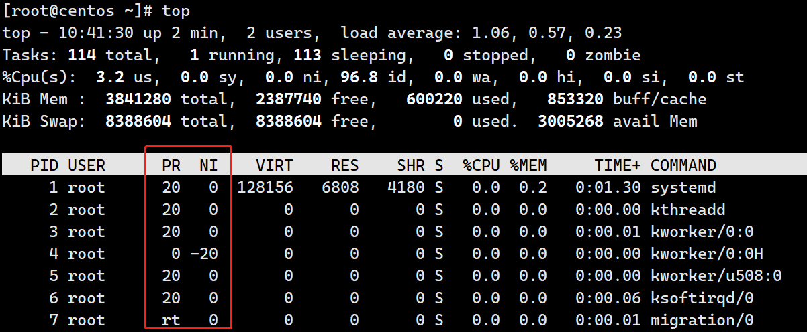

	在运维的日常工作中，监视系统的运行状况是每天例行的工作，在 Windows 中我们可以很直观的使用"任务管理器"来进行进程管理，了解系统的运行状态

通常，使用"任务管理器"主要有 3 个目的：

1. 利用"应用程序"和"进程"标签来査看系统中到底运行了哪些程序和进程；
2. 利用"性能"和"用户"标签来判断服务器的健康状态；
3. 在"应用程序"和"进程"标签中强制中止任务和进程；


# 一、什么是进程和程序

​        **进程**是正在执行的一个程序或命令，每个进程都是一个运行的实体，并占用一定的系统资源。**程序**是人使用计算机语言编写的可以实现特定目标或解决特定问题的代码集合。

​        简单来说，程序是人使用计算机语言编写的，可以实现一定功能，并且可以执行的代码集合。进程是正在执行中的程序。

**举例**：谷歌浏览器是一个程序，当我们打开谷歌浏览器，就会在系统中看到一个浏览器的进程，当程序被执行时，程序的代码都会被加载入内存，操作系统给这个进程分配一个 ID，称为 **PID**（进程 ID）。我们打开多个谷歌浏览器，就有多个浏览器子进程，但是这些进程使用的程序，都是chrome


# 二、进程管理命令

## 2.1 top 查看系统负载情况

命令：top

作用：查看服务器的进程占用的资源

语法：`top`

交换操作快捷键：

- M（大写）：表示将结果按照内存（MEM）从高到低进行降序排列；

- P（大写）：，表示将结果按照CPU 使用率从高到低进行降序排列；

- 1 ：当服务器拥有多个cpu 的时候可以使用“1”快捷键来切换是否展示显示各个cpu 的详细信息；

-  q：退出


### 2.1.1 系统整体信息

- 第一行，基本信息


| 内容                         | 说明                                                         |
| ---------------------------- | ------------------------------------------------------------ |
| 22:17:01                     | 系统当前时间                                                 |
| up 106 days，4:57            | 系统的运行时间，本机己经运行 106 天 4 小时 57 分钟           |
| 1 users                      | 当前登录了 1 个用户                                          |
| load average: 0.00,0.01,0.05 | 系统在之前 1 分钟、5 分钟、15 分钟的平均负载。如果 CPU 是单核的，则这个数值超过 1 就是高负载：如果 CPU 是四核的，则这个数值超过 4 就是高负载 |

- 第二行，任务进程信息


| 内容        | 说明                                             |
| ----------- | ------------------------------------------------ |
| 90 total    | 系统中的进程总数                                 |
| 1 running   | 正在运行的进程数                                 |
| 89 sleeping | 睡眠的进程数                                     |
| 0 stopped   | 正在停止的进程数                                 |
| 0 zombie    | 僵尸进程数。如果不是   0，则需要手工检查僵尸进程 |

- 第三行，CPU使用信息


| 内容     | 说明                                                         |
| -------- | ------------------------------------------------------------ |
| 0.0 us   | 用户模式占用的 CPU 百分比                                    |
| 0.0 sy   | 系统模式占用的 CPU 百分比                                    |
| 0.0 ni   | 改变过优先级的用户进程占用的 CPU 百分比                      |
| 100.0 id | idle缩写，空闲 CPU 占用的 CPU 百分比                         |
| 0.00 wa  | 等待输入/输出的进程占用的 CPU 百分比                         |
| 0.0 hi   | 硬中断请求服务占用的   CPU 百分比                            |
| 0.0 si   | 软中断请求服务占用的   CPU 百分比                            |
| 0.0 st   | st（steal   time）意为虚拟时间百分比，就是当有虚拟机时，虚拟 CPU 等待实际 CPU 的时间百分比 |

- 第四行，物理内存使用信息


| 内容              | 说明                     |
| ----------------- | ------------------------ |
| 1014092 total     | 物理内存的总量，单位为KB |
| 150072 free       | 空闲的物理内存数量。     |
| 82420 used        | 己经使用的物理内存数量   |
| 781600 buff/cache | 作为缓冲的内存数量       |

- 第五行，虚拟内存使用信息


| 内容             | 说明                         |
| ---------------- | ---------------------------- |
| 4194300 total    | 交换分区（虚拟内存）的总大小 |
| 4162412 free     | 空闲交换分区的大小           |
| 31888 used       | 已经使用的交换分区的大小     |
| 723972 avail Mem | 可用内存                     |

总结：我们通过 top 命令的整体信息部分，就可以判断服务器的健康状态。如果 1 分钟、5 分钟、15 分钟的平均负载高于CPU核数，说明系统压力较大。如果物理内存的空闲内存过小，则也证明系统压力较大。

### 2.1.2 进程信息


| 内容    | 说明                                                         |
| ------- | ------------------------------------------------------------ |
| PID     | 进程的 ID。                                                  |
| USER    | 该进程所属的用户。                                           |
| PR      | 优先级，数值越小优先级越高。                                 |
| NI      | 优先级，数值越小优先级越高。                                 |
| VIRT    | 该进程使用的虚拟内存的大小，单位为 KB。                      |
| RES     | 该进程使用的物理内存的大小，单位为 KB。                      |
| SHR     | 共享内存大小，单位为 KB。计算一个进程实际使用的内存 = 常驻内存（RES）- 共享内存（SHR） |
| S       | 进程状态。其中 S 表示睡眠，R 表示运行                        |
| %CPU    | 该进程占用 CPU 的百分比。                                    |
| %MEM    | 该进程占用内存的百分比。                                     |
| TIME+   | 该进程共占用的 CPU 时间。                                    |
| COMMAND | 进程（命令）名                                               |

- 交互操作快捷键 P（Process），表示将结果按照 CPU 使用率从高到低进行降序排列


- 使用交互快捷键M（MEM），表示将结果按照内存从高到低进行降序排列


## 2.2 free 查看内存使用情况

命令：free

作用：查看内存使用情况

语法：`free -h`

选项：-h 表示方便人类阅读的单位查看

```powershell
# free -h
              total        used        free      shared  buff/cache   available
Mem:           990M         81M        144M         49M        764M        708M
Swap:          4.0G         31M        4.0G
```

| 第一行指标 | 说明               |
| ---------- | ------------------ |
| total      | 内存总数           |
| used       | 已经使用的内存数   |
| free       | 空闲的内存数       |
| shared     | 共享内存数         |
| buff/cache | 块设备缓存区内存数 |
| available  | 剩余可用内存       |

第二行指标数据是Swap交换分区，也就是我们通常所说的虚拟内存。可以在内存不够使用的情况下使用硬盘空间当临时内存来使用，交换分区并不是越大越好，一般话它就等同于实际内存的大小。

## 2.3 df 查看磁盘

命令：df

作用：查看磁盘的空间(disk  free)

语法：`df -h`

选项：-h 表示方便人类阅读的单位查看

```bash
# df -h
Filesystem      Size  Used Avail Use% Mounted on
devtmpfs        485M     0  485M   0% /dev
tmpfs           496M     0  496M   0% /dev/shm
tmpfs           496M   51M  446M  11% /run
tmpfs           496M     0  496M   0% /sys/fs/cgroup
/dev/vda1        40G   14G   24G  38% /
tmpfs           100M     0  100M   0% /run/user/0
```

| 指标       | 说明                                |
| ---------- | ----------------------------------- |
| Filesystem | 磁盘名称                            |
| Size       | 总大小                              |
| Used       | 被使用的大小                        |
| Avail      | 剩余大小                            |
| Use%       | 使用百分比                          |
| Mounted on | 挂载路径（相当于 Windows 的磁盘符） |

## 2.4 ps 查看进程命令

命令：ps（process show 进程显示）

语法：`ps [参数选项]`

作用：主要是查看服务器的进程信息

选项含义：

- -e：等价于“-A”，表示列出全部（all）的进程

- -f :   表示full，显示全部的列（显示全字段）

```bash
# ps -ef
UID        PID  PPID  C STIME TTY          TIME CMD
root         1     0  0 May22 ?        00:01:43 /usr/lib/systemd/systemd --switched-root
chrony     503     1  0 May22 ?        00:00:02 /usr/sbin/chronyd
root       508     1  0 May22 ?        00:01:02 /usr/sbin/NetworkManager --no-daemon
polkitd    509     1  0 May22 ?        00:00:13 /usr/lib/polkit-1/polkitd --no-debug
root       358     1  0 May22 ?        00:08:38 /usr/lib/systemd/systemd-journald
root      1052     1  0 May22 ttyS0    00:00:00 /sbin/agetty --keep-baud 115200,38400,9600 ttyS0 vt220
root      1053     1  0 May22 tty1     00:00:00 /sbin/agetty --noclear tty1 linux
root      1110     1  0 May22 ?        01:00:51 /usr/local/hostguard/bin/hostguard --daemon
root     24432 24380  0 22:40 pts/0    00:00:00 ps -ef
```

| 指标  | 说明                                                         |
| ----- | ------------------------------------------------------------ |
| UID   | 该进程执行的用户ID                                           |
| PID   | 进程ID                                                       |
| PPID  | 该进程的父级进程ID，如果找不到，则该进程就被称之为僵尸进程（Parent Process ID） |
| C     | Cpu的占用率，其形式是百分数                                  |
| STIME | 进程的启动时间                                               |
| TTY   | 终端设备，发起该进程的设备识别符号，如果显示“?”则表示该进程并不是由终端设备发起 |
| TIME  | 进程实际使用CPU的时间                                        |
| CMD   | 该进程的名称或者对应的路径                                   |

命令：`ps -aux`（BSD格式命令）

*Unix有很多分支，目前主流的显示风格分为System V和BSD，我们之前使用的ps -ef属于system V风格，ps aux是BSD风格，大家可以理解为两种风格只是显示不同。*

```bash
[root@ecs-d886 ~]# ps aux
USER       PID %CPU %MEM    VSZ   RSS TTY      STAT START   TIME COMMAND
root         1  0.0  0.3 125520  3324 ?        Ss   May22   1:43 /usr/lib/systemd/systemd --switched-root
root     24344  0.0  0.0      0     0 ?        S    22:36   0:00 [kworker/0:0]
root     24376  0.0  0.5 157608  5928 ?        Ss   22:38   0:00 sshd: root@pts/0
root     24380  0.0  0.2 115672  2220 pts/0    Ss   22:38   0:00 -bash
root     24470  0.7  0.5 157740  5664 ?        Ss   22:44   0:00 sshd: root [priv]
sshd     24471  0.0  0.2 113000  2236 ?        S    22:44   0:00 sshd: root [net]
root     24472  0.0  0.1 155452  1876 pts/0    R+   22:44   0:00 ps aux
```

| 指标    | 说明                                                         |
| ------- | ------------------------------------------------------------ |
| USER    | 该 process 属于哪个使用者账号                                |
| PID     | 该 process 的ID                                              |
| %CPU    | 该 process 使用掉的 CPU 资源百分比                           |
| %MEM    | 该 process 所占用的物理内存百分比                            |
| VSZ     | 该 process 使用掉的虚拟内存量 (Kbytes)                       |
| RSS     | 该 process 占用的固定的内存量 (Kbytes)                       |
| TTY     | 该 process 是在那个终端机上面运作，若与终端机无关，则显示 ?，另外， tty1-tty6 是本机上面的登入者程序，若为 pts/0 等等的，则表示为由网络连接进主机的程序。 |
| STAT    | 该程序目前的状态，主要的状态有：<br/>    R ：该程序目前正在运作，或者是可被运作<br/>    S ：该程序目前正在睡眠当中 (可说是 idle 状态)，但可被某些讯号 (signal) 唤醒。<br/>    T ：该程序目前正在侦测或者是停止了<br/>    Z ：该程序应该已经终止，但是其父程序却无法正常的终止他，造成 zombie (疆尸) 程序的状态 |
| START   | 该 process 被触发启动的时间                                  |
| TIME    | 该 process 实际使用 CPU 运作的时间                           |
| COMMAND | 该程序的实际指令                                             |

## 2.5 netstat 查看进程网络访问

命令：netstat

作用：查看网络连接状态

语法：`netstat -tnlp`

选项：-t：表示只列出 tcp 协议的连接；

​	   -n：表示将地址从字母组合转化成 ip 地址，将协议转化成端口号来显示；

​	   -l ：表示过滤出"state（状态）"列中其值为LISTEN（监听）的连接；

​	   -p：表示显示发起连接的进程 pid 和进程名称；

```bash
# netstat -tnlp
Active Internet connections (only servers)
Proto Recv-Q Send-Q Local Address           Foreign Address         State       PID/Program name    
tcp        0      0 0.0.0.0:22              0.0.0.0:*               LISTEN      2438/sshd: /usr/sbi 
tcp        0      0 127.0.0.1:31768         0.0.0.0:*               LISTEN      2619/comm_srv       
tcp        0      0 127.0.0.1:31769         0.0.0.0:*               LISTEN      83662/icsfilesec    
tcp        0      0 127.0.0.1:25            0.0.0.0:*               LISTEN      1339/master         
tcp6       0      0 :::21                   :::*                    LISTEN      10258/vsftpd        
tcp6       0      0 :::22                   :::*                    LISTEN      2438/sshd: /usr/sbi 
tcp6       0      0 ::1:25                  :::*                    LISTEN      1339/master   
```

| 指标             | 说明                                            |
| ---------------- | ----------------------------------------------- |
| Proto            | 协议（tcp、upd、http、https、icmp、ssh…）       |
| Recv-Q           | 接收                                            |
| Send-Q           | 发送                                            |
| Local Address    | 本地地址                                        |
| Foreign Address  | 远程地址                                        |
| State            | 状态，LISTEN表示侦听来自远方的TCP端口的连接请求 |
| PID/Program name | 进程ID和程序名                                  |


## 2.6 kill 关闭进程

命令：kill

语法：`kill [信号] PID`

作用：kill 命令会向操作系统内核发送一个信号（多是终止信号）和目标进程的 PID，然后系统内核根据收到的信号类型，对指定进程进行相应的操作

信号种类：

| 信号编号 | 含义                                   |
| -------- | -------------------------------------- |
| 9        | 杀死进程，即强制结束进程。             |
| 15       | 正常结束进程，是 kill 命令的默认信号。 |

## 2.7 killall关闭进程

命令：killall

作用：通过程序的进程名来杀死一类进程

语法：`killall [信号] 进程名称`

信号种类：和 kill 相同，这里不再重复

# 三、进程优先级

## 3.1 什么是进程优先级

​	Linux 是一个多用户、多任务的操作系统，系统中通常运行着非常多的进程。哪些进程先运行，哪些进程后运行，就由进程优先级来控制

## 3.2 查看进程优先级

PR  优先级，数值越小优先级越高。  

NI  优先级，数值越小优先级越高。

  

## 3.3 调整进程优先级

#### 3.3.1  调整运行中的优先级

- 使用 top 按`r`来调整

如果要改变某个进程的优先级，就要利用 "r" 交互命令。

```bash
改变 NICE--->PR
优先级的范围：
-20——19 数字越低，优先级越高，系统会按照更多的 cpu 时间给该进程
注意：我们能够修改的只有 Ni 的优先级，而不能修改 Pr 的优先级。
```

步骤1：运行 top 命令，按 r，会提示输入希望修改优先级的进程的 PID，这里输入 6451，表示想修改 firewalld 进程的优先级


步骤2：输入6451后回车，提示希望修改的具体数字，这个数字是从-20到19，这里输入5，数字越大，优先级别越低，所以，这里是降低了firewalld的优先级


步骤3：输入5后，按回车，会发现6451进程的NI, 从0变成了5，PR从20变成了25


- 命令行使用`renice`调整

命令：renice
语法：`enice [NI优先级设置的数字] 想调整的进程ID`

```bash
[root@localhost ~]# renice -5 6451
含义：将6451进程的NI优先级设置为-5，实际效果是提高了6451进程的优先级
注意：这里的-5代表设置成-5，不是所谓加减的关系，如果当前NI的值是10，当设置成-5后，NI的值会变为-5.
```

#### 3.3.2 启动时指定优先级

命令：nice
语法：`nice [NI优先级设置的数字] 想调整的进程名`
启动进程时，通常会继承父进程的 nice级别，默认为0

```bash
nice -n -5 crond
含义：启动crond进程，将NI设置成-5
```


