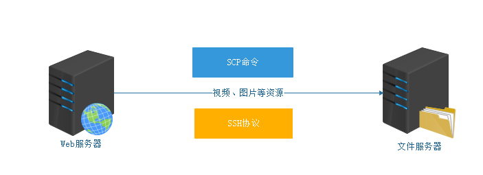

# 一、touch 修改文件时间

## 1.1 文件时间概念

```bash
[root@centos ~]# stat deploy.log 
  File: ‘deploy.log’
  Size: 0         	Blocks: 0          IO Block: 4096   regular empty file
Device: 803h/2051d	Inode: 1179763     Links: 1
Access: (0644/-rw-r--r--)  Uid: (    0/    root)   Gid: (    0/    root)
Context: unconfined_u:object_r:admin_home_t:s0
Access: 2023-09-12 10:56:32.691000000 +0800
Modify: 2023-02-27 18:50:26.323000000 +0800
Change: 2023-02-27 18:50:26.323000000 +0800
 Birth: -
```

- 访问时间（Access time）：又简称为 atime，对文件进行一次读操作，它的访问时间就会改变。例如 cat，more 等操作，但是stat，ls 命令对 atime 是不会有影响的。
- 修改时间（Modify time）：又简称为 mtime，文件内容最后一次修改的时间，我们经常用的 ls -l 命令显示出来的文件时间就是这个时间，当对文件内容修改后，它的 mtime 就会相应的改变，例如 vim 操作。
- 改变时间（Change time）：又简称为 ctime，当文件的状态被改变的时候，改变时间就会随之改变。例如当使用 chmod、chown 等改变文件属性的操作是会改变文件的 ctime。

## 1.2 修改文件的时间

基本语法：`touch [选项] 文件名`

选项：

- -m：更改文件的修改时间
- -a：更改文件的访问时间
- -d：指定时间：支持的时间格式
  - Sun, 29 Feb 2004 16:21:42 -0800
  - 2004-02-29 16:21:42
  - next Thursday

> ① 如果文件不存在，则自动创建该文件，然后设置其最后的修改时间
>
> ② 如果文件存在，touch 命令就是只修改文件的最后修改时间

```bash
# 创建一个 a.txt 文件，设置最后修改时间为 2022-03-30 00:00:00
touch -m -d "2022-03-30 00:00:00" a.txt

# 修改 a.txt 的最后访问时间为 2021-03-29 06:20:30
touch -a -d "2021-03-29 06:20:30" a.txt
```

# 二、dd 生成指定大小文件
基本语法：`dd if=/dev/zero of=文件名称 bs=1M count=1`

主要功能：在 Linux 操作系统中，生成某个大小的测试文件。

选项说明：

- if 代表输入文件
- of 代表输出文件
- bs 代表字节为单位的块大小。
- count 代表被复制的块。
- 其中 /dev/zero 是一个字符设备，会不断返回 0 值字节。

```bash
# 创建一个 1M 大小的 sun.txt 文件
dd if=/dev/zero of=sun.txt bs=1M count=1

# 创建一个 1G 大小的 moon.txt 文件
dd if=/dev/zero of=moon.txt bs=1M count=1024
```

# 三、find 查找文件

## 3.1 基本语法

在 Linux 操作系统中，find命令主要用于进行文件的搜索。

基本语法：`find 搜索路径 [选项 选项的值]`

选项说明：

- -name ：根据文件的名称搜索文件，支持 * 通配符
- -type ：f 代表普通文件、d 代表文件夹

```bash
# 搜索计算机中的所有文件，然后找到 httpd.conf 文件
find /etc -name "httpd.conf" -type f
```

## 3.2 星号通配符

在 Linux 操作系统中，我们想要查找的文件名称不是特别清晰（只记住了前面或后面的字符），这个时候就可以使用 * 星号通配符了。

```bash
# 获取/etc目录下，所有后缀名为.conf的文件信息
find /etc -name "*.conf" -type f

# 在/etc目录下，搜索所有以httpd开头的文件
find /etc -name "httpd*" -type f
```

## 3.3 根据文件修改时间搜索文件

基本语法：`find 搜索路径 -mtime +days/-days`

- -mtime：根据文件的最后修改时间搜索文件

+ 加号，代表搜索几天之前的文件信息

- 减号，代表搜索几天以内的文件信息


```bash
# 搜索3天以前的文件信息（不包含第3天的，而且只搜索.txt格式）
find ./ -name "*.txt" -mtime +3
```


```bash
# 搜索3天以内的文件信息（只搜索.txt格式）
find ./ -name "*.txt" -mtime -3
```

## 3.4 根据文件的大小搜索文件

基本语法：`find 搜索路径 -size [文件大小，常用单位：k，M，G]`

- size 值  : 搜索等于 size 值大小的文件
- -size 值 : [0, size值)
- +size 值 : (size值,正无穷大)

```bash
# 搜索 /root 目录下大小为 5M 的文件信息
find ./ -type f -size 5M
```

```bash
# 搜索 /root 目录下大小为 5M 以内的文件信息（5M>size>=0）
find ./ -type f -size -5M
```

```bash
# 搜索 /root 目录中，文件大小大于 100M 的文件信息（size>100M）
find /root -type f -size +100M
```

## 3.5 动作选项 -exec

基本语法：`find [路径] [表达式] -exec command {} \;`

- `command`表示要执行的命令
- `{} `表示找到的文件名。

`-exec` 将 find 查找到的结果放入 `{}` 中，并且必须以`\;`结尾。

```bash
# 删除 Linux 系统中 /var/log 目录下 10 天以前的日志信息（日志文件格式 *.log 结尾）
find /var/log -name "*.log" -mtime +10 -exec rm -rf {} \;

# 或者使用 -delete 选项，仅删除作用
find /var/log -name "*.log" -mtime +10 -delete
```

# 四、scp 文件传输

## 4.1 主要作用

scp 命令的主要作用是实现 Linux 与 Linux 系统之间的文件传输。（目前也支持 Windows 系统向 Linux 传文件）

## 4.2 scp 效果图



> scp 命令基于 SSH 协议，两台服务器的 sshd 服务必须处于开启状态，否则无法完成上传与下载操作。

## 4.3 下载文件或目录

基本语法：`scp [选项] 用户名@远程主机地址:资源路径 本地文件路径`

选项说明：

- -r：代表递归操作，主要针对文件夹

- -P：指定 ssh 端口，默认 22

```bash
# 从 10.1.1.17 服务器下载 /root 路径下的 video.mp4 文件到本地的 /root 目录下
scp root@10.1.1.17:/root/video.mp4 ./

# 从 10.1.1.17 服务器下载 /root 路径下的 shop 文件夹到本地的 /root 目录下
scp -r root@10.1.1.17:/root/shop ./
```

## 4.4 上传文件或目录

基本语法：`scp [选项] 本地文件路径 用户名@远程主机地址:远程路径`

选项说明：

- -r：代表递归操作，主要针对文件夹

- -P：指定 ssh 端口，默认 22

```bash
# 把本地服务器上的 /root/video.mp4 上传到 10.1.1.17 服务器的 /root 目录下
scp /root/video.mp4 root@10.1.1.17:/root/
```

```bash
# 把本地服务器上的 /root/shop 文件夹上传到 10.1.1.17 服务器的 /root 目录下
scp -r /root/shop root@10.1.1.17:/root/
```

# 五、crontab 定时任务

基本语法：`crontab [选项]`

- -l：list 缩写，查询当前用户的计划任务信息

- -e：edit 缩写，编辑计划任务

## 5.1 计划任务格式

```bash
分 时 日 月 周 执行的命令（要求使用完整路径）
```


> 周的范围比较特殊，正常情况下，只有周一 ~ 周日 1-7，但是计划任务范围0-7，所以 0 和 7 都代表周日

## 5.2 定时任务备份文件

每天的凌晨2点0分把/etc目录备份一次/tmp目录下，要求把/etc打包成etc.tar.gz格式，备份文件时，要求按时间作为备份文件的名称

```bash
# crontab -e
# 分 时 日 月 周 /usr/bin/tar -zcf /tmp/etc.tar.gz /etc
0 2 * * * /usr/bin/tar -zcf /tmp/etc-$(date +"\%Y\%m\%d").tar.gz /etc
```