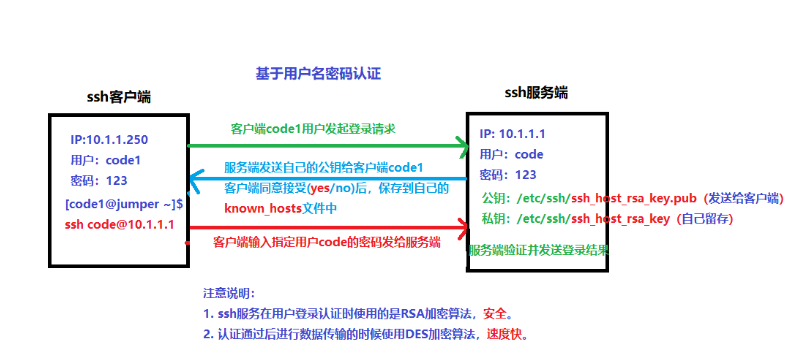
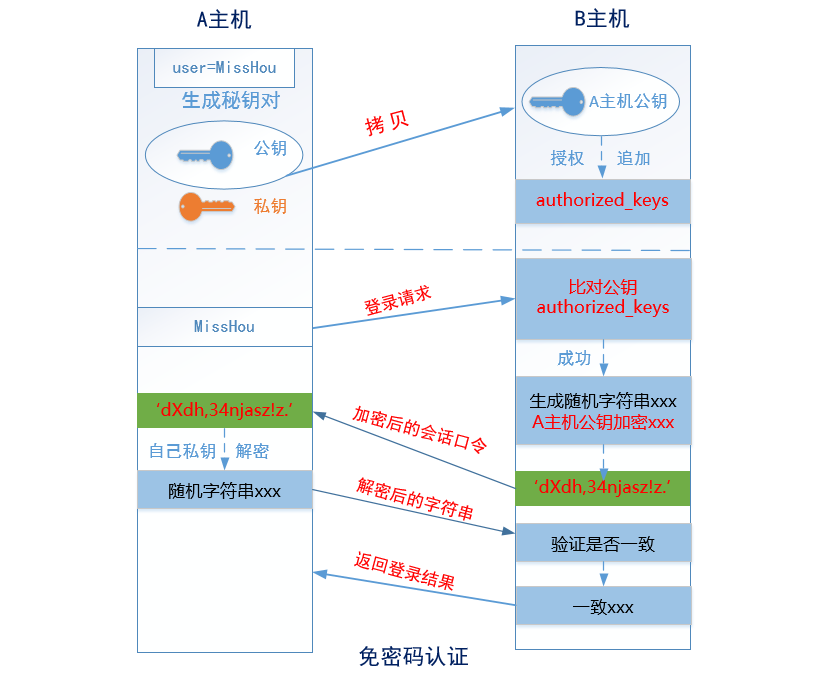
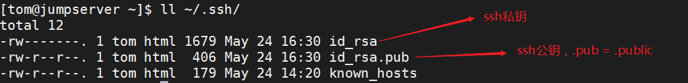

# 一、搭建 SSH 服务

## 1.1 关闭防火墙与 SELinux

```bash
# 关闭firewalld防火墙
# 临时关闭
systemctl stop firewalld
# 关闭开机自启动
systemctl disable firewalld

# 关闭selinux
# 临时关闭
setenforce 0
# 修改配置文件
# 永久关闭
vim /etc/selinux/config
SELINUX=disabled
```

## 1.2 OpenSSH 软件的安装

OpenSSH 是一个开源的用于安全远程登录和文件传输的软件套件。它提供了加密的网络通信协议，用于在网络上安全地进行远程登录、文件传输和执行远程命令。

OpenSSH 由以下几个主要组件组成：

1. sshd（SSH守护进程）：负责接受远程 SSH 连接请求，并验证用户身份，提供安全的远程登录功能。
2. ssh（SSH客户端）：用于建立与远程SSH服务器的连接，提供远程登录、文件传输和执行远程命令的功能。
3. scp（Secure Copy）：用于在本地主机和远程主机之间进行安全的文件传输。
4. sftp（SSH File Transfer Protocol）：提供了一个安全的文件传输协议，类似于FTP，但使用SSH进行加密和身份验证。

安装步骤：

```bash
yum install -y openssh
```

检查 openssh 是否安装成功

```bash
# rpm -qa |grep openssh
或
# yum list installed |grep openssh
```

获取 openssh 生成的文件列表

```bash
# rpm -ql openssh-server

# 服务端配置文件
/etc/ssh/sshd_config					    =>      ssh服务的主配置文件
/etc/sysconfig/sshd
# 服务管理脚本
/usr/lib/systemd/system/sshd.service		=>      systemctl start sshd
# 文件共享服务 提供文件上传下载的服务
/usr/libexec/openssh/sftp-server
# 二进制文件程序文件
/usr/sbin/sshd
# 公钥生成工具
/usr/sbin/sshd-keygen
# man手册
/usr/share/man/man5/sshd_config.5.gz
/usr/share/man/man8/sftp-server.8.gz
/usr/share/man/man8/sshd.8.gz
```

```bash
# rpm -ql openssh-clients

# 客户端配置文件
/etc/ssh/ssh_config
# 远程copy命令 服务器间进行文件传输
/usr/bin/scp
# sftp客户端  上传下载文件操作
/usr/bin/sftp
/usr/bin/slogin
/usr/bin/ssh
/usr/bin/ssh-add
/usr/bin/ssh-agent
/usr/bin/ssh-copy-id
/usr/bin/ssh-keyscan
# 客户端man手册
/usr/share/man/man1/scp.1.gz
/usr/share/man/man1/sftp.1.gz
/usr/share/man/man1/slogin.1.gz
/usr/share/man/man1/ssh-add.1.gz
/usr/share/man/man1/ssh-agent.1.gz
/usr/share/man/man1/ssh-copy-id.1.gz
/usr/share/man/man1/ssh-keyscan.1.gz
/usr/share/man/man1/ssh.1.gz
/usr/share/man/man5/ssh_config.5.gz
/usr/share/man/man8/ssh-pkcs11-helper.8.gz
```

## 1.3 sshd 服务管理

```bash
# 重启
systemctl restart sshd
# 状态
systemctl status sshd
# 停止
systemctl stop sshd
# 启动
systemctl start sshd
# 设置开机自启动
systemctl enable sshd
# 禁止开机自启
systemctl disable sshd
```

# 二、SSH 服务解决方案

## 2.1 创建用户并授权

第一步：创建用户与用户组（html 前端组，tom 与 jerry）

```bash
# 创建html前端组
groupadd html

# 创建组内用户 tom 与 jerry
useradd -g html tom
useradd -g html jerry
```

第二步：为用户添加密码

```bash
echo '123456' | passwd --stdin tom
echo '123456' | passwd --stdin jerry
```

第三步：为开发人员创建数据目录并且设置相应的权限

① 创建用户的数据目录：

```bash
[root@centos ~]# mkdir -p /code/html
[root@centos ~]# ll -d /code/html
drwxr-xr-x. 2 root root 4096 Sep 19 16:37 /code/html
```

② 更改目录的文件所属组（更改为html，代表html组内成员可以对这个目录进行管理）

```bash
[root@centos ~]# chgrp -R html /code/html

[root@centos ~]# ll -d /code/html/
drwxr-xr-x. 2 root html 4096 Sep 19 16:37 /code/html

[root@centos ~]# chmod -R g+w /code/html

[root@centos ~]# ll -d /code/html/
drwxrwxr-x. 2 root html 4096 Sep 19 16:37 /code/html
```

③ 添加粘滞位权限，防止误删除操作

```bash
[root@centos ~]# chmod o+t /code/html

[root@centos ~]# ll -d /code/html/
drwxrwx--T. 2 root html 4096 Sep 19 16:37 /code/html/
```

## 2.2 禁用 root 登录

修改 ssh-server 服务器端配置文件 `/etc/ssh/sshd_config`：

```bash
PermitRootLogin no
```

## 2.3 更改 SSH 默认端口

修改 ssh-server 服务器端配置文件 `/etc/ssh/sshd_config`：

```bash
Port 3712
```

## 2.4 首次登录不验证指纹

第一次连接远程服务器时：

```bash
The authenticity of host '11.1.1.100 (11.1.1.100)' can't be established.
ECDSA key fingerprint is SHA256:Y/cQNWWkX15o2MsJ5HOQBI2m8S33qIA+x3zys8J4pOY.
ECDSA key fingerprint is MD5:76:61:86:8b:d5:ee:bf:9c:60:e6:12:fa:f6:f0:74:36.
Are you sure you want to continue connecting (yes/no)?yes
Warning: Permanently added '11.1.1.100' (ECDSA) to the list of known hosts.
```

如果我们不想验证指纹，可以通过更改 SSH **客户端**的配置文件：`/etc/ssh/ssh_config`

```bash
StrictHostKeyChecking no
```

## 2.5 pwgen 生成密码

在实际生产环境中，其用户密码一定不要手工设置，建议使用专业的密码生成工具如pwgen。pwgen 是一个生成随机密码的工具。它可以根据指定的规则和选项生成强密码。pwgen 可以用于创建安全的密码，以增加账户、网络或加密密钥的安全性。它可以生成包含数字、字母和特殊字符的密码，并且可以指定密码的长度、数量和其他选项。

第一步：配置EPEL源，安装pwgen工具

```bash
wget -O /etc/yum.repos.d/epel.repo http://mirrors.aliyun.com/repo/epel-7.repo
yum clean all && yum makecache
```

第二步：安装pwgen密码生成工具

```bash
yum install -y pwgen
```

第三步：使用pwgen生成随机密码

```bash
pwgen -cnBs1 10 1
```

扩展：pwgen密码生成器的使用

```bash
# 用法: pwgen 选项参数 长度 生成个数
Usage: pwgen [ OPTIONS ] [ pw_length ] [ num_pw ]
`-s` 或 `--secure`：生成更安全的密码，包括特殊字符。
`-y` 或 `--symbols`：只包含特殊字符的密码。
`-c` 或 `--capitalize`：包含大写字母的密码。
`-n` 或 `--numerals`：只包含数字的密码。
`-B` 或 `--ambiguous`：避免使用容易混淆的字符。
`-A` 或 `--no-ambiguous`：允许使用容易混淆的字符。
`-0` 或 `--no-numerals`：不使用数字。
`-1` 或 `--no-capitalize`：不使用大写字母。
`-N <count>` 或 `--num-passwords=<count>`：生成指定数量的密码。
`-H` 或 `--sha1=path/to/file[#seed]`：使用指定文件的 SHA1 散列生成密码。
```

## 2.6 scp 传输文件

功能：scp 命令是一个用于在本地主机和远程主机之间进行文件传输的命令。它基于 SSH 协议，提供了安全的文件传输功能。

基础语法：scp [选项] 源文件 目标文件

常用选项：

- `-r`：递归上传，主要针对文件夹
- `-P`：更换了SSH服务的默认端口必须使用-P选项
- `-C`：开启压缩传输。
- `-p`：保留源文件的修改时间、权限等属性。
- `-q`：不显示传输进度和错误信息。

从本地复制文件到远程主机：

```bash
# scp [选项] 本地文件路径 远程用户名@远程服务器的IP地址:远程文件存储路径
scp file.txt user@remotehost:/path/to/destination
```

下载：

```bash
# scp [选项] 远程用户名@远程服务器的IP地址:远程文件路径 本地文件存储路径
scp user@remotehost:/path/to/file.txt /local/path
```

## 2.7 踢出用户

```bash
# 查看当前在线用户命令 
[root@centos ~]# w
 15:16:09 up 109 days, 23:35,  3 users,  load average: 1.06, 0.91, 0.80
USER     TTY        LOGIN@   IDLE   JCPU   PCPU WHAT
root     pts/0     15:15    0.00s  0.02s  0.00s w
root     pts/1     15:16    4.00s  0.02s  0.02s -bash
root     pts/2     15:16    2.00s  0.01s  0.01s -bash

# 踢出某个账号
pkill -kill -t pts/1
```

# 三、SSH 免密登录解决方案

## 3.1 SSH 认证原理

① 回顾基于用户名密码的认证方式



② 基于密钥对（公钥与私钥）的认证方式 => 免密登录



下面是 SSH 密钥认证的原理步骤：

1. 生成密钥对：用户在本地主机上生成一对密钥，包括公钥和私钥。私钥保持在本地主机上，而公钥则可以被传输到远程主机上。
2. 传输公钥到远程主机：用户将生成的公钥复制到远程主机的 `~/.ssh/authorized_keys` 文件中。这个文件存储了允许访问该账户的公钥。
3. 发起 SSH 连接：用户使用 SSH 客户端发起连接请求到远程主机。
4. 服务器验证：远程主机接收到连接请求后，会向客户端发送一个随机的挑战字符串。
5. 客户端签名：客户端使用本地保存的私钥对挑战字符串进行签名。
6. 传输签名到服务器：客户端将签名后的字符串发送回远程主机。
7. 服务器验证签名：远程主机使用之前存储的公钥对客户端发送的签名进行验证。如果验证通过，表示客户端拥有相应的私钥，认证成功。
8. 建立加密通道：认证成功后，客户端和服务器之间建立起一个安全的加密通道，用于后续的数据传输。

## 3.2 SSH 免密登录的具体实现

SSH 免密的实现思路一共分为三个步骤（三步走）

第一步：在A主机针对某个账号（tom或jerry）生成公钥与私钥

第二步：使用某些方法把公钥发送到B主机中，然后追加到authorized_keys文件中

第三步：测试是否实现免密登录

### 3.2.1 ssh-copy-id 方式

① 在A主机针对某个账号生成公钥与私钥

```bash
# ssh-keygen
```

> 注：如果不想一路确认，可以在ssh-keygen -P ""，直接生成公私钥



② 使用 ssh-copy-id 把公钥文件中的内容传输到服务器端的`~/.ssh/authorized_keys`文件中

```bash
# ssh-copy-id -p 3712 code@11.1.1.100
code@11.1.1.100's password:123456
```

③ 在客户端测试免密登录是否成功

```bash
# ssh -p 3721 code@11.1.1.100
```

### 3.2.2 修改 authorized_keys 方式

① 生成公钥与私钥

```bash
# ssh-keygen
```

② 把 `id_rsa.pub` 文件，scp 到服务器端

```bash
# scp -P 3721 ~/.ssh/id_rsa.pub code@11.1.1.100:/home/code/
```

③ 在服务器端，把`id_rsa.pub`文件中的内容追加到`~/.ssh/authorized_keys`文件中

```bash
# cd ~
# cat id_rsa.pub >> ~/.ssh/authorized_keys
```

> 注意事项：以上配置也比较简单，但是实际应用时要注意文件的权限

```bash
RealServer：
~/.ssh : 700
~/.ssh/authorized_keys : 600
```

④ 测试免密是否成功

```bash
# ssh -p 3721 code@11.1.1.100
```

