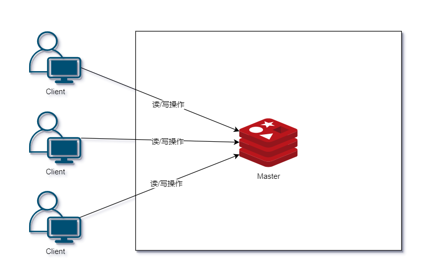
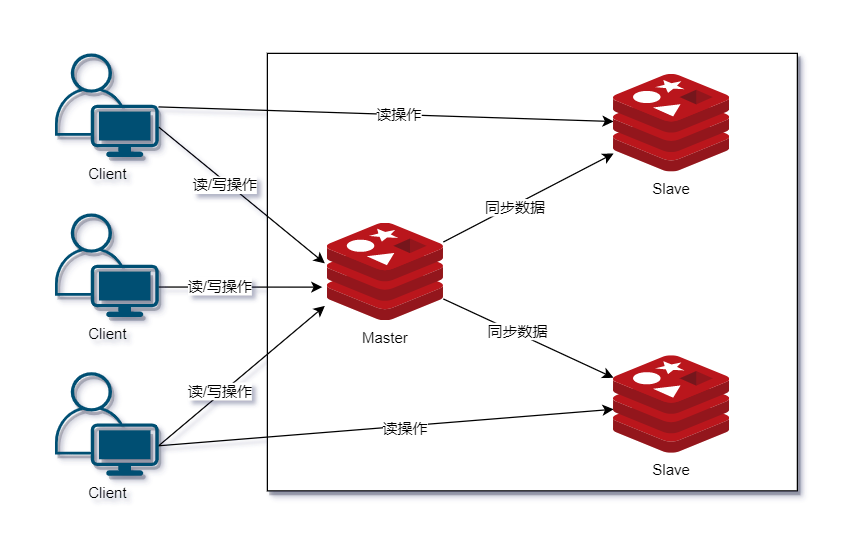
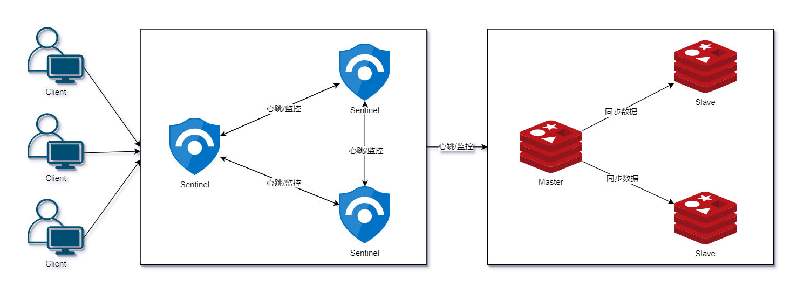
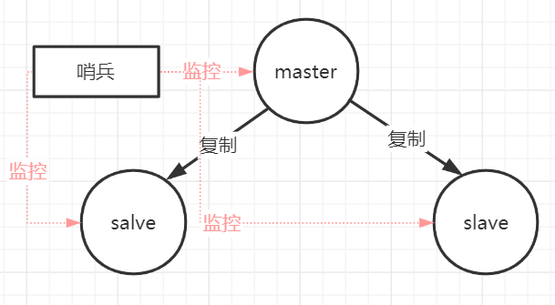
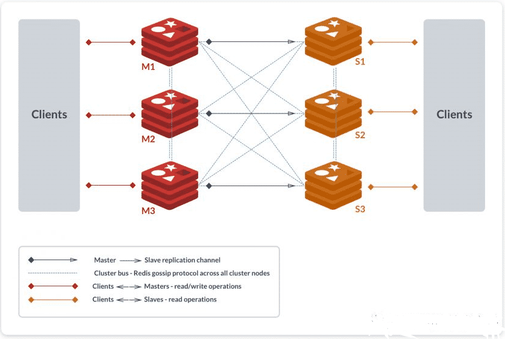
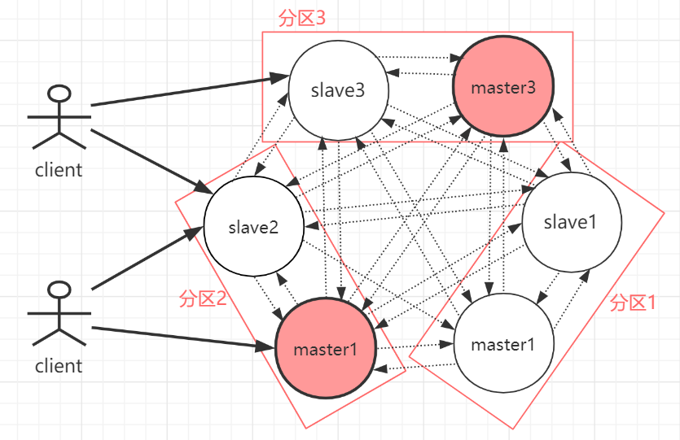
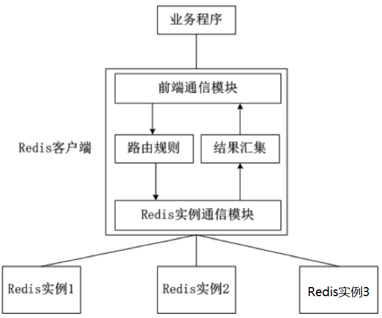
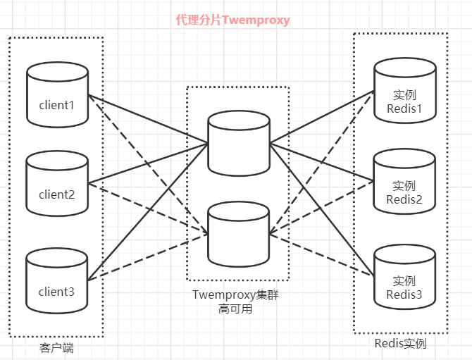
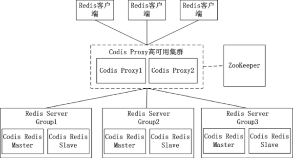
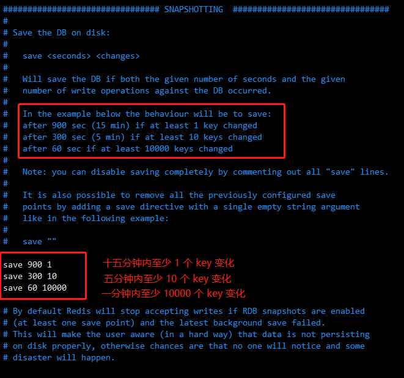

# 一、Redis 介绍

Redis（Remote Dictionary Server ) 是一个开源的，**基于内存**的数据存储组件，用作数据库、缓存、消息代理和流引擎。

Redis 支持的数据结构，比如 **String、list（双向链表）、hash（哈希）、set（集合）、sorted set（zset有序集合）**

- 数据安全：可通过 RDB、AOF 方式将内存数据持久化到磁盘中。
- 通过 Redis Sentinel 提供高可用性和 Redis Cluster 自动分区。

官方网址：<https://redis.io>

github: <https://github.com/redis/redis>

# 二、Redis 数据

| 类型       | 简介                                                         | 特性                                                         | 场景                                                         |
| :--------- | :----------------------------------------------------------- | :----------------------------------------------------------- | :----------------------------------------------------------- |
| String     | 二进制安全                                                   | 可以包含任何数据，比如 jpg 图片或者序列化的对象，一个键最大能存储 512M | 大部分场景                                                   |
| Hash       | 键值对集合，即编程语言中的 Map 类型                          | 适合存储对象，并且可以像数据库中 update 一个属性一样只修改某一项属性值 | 存储、读取、修改用户属性                                     |
| List       | 链表(双向链表)                                               | 增删快，提供了操作某一段元素的 API                           | 1、最新消息排行等功能(比如朋友圈的时间线) <br>2、消息队列    |
| Set        | 哈希表实现,元素不重复                                        | 1、添加、删除,查找的复杂度都是O(1)<br> 2、为集合提供了求交集、并集、差集等操作 | 1、共同好友<br>2、利用唯一性，统计访问网站的所有独立ip<br> 3、好友推荐时,根据 tag 求交集，大于某个阈值就可以推荐 |
| Sorted Set | 将 Set 中的元素增加一个权重参数 score，元素按 score 有序排列 | 数据插入集合时，已经进行天然排序                             | 1、排行榜 <br>2、带权重的消息队列                            |

## 2.1 数据库

Redis 支持多个数据库，并且每个数据库的数据是隔离的不能共享，并且基于单机才有，如果是集群就没有数据库的概念。

Redis 是一个字典结构的存储服务器，而实际上一个 Redis 实例提供了多个用来存储数据的字典，客户端可以指定将数据存储在哪个字典中。这与我们熟知的在一个关系数据库实例中可以创建多个数据库类似，所以可以将其中的每个字典都理解成一个独立的数据库。

每个数据库对外都是一个从 0 开始的递增数字命名，Redis 默认支持 16 个数据库（可以通过配置文件 `databases 16`支持更多，无上限）。客户端与 Redis 建立连接后会自动选择 0 号数据库，不过可以随时使用 `SELECT` 命令更换数据库，如要选择 1 号数据库：

```sql
redis> SELECT 1
OK
redis [1] > GET foo
(nil)
```

然而这些以数字命名的数据库又与我们理解的数据库有所区别。

1. Redis 不支持自定义数据库的名字，每个数据库都以编号命名，开发者必须自己记录哪些数据库存储了哪些数据。
2. Redis 也不支持为每个数据库设置不同的访问密码，所以一个客户端要么可以访问全部数据库，要么连一个数据库也没有权限访问。
3. 最重要的一点是多个数据库之间并不是完全隔离的，比如 `FLUSHALL` 命令可以清空一个 Redis 实例中所有数据库中的数据。

综上所述，这些数据库更像是一种命名空间，而不适宜存储不同应用程序的数据。比如可以使用 0 号数据库存储某个应用生产环境中的数据，使用 1 号数据库存储测试环境中的数据，但不适宜使用 0 号数据库存储 A 应用的数据而使用 1 号数据库 B 应用的数据，不同的应用应该使用不同的 Redis 实例存储数据。

## 2.2 数据类型

### 2.2.1 String

> String 是 Redis 最基本的类型，一个 key 对应一个 value。String 类型的值最大能存储 512MB。
> String 类型是二进制安全的。意思是 Redis 的 String 可以包含任何数据。比如 jpg 图片或者序列化的对象。

```sql
127.0.0.1:6379> SET Name 'liuli'
OK
127.0.0.1:6379> GET Name
"liuli"
127.0.0.1:6379> DEL Name
(integer) 1
127.0.0.1:6379> GET Name
(nil)
```

### 2.2.2 Hash

> Redis hash 是一个键值(key=>value)对集合。
> Redis hash 是一个 string 类型的 field 和 value 的映射表，hash 特别适合用于存储对象。

```sql
127.0.0.1:6379> HMSET userInfo name 'liuli' age 25 phone 110
OK
127.0.0.1:6379> HGET userInfo name
"liuli"
127.0.0.1:6379> HGET userInfo age
"25"
127.0.0.1:6379> HGET userInfo phone
"110"
127.0.0.1:6379> HKEYS userInfo
1) "name"
2) "age"
3) "phone"
127.0.0.1:6379> HVALS userInfo
1) "liuli"
2) "25"
3) "110"
127.0.0.1:6379> HGETALL userInfo
1) "name"
2) "liuli"
3) "age"
4) "25"
5) "phone"
6) "110"
```

### 2.2.3 List

> Redis 列表是简单的字符串列表，按照插入顺序排序。你可以添加一个元素到列表的头部（左边）或者尾部（右边）。

```sql
127.0.0.1:6379> LPUSH language C
(integer) 1
127.0.0.1:6379> LPUSH language Java
(integer) 2
127.0.0.1:6379> LPUSH language Python
(integer) 3
127.0.0.1:6379> LPUSH language PHP
(integer) 4
127.0.0.1:6379> RPUSH language Node
(integer) 5
127.0.0.1:6379> LRANGE language 0 10
1) "PHP"
2) "Python"
3) "Java"
4) "C"
5) "Node"
```

### 2.2.4 Set

> Redis 的 Set 是 String 类型的无序集合。
> 集合是通过哈希表实现的，所以添加，删除，查找的复杂度都是 O(1)。

```sql
127.0.0.1:6379> SADD database redis
(integer) 1
127.0.0.1:6379> SADD database mysql
(integer) 1
127.0.0.1:6379> SADD database oracle
(integer) 1
127.0.0.1:6379> SMEMBERS database
1) "mysql"
2) "oracle"
3) "redis"
```

### 2.2.5 zset

> Redis zset 和 set 一样也是 strin g类型元素的集合，且不允许重复的成员。
> 不同的是每个元素都会关联一个 double 类型的分数。redis 正是通过分数来为集合中的成员进行从小到大的排序。
> zset 的成员是唯一的,但分数（score）却可以重复。

```sql
127.0.0.1:6379> ZADD subject 99 math
(integer) 1
127.0.0.1:6379> ZADD subject 68 english
(integer) 1
127.0.0.1:6379> ZADD subject 77 physics
(integer) 1
127.0.0.1:6379> ZADD subject 87 Chinese
(integer) 1
127.0.0.1:6379> ZRANGEBYSCORE subject 0 100
1) "english"
2) "physics"
3) "Chinese"
4) "math"
```

# 三、Redis 架构

在服务开发中，单机都会存在单点故障的问题，及服务部署在一场台服务器上，一旦服务器宕机服务就不可用，所以为了让服务高可用，分布式服务就出现了，将同一服务部署到多台机器上，即使其中几台服务器宕机，只要有一台服务器可用服务就可用。

Redis 也是一样，为了解决单机故障引入了主从模式，但主从模式存在一个问题：master 节点故障后服务，需要人为的手动将 slave 节点切换成为 maser 节点后服务才恢复。Redis 为解决这一问题又引入了哨兵模式，哨兵模式能在 master 节点故障后能自动将 salve 节点提升成 master 节点，不需要人工干预操作就能恢复服务可用。

但是主从模式、哨兵模式都没有达到真正的数据 sharding 存储，每个 Redis 实例中存储的都是全量数据，所以 Redis Cluster 就诞生了，实现了真正的数据分片存储。但是由于 Redis Custer 发布得比较晚，各大厂等不及了，陆陆续续开发了自己的 Redis 数据分片集群模式，比如：Twemproxy、Codis 等。

## 3.1 单机模式



## 3.2 主从同步模式



Redis 单节点虽然有通过 RDB 和 AOF 持久化机制能将数据持久化到硬盘上，但数据是存储在一台服务器上的，如果服务器出现硬盘故障等问题，会导致数据不可用，而且读写无法分离，读写都在同一台服务器上，请求量大时会出现 I/O 瓶颈。

为了避免单点故障和读写不分离，Redis 提供了复制（replication）功能实现 master 数据库中的数据更新后，会自动将更新的数据同步到其他slave数据库上。

如上 Redis 主从结构特点：一个 master 可以有多个 salve 节点；salve 节点可以有 slave 节点，从节点是级联结构。

**主从模式优缺点**

1. 优点: 主从结构具有读写分离，提高效率、数据备份，提供多个副本等优点。
2. 不足: 最大的不足就是主从模式不具备自动容错和恢复功能，主节点故障，集群则无法进行工作，可用性比较低，从节点升主节点需要人工手动干预。

## 3.3 高可用哨兵



Redis Sentinel 是一个分布式系统， 你可以在一个架构中运行多个 Sentinel 进程（progress）， 这些进程使用流言协议（gossip protocols)来接收关于主服务器是否下线的信息， 并使用投票协议（agreement protocols）来决定是否执行自动故障迁移， 以及选择哪个从服务器作为新的主服务器。

单个 sentinel 进程来监控 Redis 集群是不可靠的，当 sentinel 进程宕掉后(sentinel本身也有单点问题，single-point-of-failure)整个集群系统将无法按照预期的方式运行。所以有必要将 sentinel 集群，这样有几个好处：

- 有一些 sentinel 进程宕掉了，依然可以进行 Redis 集群的主备切换；
- 如果只有一个 sentinel 进程，如果这个进程运行出错，或者是网络堵塞，那么将无法实现 Redis 集群的主备切换（单点问题）;
- 如果有多个 sentinel，Redis 的客户端可以随意地连接任意一个 sentinel 来获得关于 Redis 集群中的信息

一个健壮的部署至少需要三个哨兵实例。

第一种主从同步/复制的模式，当主服务器宕机后，需要手动把一台从服务器切换为主服务器，这就需要人工干预，费事费力，还会造成一段时间内服务不可用，这时候就需要哨兵模式登场了。

哨兵模式是从Redis的2.6版本开始提供的，但是当时这个版本的模式是不稳定的，直到 Redis 的 2.8 版本以后，这个哨兵模式才稳定下来。

哨兵模式核心还是主从复制，只不过在相对于主从模式在主节点宕机导致不可写的情况下，多了一个竞选机制：从所有的从节点竞选出新的主节点。竞选机制的实现，是依赖于在系统中启动一个sentinel进程。



如上图，哨兵本身也有单点故障的问题，所以在一个一主多从的Redis系统中，可以使用多个哨兵进行监控，哨兵不仅会监控主数据库和从数据库，哨兵之间也会相互监控。每一个哨兵都是一个独立的进程，作为进程，它会独立运行。

**跟主数据库建立连接后会定时执行以下三个操作：**

（1）每隔 10s 向 master 和 slave 发送 info 命令。作用是获取当前数据库信息，比如发现新增从节点时，会建立连接，并加入到监控列表中，当主从数据库的角色发生变化进行信息更新。

（2）每隔 2s 向主数据里和从数据库的 `_sentinel_:hello` 频道发送自己的信息。作用是将自己的监控数据和哨兵分享。每个哨兵会订阅数据库的 `_sentinel:hello` 频道，当其他哨兵收到消息后，会判断该哨兵是不是新的哨兵，如果是则将其加入哨兵列表，并建立连接。

（3）每隔 1s 向所有主从节点和所有哨兵节点发送 ping 命令，作用是监控节点是否存活。

哨兵节点发送ping命令时，当超过一定时间(`down-after-millisecond`)后，如果节点未回复，则哨兵认为主观下线。主观下线表示当前哨兵认为该节点已经下面，如果该节点为主数据库，哨兵会进一步判断是够需要对其进行故障切换，这时候就要发送命令(`SENTINEL is-master-down-by-addr`)询问其他哨兵节点是否认为该主节点是主观下线，当达到指定数量(quorum)时，哨兵就会认为是客观下线。

当主节点客观下线时就需要进行主从切换，主从切换的步骤为：

- 选出领头哨兵。
- 领头哨兵所有的slave选出优先级最高的从数据库。优先级可以通过`slave-priority`选项设置。
- 如果优先级相同，则从复制的命令偏移量越大（即复制同步数据越多，数据越新），越优先。
- 如果以上条件都一样，则选择run ID较小的从数据库。

选出一个从数据库后，哨兵发送`slave no one`命令升级为主数据库，并发送slaveof命令将其他从节点的主数据库设置为新的主数据库。

**哨兵模式优缺点**

**1.优点**

- 哨兵模式是基于主从模式的，解决可主从模式中 master 故障不可以自动切换故障的问题。

**2.不足-问题**

- 是一种中心化的集群实现方案：始终只有一个 Redis 主机来接收和处理写请求，写操作受单机瓶颈影响。
- 集群里所有节点保存的都是全量数据，浪费内存空间，没有真正实现分布式存储。数据量过大时，主从同步严重影响 master 的性能。
- Redis 主机宕机后，哨兵模式正在投票选举的情况之外，因为投票选举结束之前，谁也不知道主机和从机是谁，此时 Redis 也会开启保护机制，禁止写操作，直到选举出了新的 Redis 主机。

主从模式或哨兵模式每个节点存储的数据都是全量的数据，数据量过大时，就需要对存储的数据进行分片后存储到多个 Redis 实例上。此时就要用到 Redis Sharding 技术。

## 3.4 集群模式



Redis 的哨兵模式虽然已经可以实现高可用，读写分离 ，但是存在几个方面的不足：

- 哨兵模式下每台 Redis 服务器都存储相同的数据，很浪费内存空间；数据量太大，主从同步时严重影响了master性能。
- 哨兵模式是中心化的集群实现方案，每个从机和主机的耦合度很高，master 宕机到 salve 选举 master 恢复期间服务不可用。
- 哨兵模式始终只有一个 Redis 主机来接收和处理写请求，写操作还是受单机瓶颈影响，没有实现真正的分布式架构。

Redis 在 3.0上加入了 Cluster 集群模式，实现了 Redis 的分布式存储，也就是说每台 Redis 节点上存储不同的数据。Cluster 模式为了解决单机 Redis 容量有限的问题，将数据按一定的规则分配到多台机器，内存/QPS不受限于单机，可受益于分布式集群高扩展性。

Redis Cluster 是一种服务器 Sharding 技术(分片和路由都是在服务端实现)，采用多主多从，每一个分区都是由一个 Redis 主机和多个从机组成，片区和片区之间是相互平行的。Redis Cluster 集群采用了 P2P 的模式，完全去中心化。



如上图，官方推荐，集群部署至少要 3 台以上的 maste r节点，最好使用 3 主 3 从六个节点的模式。Redis Cluster 集群具有如下几个特点：

- 集群完全去中心化，采用多主多从；所有的 redis 节点彼此互联(PING-PONG机制)，内部使用二进制协议优化传输速度和带宽。
- 客户端与 Redis 节点直连，不需要中间代理层。客户端不需要连接集群所有节点，连接集群中任何一个可用节点即可。
- 每一个分区都是由一个 Redis 主机和多个从机组成，分片和分片之间是相互平行的。
- 每一个 master 节点负责维护一部分槽，以及槽所映射的键值数据；集群中每个节点都有全量的槽信息，通过槽每个node都知道具体数据存储到哪个 node 上。

redis cluster 主要是针对海量数据+高并发+高可用的场景，海量数据，如果你的数据量很大，那么建议就用 redis cluster，数据量不是很大时，使用 sentinel 就够了。redis cluster 的性能和高可用性均优于哨兵模式。

Redis Cluster 采用虚拟哈希槽分区而非一致性hash算法，预先分配一些卡槽，所有的键根据哈希函数映射到这些槽内，每一个分区内的master 节点负责维护一部分槽以及槽所映射的键值数据。

## 3.5 其他Redis集群方案

Redis在3.0版本前只支持单实例模式，虽然Redis的开发者Antirez早在博客上就提出在Redis 3.0版本中加入集群的功能，但3.0版本等到2015年才发布正式版。各大企业等不急了，在3.0版本还没发布前为了解决Redis的存储瓶颈，纷纷推出了各自的Redis集群方案。这些方案的核心思想是把数据分片（sharding）存储在多个Redis实例中，每一片就是一个Redis实例。

#### 3.5.1 客户端分片

客户端分片是把分片的逻辑放在Redis客户端实现，（比如：jedis已支持Redis Sharding功能，即ShardedJedis），通过Redis客户端预先定义好的路由规则(使用一致性哈希)，把对Key的访问转发到不同的Redis实例中，查询数据时把返回结果汇集。这种方案的模式如图所示。



**客户端分片的优缺点：**

优点：客户端sharding技术使用hash一致性算法分片的好处是所有的逻辑都是可控的，不依赖于第三方分布式中间件。服务端的Redis实例彼此独立，相互无关联，每个Redis实例像单服务器一样运行，非常容易线性扩展，系统的灵活性很强。开发人员清楚怎么实现分片、路由的规则，不用担心踩坑。

1.一致性哈希算法:

是分布式系统中常用的算法。比如，一个分布式的存储系统，要将数据存储到具体的节点上，如果采用普通的hash方法，将数据映射到具体的节点上，如mod(key,d)，key是数据的key，d是机器节点数，如果有一个机器加入或退出这个集群，则所有的数据映射都无效了。

一致性哈希算法解决了普通余数Hash算法伸缩性差的问题，可以保证在上线、下线服务器的情况下尽量有多的请求命中原来路由到的服务器。

2.实现方式：一致性hash算法，比如MURMUR_HASH散列算法、ketamahash算法

比如Jedis的Redis Sharding实现，采用一致性哈希算法(consistent hashing)，将key和节点name同时hashing，然后进行映射匹配，采用的算法是MURMUR_HASH。

采用一致性哈希而不是采用简单类似哈希求模映射的主要原因是当增加或减少节点时，不会产生由于重新匹配造成的rehashing。一致性哈希只影响相邻节点key分配，影响量小。

**不足：**

- 这是一种静态的分片方案，需要增加或者减少Redis实例的数量，需要手工调整分片的程序。
- 运维成本比较高，集群的数据出了任何问题都需要运维人员和开发人员一起合作，减缓了解决问题的速度，增加了跨部门沟通的成本。
- 在不同的客户端程序中，维护相同的路由分片逻辑成本巨大。比如：java项目、PHP项目里共用一套Redis集群，路由分片逻辑分别需要写两套一样的逻辑，以后维护也是两套。

客户端分片有一个最大的问题就是，服务端Redis实例群拓扑结构有变化时，每个客户端都需要更新调整。如果能把客户端分片模块单独拎出来，形成一个单独的模块(中间件)，作为客户端 和 服务端连接的桥梁就能解决这个问题了，此时代理分片就出现了。

#### 3.5.2 代理分片

redis代理分片用得最多的就是Twemproxy，由Twitter开源的Redis代理，其基本原理是：通过中间件的形式，Redis客户端把请求发送到Twemproxy，Twemproxy根据路由规则发送到正确的Redis实例，最后Twemproxy把结果汇集返回给客户端。

Twemproxy通过引入一个代理层，将多个Redis实例进行统一管理，使Redis客户端只需要在Twemproxy上进行操作，而不需要关心后面有多少个Redis实例，从而实现了Redis集群。



Twemproxy的优点：

- 客户端像连接Redis实例一样连接Twemproxy，不需要改任何的代码逻辑。
- 支持无效Redis实例的自动删除。
- Twemproxy与Redis实例保持连接，减少了客户端与Redis实例的连接数。

Twemproxy的不足：

- 由于Redis客户端的每个请求都经过Twemproxy代理才能到达Redis服务器，这个过程中会产生性能损失。
- 没有友好的监控管理后台界面，不利于运维监控。
- Twemproxy最大的痛点在于，无法平滑地扩容/缩容。对于运维人员来说，当因为业务需要增加Redis实例时工作量非常大。

**Twemproxy作为最被广泛使用、最久经考验、稳定性最高的Redis代理，在业界被广泛使用。**

#### 3.5.3 Codis

Twemproxy不能平滑增加Redis实例的问题带来了很大的不便，于是豌豆荚自主研发了Codis，一个支持平滑增加Redis实例的Redis代理软件，其基于Go和C语言开发，并于2014年11月在GitHub上开源。



在Codis的架构图中，Codis引入了`Redis Server Group`，其通过指定一个主CodisRedis和一个或多个从CodisRedis，实现了Redis集群的高可用。当一个主CodisRedis挂掉时，Codis不会自动把一个从CodisRedis提升为主CodisRedis，这涉及数据的一致性问题（Redis本身的数据同步是采用主从异步复制，当数据在主CodisRedis写入成功时，从CodisRedis是否已读入这个数据是没法保证的），需要管理员在管理界面上手动把从CodisRedis提升为主CodisRedis。

如果手动处理觉得麻烦，豌豆荚也提供了一个工具`Codis-ha`，这个工具会在检测到主CodisRedis挂掉的时候将其下线并提升一个从CodisRedis为主CodisRedis。

Codis中采用预分片的形式，启动的时候就创建了1024个slot，1个slot相当于1个箱子，每个箱子有固定的编号，范围是1~1024。slot这个箱子用作存放Key，至于Key存放到哪个箱子，可以通过算法“`crc32(key)%1024`”获得一个数字，这个数字的范围一定是1~1024之间，Key就放到这个数字对应的slot。

例如，如果某个Key通过算法“`crc32(key)%1024`”得到的数字是5，就放到编码为5的slot（箱子）。1个slot只能放1个`Redis Server Group`，不能把1个slot放到多个`Redis Server Group`中。1个`Redis Server Group`最少可以存放1个slot，最大可以存放1024个slot。因此，Codis中最多可以指定1024个`Redis Server Group`。

Codis最大的优势在于支持平滑增加（减少）`Redis Server Group`（Redis实例），能安全、透明地迁移数据，这也是Codis 有别于Twemproxy等静态分布式 Redis 解决方案的地方。Codis增加了`Redis Server Group`后，就牵涉到slot的迁移问题。

例如，系统有两个`Redis Server Group`，`Redis Server Group`和slot的对应关系如下。

**当增加了一个Redis Server Group，slot就要重新分配了。Codis分配slot有两种方法：**

第一种：通过Codis管理工具Codisconfig手动重新分配，指定每个Redis Server Group所对应的slot的范围，例如：可以指定Redis Server Group和slot的新的对应关系如下。

第二种：通过Codis管理工具Codisconfig的rebalance功能，会自动根据每个Redis Server Group的内存对slot进行迁移，以实现数据的均衡。

# 四、数据持久化

数据  持久化（数据在服务或者软件重启之后不丢失）

如果数据只存在内存中，肯定会丢失，实现持久化，就需要把数据存储到磁盘中（hdd ssd）

## 4.1 snappshoting（快照）

默认 snappshoting 是开启的，有一个备份的频率

通过查看配置文件可以看到



备份文件名称

```yaml
# The filename where to dump the DB
dbfilename dump.rdb
```

**手动数据备份**

```sql
127.0.0.1:6379> SAVE
```


数据恢复  需要先停掉 redis 服务

如果需要恢复数据，只需将备份文件 (dump.rdb) 移动到 redis 安装目录并启动服务即可

## 4.2 append only file

开启 aof 后，之前的 redis 里的数据会丢失

```yaml
# 开启 aof 模式
appendonly yes
# 备份文件
appendfilename "appendonly.aof"
# 备份频率
# always 每操作一次备份一次
# everysec 每秒钟备份一次
# no redis 空闲时备份一次
appendfsync everysec
```

## 4.3 总结

snappshoting 一般的数据持久化使用，效率高，数据迁移方便

aof 适合于备份、数据实时性备份要求更高的情况

# 五、单机模式搭建

## 5.1 源码下载

各版本下载地址：https://github.com/redis/redis/releases

本文使用 5 版本的最后一个稳定版

```bash
wget https://github.com/redis/redis/archive/refs/tags/5.0.14.tar.gz -O redis-5.0.14.tar.gz
```

## 5.2 编译安装

```bash
yum install -y gcc
```

解压源码包

```bash
tar -zxvf redis-5.0.14.tar.gz
cd redis-5.0.14
```

编译安装到 `data` 目录

```bash
mkdir -p /data/redis/{logs,conf,data}
```

```bash
make PREFIX=/data/redis install
```

配置文件

```bash
cp *.conf /data/redis/conf/
```

配置环境变量

```bash
echo 'export PATH=$PATH:/data/redis/bin' >> ~/.bashrc
source ~/.bashrc
```

## 5.3 配置文件

- redis 配置文件

```bash
vim /data/redis/conf/redis.conf
---
# 绑定网卡地址
bind 0.0.0.0
# 保护模式
protected-mode no
# daemon 模式启动
daemonize yes
# 与 systemd 交互
supervised systemd
# pid 文件路径
pidfile /data/redis/logs/redis_6379.pid
# log 日志文件路径
logfile /data/redis/logs/redis_6379.log
# 数据文件存放目录
dir /data/redis/data/
# 设置 redis 密码
requirepass P@ssw0rd996
```

- 系统参数调优

```bash
echo 2048 > /proc/sys/net/core/somaxconn
echo 1 > /proc/sys/vm/overcommit_memory
echo never > /sys/kernel/mm/transparent_hugepage/enabled
```

```bash
echo "net.core.somaxconn = 2048" >> /etc/sysctl.conf
echo "vm.overcommit_memory = 1" >> /etc/sysctl.conf
sysctl -p
```

```bash
cat >> /etc/rc.local << EOF
echo never > /sys/kernel/mm/transparent_hugepage/enabled
EOF
```

```bash
chmod +x /etc/rc.local
```

## 5.4 启动服务

编辑 service 文件，修改安装目录相关内容

```bash
cat > /usr/lib/systemd/system/redis.service << "EOF"
[Unit]
Description=Redis persistent key-value database
After=network.target

[Service]
PIDFile=/data/redis/logs/redis_6379.pid
ExecStart=/data/redis/bin/redis-server /data/redis/conf/redis.conf
ExecStop=/bin/kill -s QUIT \$MAINPID
LimitNOFILE=655360
PrivateTmp=true
Type=notify
User=root
Group=root

[Install]
WantedBy=multi-user.target
EOF
```

启动服务

```bash
systemctl start redis.service && systemctl enable redis.service && systemctl status redis.service
```

# 六、主从复制模式

| 主机         | Redis 版本 | 角色    |
| ------------ | ---------- | ------- |
| 10.11.141.11 | 5.0.14     | master  |
| 10.11.141.12 | 5.0.14     | slave01 |
| 10.11.141.13 | 5.0.14     | slave02 |

## 5.1 源码下载

各版本下载地址：https://github.com/redis/redis/releases，本文使用 5 版本的最后一个稳定版。

需要在三台主机上都安装 Redis，然后通过修改配置文件，配置主从复制关系

```bash
wget https://github.com/redis/redis/archive/refs/tags/5.0.14.tar.gz -O redis-5.0.14.tar.gz
```

## 5.2 编译安装

```bash
yum install -y gcc
```

解压源码包

```bash
tar -zxvf redis-5.0.14.tar.gz
cd redis-5.0.14
```

编译安装到 `data` 目录

```bash
mkdir -p /data/redis/{logs,conf,data}
```

```bash
make PREFIX=/data/redis install
```

配置文件

```bash
cp *.conf /data/redis/conf/
```

配置环境变量

```bash
echo 'export PATH=$PATH:/data/redis/bin' >> ~/.bashrc
source ~/.bashrc
```

## 5.3 配置文件

- redis 配置文件

```bash
vim /data/redis/conf/redis.conf
---
# 绑定网卡地址
bind 0.0.0.0
# 保护模式
protected-mode no
# daemon 模式启动
daemonize yes
# 与 systemd 交互
supervised systemd
# pid 文件路径
pidfile /data/redis/logs/redis_6379.pid
# log 日志文件路径
logfile /data/redis/logs/redis_6379.log
# 数据文件存放目录
dir /data/redis/data/
# 设置 redis 密码
requirepass P@ssw0rd996
```

- 系统参数调优

```bash
echo 2048 > /proc/sys/net/core/somaxconn
echo 1 > /proc/sys/vm/overcommit_memory
echo never > /sys/kernel/mm/transparent_hugepage/enabled
```

```bash
echo "net.core.somaxconn = 2048" >> /etc/sysctl.conf
echo "vm.overcommit_memory = 1" >> /etc/sysctl.conf
sysctl -p
```

```bash
cat >> /etc/rc.local << EOF
echo never > /sys/kernel/mm/transparent_hugepage/enabled
EOF
```

```bash
chmod +x /etc/rc.local
```

## 5.4 配置主从关系

master 节点可以有多个从节点，只需修改所有 slave 主机的 `redis.conf` 配置文件，新增内容如下：

```bash
vim /data/redis/conf/redis.conf
---
# 指定 master 的 ip port
replicaof 10.11.141.11 6379
# master redis 的密码
masterauth P@ssw0rd996
```

## 5.5 启动服务

编辑 service 文件，修改安装目录相关内容

```bash
cat > /usr/lib/systemd/system/redis.service << "EOF"
[Unit]
Description=Redis persistent key-value database
After=network.target

[Service]
PIDFile=/data/redis/logs/redis_6379.pid
ExecStart=/data/redis/bin/redis-server /data/redis/conf/redis.conf
ExecStop=/bin/kill -s QUIT \$MAINPID
LimitNOFILE=655360
PrivateTmp=true
Type=notify
User=root
Group=root

[Install]
WantedBy=multi-user.target
EOF
```

启动服务

```bash
systemctl start redis.service && systemctl enable redis.service && systemctl status redis.service
```

## 5.6 查看主从复制状态

- master

```bash
[root@redis-master ~]# redis-cli -a P@ssw0rd996
Warning: Using a password with '-a' or '-u' option on the command line interface may not be safe.
127.0.0.1:6379> INFO replication
# Replication
role:master
connected_slaves:2
slave0:ip=10.11.141.13,port=6379,state=online,offset=392,lag=1
slave1:ip=10.11.141.12,port=6379,state=online,offset=392,lag=1
master_replid:69a550e7d51c065d6cf23fa25c743924f3d58df4
master_replid2:0000000000000000000000000000000000000000
master_repl_offset:392
second_repl_offset:-1
repl_backlog_active:1
repl_backlog_size:1048576
repl_backlog_first_byte_offset:1
repl_backlog_histlen:392
```

- slave01

```bash
[root@redis-slave01 ~]# redis-cli -a P@ssw0rd996
Warning: Using a password with '-a' or '-u' option on the command line interface may not be safe.
127.0.0.1:6379> INFO replication
# Replication
role:slave
master_host:10.11.141.11
master_port:6379
master_link_status:up
master_last_io_seconds_ago:3
master_sync_in_progress:0
slave_repl_offset:392
slave_priority:100
slave_read_only:1
connected_slaves:0
master_replid:69a550e7d51c065d6cf23fa25c743924f3d58df4
master_replid2:0000000000000000000000000000000000000000
master_repl_offset:392
second_repl_offset:-1
repl_backlog_active:1
repl_backlog_size:1048576
repl_backlog_first_byte_offset:1
repl_backlog_histlen:392
```

- slave02

```bash
[root@redis-slave02 ~]# redis-cli -a P@ssw0rd996
Warning: Using a password with '-a' or '-u' option on the command line interface may not be safe.
127.0.0.1:6379> INFO replication
# Replication
role:slave
master_host:10.11.141.11
master_port:6379
master_link_status:up
master_last_io_seconds_ago:3
master_sync_in_progress:0
slave_repl_offset:392
slave_priority:100
slave_read_only:1
connected_slaves:0
master_replid:69a550e7d51c065d6cf23fa25c743924f3d58df4
master_replid2:0000000000000000000000000000000000000000
master_repl_offset:392
second_repl_offset:-1
repl_backlog_active:1
repl_backlog_size:1048576
repl_backlog_first_byte_offset:1
repl_backlog_histlen:392
```

# 七、高可用哨兵模式

哨兵模式为主从复制模式的升级版，需要先搭建主从模式。


| 主机         | Redis 版本 | 角色              |
| ------------ | ---------- | ----------------- |
| 10.11.141.11 | 5.0.14     | master、sentinel  |
| 10.11.141.12 | 5.0.14     | slave01、sentinel |
| 10.11.141.13 | 5.0.14     | slave02、sentinel |

## 7.1 源码下载

各版本下载地址：https://github.com/redis/redis/releases，本文使用 5 版本的最后一个稳定版。

需要在三台主机上都安装 Redis，然后通过修改配置文件，配置主从复制关系

```bash
wget https://github.com/redis/redis/archive/refs/tags/5.0.14.tar.gz -O redis-5.0.14.tar.gz
```

## 7.2 编译安装

```bash
yum install -y gcc
```

解压源码包

```bash
tar -zxvf redis-5.0.14.tar.gz
cd redis-5.0.14
```

编译安装到 `data` 目录

```bash
mkdir -p /data/redis/{logs,conf,data}
```

```bash
make PREFIX=/data/redis install
```

配置文件

```bash
cp *.conf /data/redis/conf/
```

配置环境变量

```bash
echo 'export PATH=$PATH:/data/redis/bin' >> ~/.bashrc
source ~/.bashrc
```

## 7.3 配置文件

- redis 配置文件

```bash
vim /data/redis/conf/redis.conf
---
# 绑定网卡地址
bind 0.0.0.0
# 保护模式
protected-mode no
# daemon 模式启动
daemonize yes
# 与 systemd 交互
supervised systemd
# pid 文件路径
pidfile /data/redis/logs/redis_6379.pid
# log 日志文件路径
logfile /data/redis/logs/redis_6379.log
# 数据文件存放目录
dir /data/redis/data/
# 设置 redis 密码
requirepass P@ssw0rd996
```

- 系统参数调优

```bash
echo 2048 > /proc/sys/net/core/somaxconn
echo 1 > /proc/sys/vm/overcommit_memory
echo never > /sys/kernel/mm/transparent_hugepage/enabled
```

```bash
echo "net.core.somaxconn = 2048" >> /etc/sysctl.conf
echo "vm.overcommit_memory = 1" >> /etc/sysctl.conf
sysctl -p
```

```bash
cat >> /etc/rc.local << EOF
echo never > /sys/kernel/mm/transparent_hugepage/enabled
EOF
```

```bash
chmod +x /etc/rc.local
```

## 7.4 配置主从关系

master 节点可以有多个从节点，只需修改所有 slave 主机的 `redis.conf` 配置文件，新增内容如下：

```bash
vim /data/redis/conf/redis.conf
---
# 指定 master 的 ip port
replicaof 10.11.141.11 6379
# master redis 的密码
masterauth P@ssw0rd996
```

## 7.5 哨兵配置文件

```bash
vim /data/redis/conf/sentinel.conf
---
# daemon 模式启动
daemonize yes
# pid 文件路径
pidfile /data/redis/logs/redis-sentinel.pid
# log 日志文件路径
logfile /data/redis/logs/redis-sentinel.log
# 监控的主节点名称、IP、端口、权重值
sentinel monitor mymaster 10.11.141.11 6379 2
# 设置连接 master 的密码
sentinel auth-pass mymaster P@ssw0rd996
EOF
```

## 7.6 启动服务

编辑 service 文件，修改安装目录相关内容

- redis.service

```bash
cat > /usr/lib/systemd/system/redis.service << "EOF"
[Unit]
Description=Redis persistent key-value database
After=network.target

[Service]
PIDFile=/data/redis/logs/redis_6379.pid
ExecStart=/data/redis/bin/redis-server /data/redis/conf/redis.conf
ExecStop=/bin/kill -s QUIT \$MAINPID
LimitNOFILE=655360
PrivateTmp=true
Type=notify
User=root
Group=root

[Install]
WantedBy=multi-user.target
EOF
```

- redis-sentinel.service

```bash
cat > /usr/lib/systemd/system/redis-sentinel.service << EOF
[Unit]
Description=Redis Sentinel
After=network.target

[Service]
PIDFile=/data/redis/logs/redis-sentinel.pid
ExecStart=/data/redis/bin/redis-sentinel /data/redis/conf/sentinel.conf --supervised systemd
ExecStop=/bin/kill -s QUIT \$MAINPID
Type=notify
User=root
Group=root

[Install]
WantedBy=multi-user.target
EOF
```

启动 redis 服务

```bash
systemctl start redis.service && systemctl enable redis.service
```

启动 sentinel 服务

```bash
systemctl start redis-sentinel.service && systemctl enable redis-sentinel
```

## 7.7 查看主从复制状态

- master

```bash
[root@redis-master ~]# redis-cli -a P@ssw0rd996
Warning: Using a password with '-a' or '-u' option on the command line interface may not be safe.
127.0.0.1:6379> INFO replication
# Replication
role:master
connected_slaves:2
slave0:ip=10.11.141.13,port=6379,state=online,offset=392,lag=1
slave1:ip=10.11.141.12,port=6379,state=online,offset=392,lag=1
master_replid:69a550e7d51c065d6cf23fa25c743924f3d58df4
master_replid2:0000000000000000000000000000000000000000
master_repl_offset:392
second_repl_offset:-1
repl_backlog_active:1
repl_backlog_size:1048576
repl_backlog_first_byte_offset:1
repl_backlog_histlen:392
```

- slave01

```bash
[root@redis-slave01 ~]# redis-cli -a P@ssw0rd996
Warning: Using a password with '-a' or '-u' option on the command line interface may not be safe.
127.0.0.1:6379> INFO replication
# Replication
role:slave
master_host:10.11.141.11
master_port:6379
master_link_status:up
master_last_io_seconds_ago:3
master_sync_in_progress:0
slave_repl_offset:392
slave_priority:100
slave_read_only:1
connected_slaves:0
master_replid:69a550e7d51c065d6cf23fa25c743924f3d58df4
master_replid2:0000000000000000000000000000000000000000
master_repl_offset:392
second_repl_offset:-1
repl_backlog_active:1
repl_backlog_size:1048576
repl_backlog_first_byte_offset:1
repl_backlog_histlen:392
```

- slave02

```bash
[root@redis-slave02 ~]# redis-cli -a P@ssw0rd996
Warning: Using a password with '-a' or '-u' option on the command line interface may not be safe.
127.0.0.1:6379> INFO replication
# Replication
role:slave
master_host:10.11.141.11
master_port:6379
master_link_status:up
master_last_io_seconds_ago:3
master_sync_in_progress:0
slave_repl_offset:392
slave_priority:100
slave_read_only:1
connected_slaves:0
master_replid:69a550e7d51c065d6cf23fa25c743924f3d58df4
master_replid2:0000000000000000000000000000000000000000
master_repl_offset:392
second_repl_offset:-1
repl_backlog_active:1
repl_backlog_size:1048576
repl_backlog_first_byte_offset:1
repl_backlog_histlen:392
```

## 7.8 验证高可用

1. 关闭 master 服务器

```bash
systemctl stop redis.service
```

2. 重新查看两个 slave 的主从情况，发现 **slave01 ** 已经成为 master 服务器了

```bash
[root@redis-slave01 ~]# redis-cli -a P@ssw0rd996
Warning: Using a password with '-a' or '-u' option on the command line interface may not be safe.
127.0.0.1:6379> INFO replication
# Replication
role:master
connected_slaves:1
slave0:ip=10.11.141.13,port=6379,state=online,offset=12128,lag=1
master_replid:c72b1738cedae39a964a32bb016805a666c4bd1c
master_replid2:944714ad9da51dd3e3f85ba382f21e2c3b82ab59
master_repl_offset:12267
second_repl_offset:11272
repl_backlog_active:1
repl_backlog_size:1048576
repl_backlog_first_byte_offset:1
repl_backlog_histlen:12267
```

```bash
[root@redis-slave02 ~]# redis-cli -a P@ssw0rd996
Warning: Using a password with '-a' or '-u' option on the command line interface may not be safe.
127.0.0.1:6379> INFO replication
# Replication
role:slave
master_host:10.11.141.12
master_port:6379
master_link_status:up
master_last_io_seconds_ago:0
master_sync_in_progress:0
slave_repl_offset:12267
slave_priority:100
slave_read_only:1
connected_slaves:0
master_replid:c72b1738cedae39a964a32bb016805a666c4bd1c
master_replid2:944714ad9da51dd3e3f85ba382f21e2c3b82ab59
master_repl_offset:12267
second_repl_offset:11272
repl_backlog_active:1
repl_backlog_size:1048576
repl_backlog_first_byte_offset:1
repl_backlog_histlen:12267
```

3. master 重新开机，查看主从情况，以 slave 的身份加入集群

```bash
systemctl start redis.service
```

```bash
[root@redis-master ~]# redis-cli -a P@ssw0rd996
Warning: Using a password with '-a' or '-u' option on the command line interface may not be safe.
127.0.0.1:6379> INFO replication
# Replication
role:slave
master_host:10.11.141.12
master_port:6379
master_link_status:down
master_last_io_seconds_ago:-1
master_sync_in_progress:0
slave_repl_offset:1
master_link_down_since_seconds:1658197384
slave_priority:100
slave_read_only:1
connected_slaves:0
master_replid:bb3831b3fb0cf2061085af977e8cf96fbbc231c9
master_replid2:0000000000000000000000000000000000000000
master_repl_offset:0
second_repl_offset:-1
repl_backlog_active:0
repl_backlog_size:1048576
repl_backlog_first_byte_offset:0
repl_backlog_histlen:0
```

# 八、集群模式

| 主机         | 角色     | 端口 | 配置文件        |
| ------------ | -------- | ---- | --------------- |
| 10.11.141.21 | master01 | 7001 | redis_7001.conf |
| 10.11.141.21 | slave03  | 7002 | redis_7002.conf |
| 10.11.141.22 | master02 | 7003 | redis_7003.conf |
| 10.11.141.22 | slave01  | 7004 | redis_7004.conf |
| 10.11.141.23 | master03 | 7005 | redis_7005.conf |
| 10.11.141.23 | slave02  | 7006 | redis_7006.conf |

## 8.1 源码下载

各版本下载地址：https://github.com/redis/redis/releases，本文使用 5 版本的最后一个稳定版。

需要在每台主机上各安装两个 Redis 实例，然后通过修改配置文件开启集群模式，通过客户端配置集群主从关系

```bash
wget https://github.com/redis/redis/archive/refs/tags/5.0.14.tar.gz -O redis-5.0.14.tar.gz
```

## 8.2 编译安装

```bash
yum install -y gcc
```

解压源码包

```bash
tar -zxvf redis-5.0.14.tar.gz
cd redis-5.0.14
```

编译安装到 `data` 目录

```bash
mkdir -p /data/redis/{logs,conf,data}
```

```bash
make PREFIX=/data/redis install
```

配置环境变量

```bash
echo 'export PATH=$PATH:/data/redis/bin' >> ~/.bashrc
source ~/.bashrc
```

- 系统参数调优

```bash
echo 2048 > /proc/sys/net/core/somaxconn
echo 1 > /proc/sys/vm/overcommit_memory
echo never > /sys/kernel/mm/transparent_hugepage/enabled
```

```bash
echo "net.core.somaxconn = 2048" >> /etc/sysctl.conf
echo "vm.overcommit_memory = 1" >> /etc/sysctl.conf
sysctl -p
```

```bash
cat >> /etc/rc.local << EOF
echo never > /sys/kernel/mm/transparent_hugepage/enabled
EOF
```

```bash
chmod +x /etc/rc.local
```

## 8.3 配置文件

生成配置文件，通过修改 PORT 值，生成不同的配置文件

```bash
export PORT=7001
```

```bash
cat > /data/redis/conf/redis_$PORT.conf << EOF
# redis 端口
port $PORT
# 启用集群模式
cluster-enabled yes
# 集群配置文件路径，由 redis 程序生成
cluster-config-file /data/redis/conf/cluster_nodes_$PORT.conf
# 集群中的节点最大不可用时长
cluster-node-timeout 5000
# 数据目录
dir /data/redis/data/
# 数据文件名
dbfilename dump_$PORT.rdb
# 指定是否在每次更新操作后进行日志记录
appendonly yes
# 指定更新日志文件名
appendfilename appendonly_$PORT.aof
# 日志文件路径
logfile /data/redis/logs/redis_$PORT.log
# pid 文件路径
pidfile /data/redis/log/redis_$PORT.pid
# 后台运行
daemonize yes
# 与 systemd 交互
supervised systemd
# 非保护模式
protected-mode no
# 密码验证
requirepass P@ssw0rd996
EOF
```

## 8.4 启动集群

创建不同的 service 服务

```bash
export PORT=7001
```

```bash
cat > /usr/lib/systemd/system/redis_$PORT.service << EOF
[Unit]
Description=Redis persistent key-value database
After=network.target

[Service]
PIDFile=/data/redis/logs/redis_$PORT.pid
ExecStart=/data/redis/bin/redis-server /data/redis/conf/redis_$PORT.conf
ExecStop=/bin/kill -s QUIT \$MAINPID
LimitNOFILE=655360
PrivateTmp=true
Type=notify
User=root
Group=root

[Install]
WantedBy=multi-user.target
EOF
```

启动 redis 服务

```bash
systemctl start redis_$PORT.service && systemctl enable redis_$PORT.service
```

将六个 redis 实例全部启动。

## 8.5 配置集群关系

该命令一台主机设置即可，主机按照三主、三从的顺序配置集群关系

```bash
redis-cli -a P@ssw0rd996 --cluster create \
  10.11.141.21:7001 10.11.141.22:7003 10.11.141.23:7005 \
  10.11.141.21:7002 10.11.141.22:7004 10.11.141.23:7006 \
  --cluster-replicas 1
```

Redis 会自动交叉主机绑定主从关系（输入 `yes` 确认）防止**一组主从**在同一台主机上

```bash
>>> Performing hash slots allocation on 6 nodes...
Master[0] -> Slots 0 - 5460
Master[1] -> Slots 5461 - 10922
Master[2] -> Slots 10923 - 16383
Adding replica 10.11.141.22:7004 to 10.11.141.21:7001
Adding replica 10.11.141.23:7006 to 10.11.141.22:7003
Adding replica 10.11.141.21:7002 to 10.11.141.23:7005
M: 0c3f177a597be364c64c8d23f5706f38a3c3f3a1 10.11.141.21:7001
   slots:[0-5460] (5461 slots) master
M: d6d60e7493230304342cf83b88640907f5c9b458 10.11.141.22:7003
   slots:[5461-10922] (5462 slots) master
M: 6396ac297c975a3ba4cfe120bd487945720c7a38 10.11.141.23:7005
   slots:[10923-16383] (5461 slots) master
S: de007dfa61e87344b6ff100682eff21099feb3ff 10.11.141.21:7002
   replicates 6396ac297c975a3ba4cfe120bd487945720c7a38
S: 1b64c59f1cacb323ac1c2d53de7dc81b38422ff5 10.11.141.22:7004
   replicates 0c3f177a597be364c64c8d23f5706f38a3c3f3a1
S: cb24c1e8b672cd85615b222d6ef1d7a5d8349fba 10.11.141.23:7006
   replicates d6d60e7493230304342cf83b88640907f5c9b458
Can I set the above configuration? (type 'yes' to accept): yes
>>> Nodes configuration updated
>>> Assign a different config epoch to each node
>>> Sending CLUSTER MEET messages to join the cluster
Waiting for the cluster to join
.
>>> Performing Cluster Check (using node 10.11.141.21:7001)
M: 0c3f177a597be364c64c8d23f5706f38a3c3f3a1 10.11.141.21:7001
   slots:[0-5460] (5461 slots) master
   1 additional replica(s)
S: cb24c1e8b672cd85615b222d6ef1d7a5d8349fba 10.11.141.23:7006
   slots: (0 slots) slave
   replicates d6d60e7493230304342cf83b88640907f5c9b458
M: d6d60e7493230304342cf83b88640907f5c9b458 10.11.141.22:7003
   slots:[5461-10922] (5462 slots) master
   1 additional replica(s)
S: 1b64c59f1cacb323ac1c2d53de7dc81b38422ff5 10.11.141.22:7004
   slots: (0 slots) slave
   replicates 0c3f177a597be364c64c8d23f5706f38a3c3f3a1
S: de007dfa61e87344b6ff100682eff21099feb3ff 10.11.141.21:7002
   slots: (0 slots) slave
   replicates 6396ac297c975a3ba4cfe120bd487945720c7a38
M: 6396ac297c975a3ba4cfe120bd487945720c7a38 10.11.141.23:7005
   slots:[10923-16383] (5461 slots) master
   1 additional replica(s)
[OK] All nodes agree about slots configuration.
>>> Check for open slots...
>>> Check slots coverage...
[OK] All 16384 slots covered.
```

## 8.6 测试集群

随意连接一个 redis 节点，设置一个 key

```bash
[root@redis-cluster01 ~]# redis-cli -c -h 10.11.141.21 -p 7001 -a P@ssw0rd996
10.11.141.21:7001> set name liuli
-> Redirected to slot [5798] located at 10.11.141.22:7003
OK
10.11.141.22:7003> set phone 110
OK

[root@redis-cluster01 ~]# redis-cli -c -h 10.11.141.22 -p 7004 -a P@ssw0rd996
10.11.141.22:7004> get name
-> Redirected to slot [5798] located at 10.11.141.22:7003
"liuli"
10.11.141.22:7003> get phone
"110"
10.11.141.22:7003> set age 26
-> Redirected to slot [741] located at 10.11.141.21:7001
OK
10.11.141.21:7001> get age
"26"
```