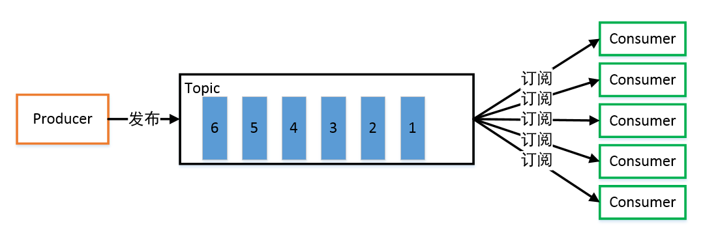
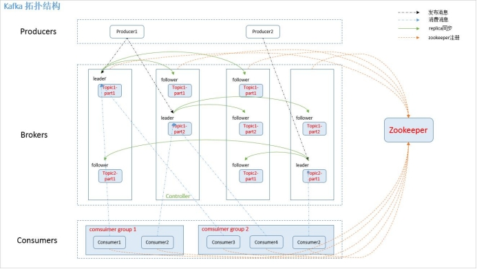
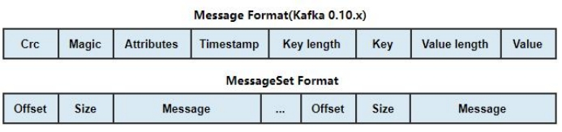
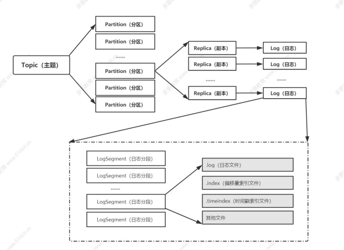
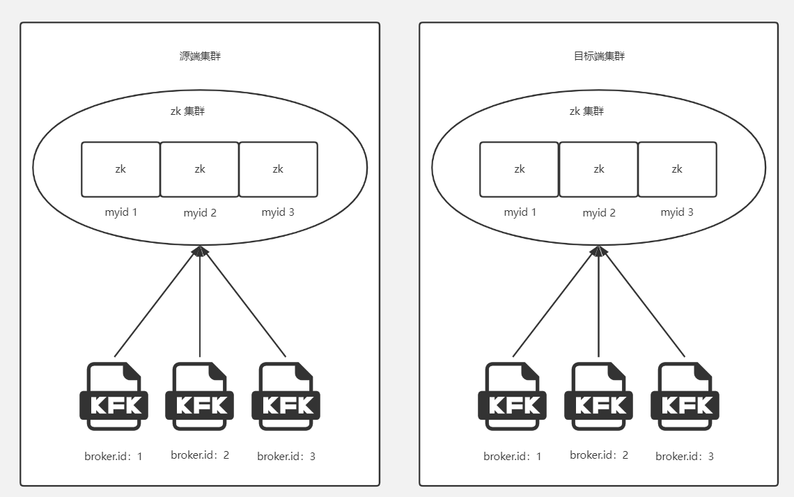

# 一、基本概念

## 1.1 什么是 kafka

Kafka 它最初由 LinkedIn 公司开发，之后成为 Apache 项目的一部分。Kafka 是一个分布式消息中间件, 支持分区的、多副本的、多订阅者的、基于 zookeeper 协调的分布式消息系统。通俗来说： kafka 就是一个存储系统，存储的数据形式为 “消息"；它的主要作用类似于蓄水池，起到一个缓冲作用；

### 1.1.1 消息队列介绍



常见的消息队列有 activemq ，rabbitmq， rocketmq；消息队列常用于 两个系统之间的 数据传递；分布式消息传递基于可靠的消息队列，在客户端应用和消息系统之间异步传递消息。有两种主要的 消息传递模式： 点对点传递模式、发布- 订阅模式。大部分的消息系统选用发布-订阅模式。kafka 是发布-订阅模式。

### 1.1.2 为什么使用消息队列

1)、**提高扩展性**：因为消息队列解耦了处理过程，有新增需求时只要另外增加处理过程即可。

2)、**提高峰值处理能力**：在访问量剧增的情况下，应用仍然需要继续发挥作用。使用消息队列能够使关键组件顶住突发的访问压力，而不会因为突发的超负荷请求而完全崩溃；

3）、**提高系统的可恢复性**：消息队列降低了进程间的耦合度，所以即使一个处理消息的进程挂掉，加入队列中的消息仍然可以在系统回复后被处理

## 1.2 kafka 的特点

1)、高吞吐量、低延迟：kafka 每秒可以处理几十万条消息，它的延迟最低只有几毫秒

2)、可扩展性：kafka 集群支持热扩展

3)、持久性、可靠性：消息被持久化到本地磁盘，并且 支持数据备份防止数据丢失

4)、容错性： 允许集群中节点失败（若副本数量为n,则允许n-1 个节点失败）

5)、高并发：支持数千个客户端同时读写

## 1.3 kafka 的使用场景

1)、主要用于数据处理系统中的缓冲！（尤其是实时流式数据处理）

2)、日志收集：可以用 kafka 可以收集各种服务的 log，通过 kafka 以统一接口服务的方式开放给各种 consumer，例如 hadoop、HBase、Solr 等。

3)、消息系统：解耦和生产者和消费者、缓存消息等。

4)、用户活动跟踪：kafka 经常被用来记录 web 用户或者 app 用户的各种活动

5)、来做实时的监控分析，或者装载到 hadoop、数据仓库中做离线分析和挖掘。

6)、运营指标：kafka经常用来记录运维监控数据。包括收集各种分布式应用的数据，各种操作的集中反馈，比如报警和报告。

7)、流式数据处理：比如 spark streaming 和 Flink

# 二、kafka 系统的架构

 

**Kafka 架构分为以下几个部分**

## 2.1 producer

消息生产者，就是向 kafkabroker 发消息的客户端。

## 2.2 consumer

consumer ：消息消费者，从 kafka broker 取消息的客户端。

consumer group：单个或多个 consumer 可以组成一个 consumer group；这是 kafka 用来实现消息的广播（发给所有的 consumer）和单播（发给任意一个 consumer）的手段。一个 topic 可以有多个 Consumer Group。

## 2.3 Topic

### 2.3.1 数据的逻辑分类

可以理解为数据库中“表"的概念；

### 2.3.2 Partition

1）、topic 中数据的具体管理单元； 

2）、一个 topic 可以划分为多个partition，分布到多个 broker 上管理；每个 partition 由一个kafka broker 服务器管理；

3）、partition 中的每条消息都会被分配一个递增的 id（offset）；

4）、每个 partition 是一个有序的队列，kafka 只保证按一个 partition 中的消息的顺序，不保证一个 topic的整体（多个 partition 间）的顺序。每个 partition 都可以有多个副本；

### 2.3.3 Broker

1）、一台 kafka 服务器就是一个 broker。

2）、一个 kafka 集群由多个 broker 组成。

3）、一个 broker 可以容纳多个 topic 的多个 partition。

4）、分区对于 kafka 集群的好处是：实现 topic 数据的负载均衡。分区对于消费者来说，可以提高并发度，提高效率。

### 2.3.4 offset

消息在底层存储中的索引位置，kafka 底层的存储文件就是以文件中第一条消息的 offset 来命名的，通过 offset 可以快速定位到消息的具体存储位置；

## 2.4 Leader

partition replica 中的一个角色，producer 和 consumer 只跟 leader 交互（ 负责读写）。

## 2.5 Replica

partition 的副本，保障 partition 的高可用（replica 副本数目不能大于 kafka broker 节点的数目，否则报错。每个 partition 的所有副本中，必包括一个 leader 副本，其他的就是 follower 副本。

## 2.6 Follower

partition replica 中的一个角色，从leader 中拉取复制数据（ 只负责备份）。

如果 leader 所在节点宕机，follower 中会选举出新的 leader；

## 2.7 Offset

每一条数据都有一个 offset，是数据在该 partition 中的唯一标识（其实就是消息的索引号）。各个 consumer 会保存其消费到的 offset位置，这样下次可以从该 offset 位置开始继续消费；consumer 的消费 offset 保存在一个专门的 topic（__consumer_offsets）中；

## 2.8 Message

在客户端编程代码中，消息的类叫做 ProducerRecord； ConsumerRecord；

简单来说，kafka 中的每个massage 由一对 key-value 构成

Kafka 中的 message格式经历了 3个版本的变化了：version0 、 version1 、 version2

各个字段的含义介绍如下：

 

1）、crc：占用 4 个字节，主要用于校验消息的内容；

2）、magic：这个占用 1 个字节，主要用于标识 Kafka 版本。Kafka 0.10.x magic 默认值为 1 

3）、attributes：占用 1 个字节，这里面存储了消息压缩使用的编码以及 Timestamp 类型。目前 Kafka 支持 gzip、snappy 以及 lz4（0.8.2 引入） 三种压缩格式；后四位如果是 0001 则表示 gzip 压缩，如果是 0010 则是snappy 压缩，如果是 0011 则是 lz4 压缩，如果是 0000 则表示没有使用压缩。第 4个 bit 位如果为 0，代表使用 create time；如果为 1 代表 append time；其余位（第 5~8 位）保留；

4）、key length：占用 4 个字节。主要标识 Key 的内容的长度；

5）、key：占用 N 个字节，存储的是 key 的具体内容；

6）、value length：占用 4 个字节。主要标识 value 的内容的长度；

7）、value：value 即是消息的真实内容，在 Kafka 中这个也叫做 payload。

# 三、kafka 的数据存储结构

## 3.1 kafka 的整体存储结构

 

## 3.2 服务器存储结构示例

1)、由于生产者生产的消息会不断追加到 log 文件末尾，为防止 log 文件过大导致数据定位效率低下，

2）、Kafka 采取了分片和索引机制，将每个 partition 分为多个 segment。每个 segment 对应两个文件：“.index"文件和“.log"文件。这些文件位于一个文件夹下，该文件夹的命名规则为：topic 名称-分区序号。index 和log 文件以当前 segment 的第一条消息的offset 命名。“.index"文件存储大量的索引信息，“.log"文件存储大量的数据，索引文件中的元数据指向对应数据文件中 message的物理偏移地址。

3）、Kafka 中的索引文件以稀疏索引（ sparse index ）的方式构造消息的索引，它并不保证每个消息在索引文件中都有对应的索引；每当写入一定量（由broker 端参数 log.index.interval.bytes 指定，默认值为 4096 ，即 4KB ）的消息时，偏移量索引文件和时间戳索引文件分别增加一个偏移量索引项和时间戳索引项，增大或减小 log.index.interval.bytes 的值，对应地可以增加或缩小索引项的密度；偏移量索引文件中的偏移量是单调递增的，查询指定偏移量时，使用二分查找法来快速定位偏移量的位置。

# 四、集群搭建

## 4.1 集群环境

| IP地址        | 角色                        |
| ------------- | --------------------------- |
| 10.11.113.181 | 源端：zk 集群、kafka 集群   |
| 10.11.113.182 | 源端：zk 集群、kafka 集群   |
| 10.11.113.183 | 源端：zk 集群、kafka 集群   |
| 10.11.113.184 | 目标端：zk 集群、kafka 集群 |
| 10.11.113.185 | 目标端：zk 集群、kafka 集群 |
| 10.11.113.186 | 目标端：zk 集群、kafka 集群 |



## 4.2 JDK 环境

```bash
tar -zxvf jdk-8u321-linux-x64.tar.gz -C /opt
echo "export PATH=$PATH:/opt/jdk1.8.0_321/bin" >> ~/.bashrc
source ~/.bashrc
```

```bash
# java -version
java version "1.8.0_321"
Java(TM) SE Runtime Environment (build 1.8.0_321-b07)
Java HotSpot(TM) 64-Bit Server VM (build 25.321-b07, mixed mode)
```

## 4.3 Zookeeper 集群

```bash
tar -zxvf apache-zookeeper-3.7.1-bin.tar.gz -C /opt
cd /opt/apache-zookeeper-3.7.1-bin/
```

```bash
mkdir dataLog data
```

注意 myid 内的数字不能重复，作为 zookeeper 的独立标志

```bash
# 身份标识，区别其他 zookeeper
echo 1 > data/myid
echo 2 > data/myid
echo 3 > data/myid
```

修改配置文件

```bash
cp conf/zoo_sample.cfg conf/zoo.cfg
```

修改内容

```bash
dataDir=/opt/apache-zookeeper-3.7.1-bin/data/
dataLogDir=/opt/apache-zookeeper-3.7.1-bin/dataLog/
server.1=10.11.113.181:2888:3888
server.2=10.11.113.182:2888:3888
server.3=10.11.113.183:2888:3888
```

添加环境变量

```bash
echo "export PATH=$PATH:/opt/apache-zookeeper-3.7.1-bin/bin" >> ~/.bashrc
source ~/.bashrc
```

启动 zookeeper

```bash
zkServer.sh start
```

查看状态

```bash
zkServer.sh status
```

## 4.4 Kafka 集群

```bash
tar -zxvf kafka_2.13-2.7.0.tgz -C /opt
cd /opt/kafka_2.13-2.7.0
```

编辑配置文件

```bash
vim config/server.properties
```

```bash
# kafka 身份标识，区别其他 kafka
broker.id=1
# 当前主机 IP
listeners=PLAINTEXT://10.11.113.181:9092
# 广播地址
advertised.listeners=PLAINTEXT://10.11.113.181:9092
# 日志数据文件
log.dirs=/opt/kafka_2.13-2.7.0/logs
# zookeeper 集群地址
zookeeper.connect=10.11.113.181:2181,10.11.113.182:2181,10.11.113.183:2181
```

```bash
echo "export PATH=$PATH:/opt/kafka_2.13-2.7.0/bin" >> ~/.bashrc
source ~/.bashrc
```

启动 kafka 集群

```bash
bin/kafka-server-start.sh -daemon config/server.properties
tailf logs/server.log
```

查看进程含有 `QuorumPeerMain、Kafka`

```bash
# jps
3378 Jps
2726 QuorumPeerMain
3278 Kafka
```

# 五、Kafka 集群测试

## 5.1 创建 topic

```bash
bin/kafka-topics.sh --zookeeper 10.11.113.181:2181 \
  --create \
  --topic my-test-topic \
  --replication-factor 2 \
  --partitions 1
```

```bash
# 参数解释
--topic: topic 名称
--replication-factor: 副本数量
--partitions: 分区数量
```

## 5.2 查看当 topic 列表

```bash
bin/kafka-topics.sh --zookeeper 10.11.113.181:2181 --list
```

## 5.3 查看 topic 详细信息

```bash
bin/kafka-topics.sh --zookeeper 10.11.113.181:2181 --describe --topic my-test-topic
```

## 5.4 消息生产者

运行一个消息生产者，指定 topic 为刚刚创建的 my-test-topic

```bash
$ bin/kafka-console-producer.sh --bootstrap-server 10.11.113.181:9092 --topic my-test-topic
>1
>2
>3
>4
>5
>6
>7
>8
>9
```

## 5.5 消息消费者

运行一个消息消费者，同样指定 topic 为 my-test-topic

```bash
--from-beginning: 从头开始接收消息
```

```bash
$ bin/kafka-console-consumer.sh --bootstrap-server 10.11.113.181:9092 --topic my-test-topic --from-beginning
1
2
3
4
5
6
7
8
9
```

## 5.6 删除 topic

```bash
bin/kafka-topics.sh --zookeeper 10.11.113.181:2181 --delete --topic my-test-topic
```

想要彻底删除 topic，需要一个参数处于启用状态： `delete.topic.enable = true`

