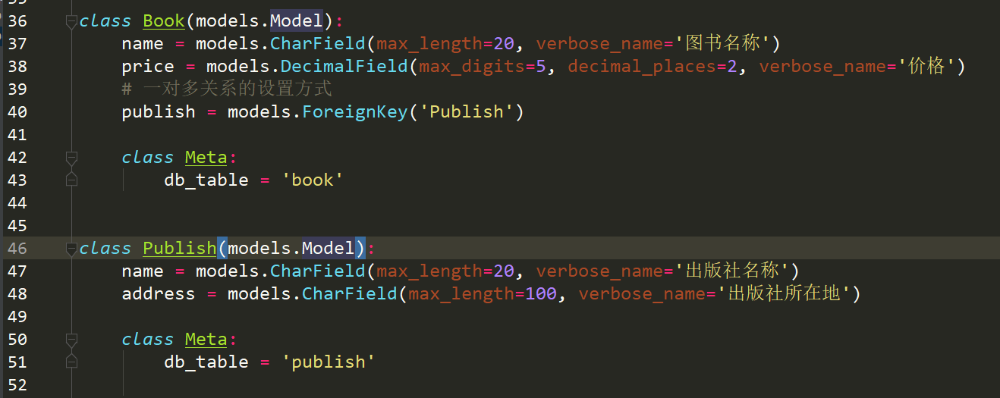
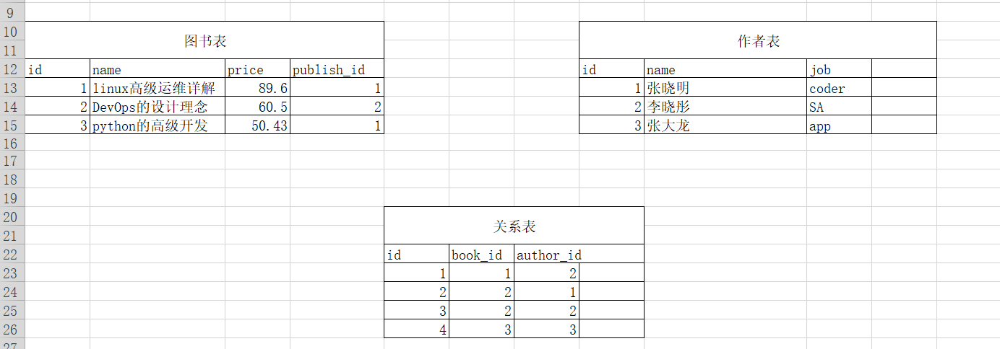
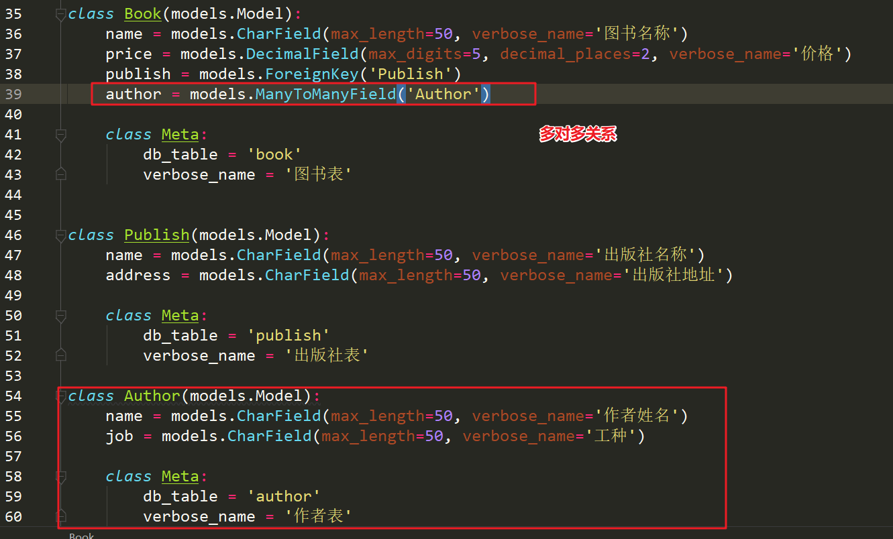

# Web框架之Django三

**学习目标和内容**

> 1、能够通过ORM模型创建数据表
>
> 2、能够通过ORM模型对数据进行操作
>
> 3、能够理解ORM模型对应关系

# 一、ORM概念

## 1、ORM介绍

​	==对象关系映射==  用于实现面向对象编程语言里不同类型系统数据之间的转换。

其就是==使用面向对象的方式==，==操作数据库进行表管理和增删改查操作==等。

## 2、ORM的作用和优点

Django中的对ORM进行封装，对接数据库引擎，执行对应的SQL语句。

使用者无需关心数据库引擎具体实现的软件（Mysql，sqlite......）。重点把握业务逻辑实现即可。之后如果数据库软件更换需要迁移，直接修改相关配置即可。

> 好处:
>
> ORM使操作数据库变的更为简单、快捷。无需直接编写SQL语句，快速开发。
>

# 二、ORM建表

## 1、映射关系

在Django框架中，通过ORM模型进行数据库的管理和操作。

通过Python代码，Django的ORM模型将代码转为SQL语句，操作数据库。

以下为对应关系：

> 类名  ====  表名
>
> 属性  ====  字段
>
> 类实例对象   ====  表记录
>

 

## 2、创建模型（表定义）

创建一个app03应用，模型代码的学习

**①进入命令行**

 

**②执行创建新应用**

 

创建一张表，只需在应用下的==model.py==中定义对应的类模型即可。==继承models.Model==。

> 常用的模型字段有哪些：
>
> ==CharField  -> 字符串类型==
>
> BooleanField -> 布尔类型
>
> IntegerField -> 整数类型
>
> DateField / DateTimeField -> 时间类型
>
> EmailField -> Email类型
>
> TextField -> 文本类型
>

更多类型参考：

<https://docs.djangoproject.com/en/1.11/ref/models/fields/#field-types>

[https://docs.djangoproject.com/en/1.11/ref/models/fields/#django.db.models.CharField](#django.db.models.CharField)

例：编写一个类模型

 

## 3、字段属性

字段属性，用来限定字段的最大长度，Null值，默认值，主键，唯一性，备注等信息。

> （1）max_length
>
> CharField需要max_length参数来指定VARCHAR数据库字段的大小。
>
> （2）null
>
> 如果为True，Django 将用NULL来在数据库中存储空值。 默认值是 False。
>
> （3）default
>
> 字段的默认值。可以是一个值或者可调用对象。如果可调用 ，每有新对象被创建它都会被调用。
>
> （4）primary_key
>
> 如果为True，那么这个字段就是模型的主键。如果你没有指定任何一个字段的primary_key=True，Django 就会自动添加一个IntegerField字段做为主键，所以除非你想覆盖默认的主键，否则没必要设置任何一个字段的primary_key=True。
>
> （5）unique
>
> 如果该值设置为 True, 这个数据字段的值在整张表中必须是唯一的。
>
> （6）verbose_name
>
> 备注的名字，可读更好。
>
> （7）choices
>
> 由元组组成的一个可迭代对象（例如，列表或元组），用来给字段提供选择项。 如果设置了choices ，默认的表单将是一个选择框而不是标准的文本框，而且这个选择框的选项就是choices 中的选项。
>

更多属性参考：<https://docs.djangoproject.com/en/1.11/ref/models/fields/#field-options>

根据提供的字段属性，设置合适的字段属性

 

## 4、模型元数据（可选）

模型元数据是“任何不是字段的数据”，比如排序选项（ordering），数据库表名（db_table）。在模型中添加class Meta是完全可选的，所有选项都不是必须的。

 

Meta选项参数：

> （1）db_table
>
> 指定自定义数据库表名的。Django有一套默认的按照一定规则生成数据模型对应的数据库表名，如果你想使用自定义的表名，就通过这个属性指定。
>
> 若不提供该参数, Django 会使用 app_label + '_' + module_name 作为表的名字。当你通过db_table覆写表名称时，强烈推荐使用小写字母给表命名
>
> （2）ordering
>
> 这个字段是告诉Django模型对象返回的记录结果集是按照哪个字段排序的
>
> ​		例如：
>
> class Meta:
>
> ​     ordering = ['- name']
>
> 它是一个字符串的列表或元组。每个字符串是一个字段名，前面带有可选的“-”前缀表示倒序。前面没有“-”的字段表示正序。
>
> （3）verbose_name
>
> 可读性更高的名字。可以认为是一个表名注释。
>
> 更多的元数据设置参考：<https://docs.djangoproject.com/en/1.11/ref/models/options/>

 

## 5、迁移数据库（同步）

**创建和迁移数据库表，一般执行两个步骤**

> ①makegrations 根据类模型 创建迁移文件
>
> ②migrate 通过迁移文件，进行数据表的创建和修改操作（连接数据库，管理表）
>

> Tip：
>
> 当模型初次创建和修改都需要执行
>

**①进入操作命令行**

 

**②执行makegrations命令，创建迁移文件**

 

Tip:如果遇到以下问题

 

需要在settings.py 配置

 

生成的migration迁移文件

 

**③执行migrate迁移命令**

 

以上操作就完成了Django中ORM模型。数据表的创建和修改已经完成。

> **问：Django连接数据库和数据表在哪里？表创建到哪儿了？**
>
> 答：默认Django使用的sqlite数据库，sqlite是一个小型数据库，一个文件。
>

 

 

## 6、更换数据库

在Django框架中，默认提供了sqllite数据库，进行开发和调试。

实际业务环境中，可以选择为业务数据库，比如说MySQL

###6.1、windows安装mysql

**①获取软件包**

 

**②解压并部署到一个目录**

 

**③配合环境变量**

 

 

 

添加MySQL的安装路径bin目录下

 

配置环境变量后的效果

 

**④安装并启动MySQL服务**

对于服务安装和卸载，都是需要使用cmd的管理员模式，否则没有权限

 

右键启动服务

 

删除匿名用户（防止远程登录的问题）

 

以上完成了windows下MySQL服务器的部署

###6.2、Django配置使用MySQL

**①修改settings.py配置**

```python
DATABASES = {
    'default': {
        'ENGINE': 'django.db.backends.mysql',
        'NAME': '',    #你的数据库名称 数据库需要自己提前建好
        'USER': '',   #你的数据库用户名
        'PASSWORD': '', #你的数据库密码
        'HOST': '', #你的数据库主机，留空默认为localhost
        'PORT': '3306', #你的数据库端口
        'OPTIONS': {
            "init_command": "SET sql_mode='STRICT_TRANS_TABLES'",
        }
    }
}
```

 

**②使用MySQL创建数据库**

MySQL的数据库需要提前创建，注意字符编码，统一为uf8

```mysql
CREATE DATABASE 库名 DEFAULT CHARACTER SET utf8 COLLATE utf8_general_ci;
```

 

**③重新执行数据库迁移操作**

 

```powershell
cmd > pip install pymysql
```

在初始化文件中，导入mysql包

 

再次执行迁移，查看数据库表

 

 

 简单查看数据表及其结构

 

 

> Tip:MySQL严格模式
>
> **出现问题**
>
>  
>
> mysql 数据校验的严格模式，相关MySQL的配置解决，可以自定查询解决。
>
> 这里提供的是在Django里配置的方式。
>
> **解决方案**
>
>  
>

# 三、ORM操作

<https://docs.djangoproject.com/en/1.11/topics/db/queries/>

## 1、添加数据

Django 使用一种直观的方式把数据库表中的数据表示成Python 对象：一个模型类代表数据库中的一个表，一个模型类的实例代表这个数据库表中的一条特定的记录。

使用关键字参数实例化模型实例来创建一个对象，然后调用==save()== 把它保存到数据库中。

也可以使用一条语句创建并保存一个对象，使用==create()==方法

**定义url路由**

 

**在视图中导入模型类**

 

**（1）save**

 

 

或者

 

**（2）create**

 

**（3）create可以传入关键字参数kwargs**

 

## 2、查询数据

**（1）all方法**

查询全部数据

 

Tip:模型类中定义返回的字段内容

 

**（2）get方法**

只取出一条数据，返回的是一个数据对象，如果查询的数据有多条或者没有都会抛出异常。

 

**（3）==filter方法==**

返回的是一个Queryset，即使只查出一条数据，也是一个Queryset。查询的数据没有也是一个空的Queryset。Queryset其实跟列表类似，列表的切片Queryset也可以使用。

 

**（4）exclude方法**

exclude  排除满足条件的，返回其他的

select * from hostlist where status != 1

 

**（5）values方法**

select * from hostlist

select hostname,ip from hostlist

values方法提供了，查询需要显示的字段筛选。

 

如果需要显示多个字段，可以使用以下写法

 

 

## 3、更新数据

**（1）操作对象的方式更新**

我们先找到我们需要更新的数据，然后直接调用属性更改，最后save保存就可以了。

 

**（2）使用update的方式修改数据（推荐）**

 

## 4、删除数据

**使用delete方法删除数据**

 

## 5、ORM内置查询字段

使用__关键查询字段  双下划线

> contains       “模糊”大小写敏感的包含指定字符串
>
> icontains      “模糊”大小写不敏感的包含指定字符串
>
> startswith, endswith    以指字字符串开头或结尾
>
> in            在给定的列表内
>
> gt            大于
>
> gte           大于或等于
>
> lt             小于
>
> lte            小于或等于
>
> range         在指定范围内
>

 

 

# 四、ORM关联关系

运动会

一对一    一个运动员对应一个号码

多对一（一对多）   一个代表队可以被多个运动员申报

多对多   多个运动员可以报多个项目

## 1、多对一

多对一 就是一个对多个的关系。

比如：==一本书只能对应一个出版社，而一个出版社可以出版多本书==，这样就是==多对一的关系==。

多对一的关系，主要是通过主键和外键进行关联的。

在Django的ORM模型中，使用ForeignKey定义一对多的关系。


**①创建模型一对多关系**



创建模型后，同步数据生成数据表


查看创建的数据表结构


**②多对一关系操作**

添加数据   注意需要先添加一的关系，才能够添加多的关系。也就是此例中，先添加出版社，才可以添加图书。顺序和关联的先后，需要处理清楚。

先添加出版社信息

 

 

再添加图书信息

 

 

查询数据

 

通过书名称查询属于哪个出版社出版的  正向查询

 

通过出版社名称 查询出所有的该出版社出版的书籍  反向查询  对象实例_set

 

删除数据  删除出版社

当出版社删除后，对应的外键关系   图书也就跟着删除了   这是默认Django 多对一模型实现的


实际操作中：

如果在mysql中，图书属于某个出版社，这个出版社是不能够删除的


##2、多对多

比如：==一本书可以多个作者合作编写，一个作者也可以编写多本书==，这样就是==多对多的关系==。

在Django的ORM模型中，使用ManyToManyField定义一对多的关系。





<https://docs.djangoproject.com/en/1.11/topics/db/examples/many_to_many/>

> 操作方法
>
> add(obj1, obj2, ...)        #添加一指定的模型对象到关联的对象集中。
> create(**kwargs)         #创建一个新的对象，将它保存并放在关联的对象集中。返回新创建的对象。
> remove(obj1, obj2, ...)    #从关联的对象集中删除指定的模型对象。
> clear()                  #从关联的对象集中删除所有的对象。