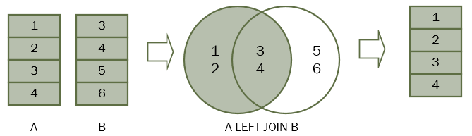

# Insert

INSERT INTO 语句用于向表格中插入新的行。

```sql
INSERT INTO table_name (col_name,...) VALUES (value1,...);
-- 向表中插入一行数据，自增字段、缺省值字段、可为空字段可以不写

INSERT INTO table_name SELECT ... ;
-- 将select查询的结果插入到表中

INSERT INTO table_name (col_name1,...) VALUES (value1,...) ON DUPLICATE KEY UPDATE col_name1=value1,...;
-- 如果主键冲突、唯一键冲突就执行update后的设置。这条语句的意思，就是主键不在新增记录，主键在就更新部分字段。

INSERT IGNORE INTO table_name (col_name,...) VALUES (value1,...);
-- 如果主键冲突、唯一键冲突就忽略错误，返回一个警告。
```

**例1：向 student 表中插入数据，指定字段**

```sql
-- 根据指定的字段名插入数据
INSERT INTO students (id, name, age) VALUES (1, "张三", 21)
```

**例2：向 student 表中插入数据**

```sql
-- 简写版，省略字段名，值会按照字段顺序填入
INSERT INTO students VALUES (2, "李四", 22)
```


# Delete 

DELETE 语句用于删除表中的行。

```sql
DELETE FROM table_name [WHERE where_definition]
-- 删除符合条件的记录
```

**例1：删除 student 表中的数据（全表删除，慎用）**

```sql
DELETE FROM students
```

**例2：删除 student 表中 id 为 2 的行**

```sql
DELETE FROM students WHERE id = 2
```


# Update 

UPDATE 语句用于修改表中的数据。

```sql
UPDATE [IGNORE] table_name SET col_name1=expr1 [,col_name2=expr2 ...] [WHERE where_definition]
-- IGNORE 意义同Insert语句
```

**例1：更新 student 表中 age 字段（全表更新，禁用）**

```sql
UPDATE students SET age = 30
```

**例2：更新 student 表中 id 为 2 的 age 字段**

```sql
UPDATE students SET age = 21 WHERE id = 2
```


# Select 

SELECT 语句用来查询表中数据，查询结果被存储在一个结果表中（称为结果集）。

```sql
SELECT
    [DISTINCT]
   	select_expr, ...
    [FROM table_references
    [WHERE where_definition]
    [GROUP BY {col_name | expr | position}
    [ASC | DESC], ... [WITH ROLLUP]]
    [HAVING where_definition]
    [ORDER BY {col_name | expr | position}
    [ASC | DESC] , ...]
    [LIMIT {[offset,] row_count | row_count OFFSET offset}]
    [FOR UPDATE | LOCK IN SHARE MODE]]
```

## 全表查询

```sql
SELECT col_name FROM table_name
```

**例1：查询 employees 表全部字段的值。**

```sql
SELECT * FROM employees
-- 星号（*）是选取所有字段的快捷方式。
```

**例2：只查询 emp_no、first_name、last_name 字段的值。**

```sql
SELECT emp_no,first_name,last_name FROM employees
```

## AS 别名

使用 AS 关键字，可以给表、字段取别名，在查询结果集中显示别名。

```sql
SELECT col_name [AS] alias_name FROM table_name [AS] alias_name
```

**例1：给 employees 表重命名为 emp。**

```sql
SELECT emp.emp_no,emp.first_name FROM employees AS emp
```

**例2：给 emp_no、first_name、last_name 字段命名。**

```sql
SELECT emp_no AS e_no,first_name AS f_name FROM employees 
```

## Where 子句

如需有条件地从表中选取数据，可将 WHERE 子句添加到 SELECT 语句。

```sql
SELECT col_name FROM table_name WHERE col_name expr values
```
where 可用的运算符

| 操作符  | 描述                                             |
| :------ | :----------------------------------------------- |
| =       | 等于                                             |
| <>      | 不等于                                           |
| >       | 大于                                             |
| <       | 小于                                             |
| >=      | 大于等于                                         |
| <=      | 小于等于                                         |
| AND     | 并且                                             |
| OR      | 或者                                             |
| IN      | 匹配规定的多个值                                 |
| BETWEEN | 在某个范围内                                     |
| LIKE    | 支持通配符匹配，%表示任意多个字符，_表示一个字符 |

**例1：查询 emp_no 大于等于 10010 的员工信息**

```sql
SELECT * FROM employees WHERE emp_no >= 10010 
```

**例2：查询名字是 Lillian，Mary，Parto 的员工信息**

```sql
-- 使用 OR
SELECT * FROM employees WHERE first_name = "Lillian" OR first_name = "Mary" OR  first_name = "Parto"
-- 使用 IN
SELECT * FROM employees WHERE first_name IN ("Lillian","Mary","Parto")
```

**例3：查询工资在 40000 到 50000 之间的员工工号**

```sql
SELECT emp_no,salary FROM salaries WHERE salary BETWEEN 40000 AND 50000
```

**例4：查询名字中包含 ar 的员工信息**

```sql
SELECT * FROM employees WHERE first_name LIKE "%ar%"
```

## Limit 子句

Limit 和 Offset 可以用于简单分页查询，且用于查询语句的最后。

```sql
SELECT col_name FROM table_name LIMIT row_count OFFSET offset
```

**例1：查询 employees 表前 5 条结果**

```sql
SELECT * FROM employees LIMIT 5
```

**例2：查询 employees 表漂移 5 行后的 5 条结果（每页展示 5 条，展示第 2 页）** 

```sql
SELECT * FROM employees LIMIT 5 OFFSET 5
-- 如果使用的是MySQL，则可以使用LIMIT OFFSET子句的较短形式。
SELECT * FROM employees LIMIT 5,5
```

## Order by  排序

对查询结果进行排序，可以升序ASC、降序DESC。 

**例1：按照薪资排序，取最高的工资**

```sql
SELECT * FROM salaries ORDER BY salary DESC LIMIT 1
```

**例2：先以名排序，如果名相同再以姓排序**

```sql
SELECT * FROM employees ORDER BY first_name,last_name
```

## Distinct 去重

指定字段，将返回结果集去重，如果使用两列或更多列，数据库系统将使用这些列的组合进行重复检查。

**例1：对员工部门表的部门号去重**

```sql
SELECT DISTINCT dept_no FROM dept_emp
```

**例2：将薪水与工号组合后，还重复的值去掉**

```sql
SELECT DISTINCT emp_no,salary FROM salaries
```

## 聚合函数

聚合函数通过计算一组值并返回单个值。因为聚合函数对一组值进行操作，所以它通常与 `SELECT`语句的`GROUP BY`子句一起使用。 `GROUP BY`子句将结果集划分为值分组，聚合函数为每个分组返回单个值。

| 函数                                       | 描述                                       |
| ------------------------------------------ | ------------------------------------------ |
| COUNT(expr)                                | 返回记录中记录的数目                       |
| SUM(expr)，AVG(expr)，MIN(expr)，MAX(expr) | 返回总和值、平均值、最小值、最大值         |
| GROUP BY                                   | 对某个字段进行分组，然后方便之后计算、统计 |
| HAVING                                     | 分组后的筛选条件，只能用HAVING             |

注意：使用 GROUP BY 分组时，如果 SELECT 语句中出现非分组字段，则最终该字段就要使用第一个值开始覆盖。

**例1：统计部门表中总共有多少个部门**

```sql
-- 先去重，再统计行数
SELECT COUNT(DISTINCT dept_no) FROM dept_emp
```

**例2：统计薪水的最大值、最小值、平均值、总和**

```sql
SELECT MAX(salary),MIN(salary),AVG(salary),SUM(salary) FROM salaries
```

**例3：求每个员工达到过的最高薪资是多少**

```sql
-- 按照 emp_no 不同分组，分别求出每组中最大的薪资
SELECT emp_no,MAX(salary) FROM salaries GROUP BY emp_no
```

**例4：查询工资大于70000的员工工号**

```sql
-- 使用 HAVING 对分组后的数据筛选
SELECT emp_no,MAX(salary) FROM salaries GROUP BY emp_no HAVING MAX(salary) > 70000
```

## 子查询

查询语句可以嵌套，内部查询就是子查询，可以把子查询的结果集当作一个新表用。

子查询必须在一组小括号中，子查询中不能使用`Order by`。

**例1：查询工号大于10015且小于10019的员工姓名、性别**

```sql
-- 子查询做临时表需要别名
SELECT emp.emp_no, emp.first_name, gender FROM ( SELECT * FROM employees WHERE emp_no > 10015 ) AS emp WHERE emp.emp_no < 10019 ORDER BY emp_no
```

**例2：查询工资最高的员工的信息**

```sql
SELECT * FROM salaries WHERE salary =  (SELECT MAX(salary) FROM salaries)
```

## 表连接

### 内连接


内连接 INNER JOIN，省略为 JOIN。 等值连接，只选某些 field 相等的元组（行），使用 ON 限定关联的结果。相当于求等值后的交集。

**例1：查询部门表和员工部门表、员工表的内连接结果集**

```sql
SELECT
	* 
FROM
	departments
	INNER JOIN dept_emp ON departments.dept_no = dept_emp.dept_no
	INNER JOIN employees ON employees.emp_no = dept_emp.emp_no
```

### 左外连接



左连接将返回左表中的所有行，而不管右表中是否存在匹配的行。

```sql
SELECT * from employees LEFT JOIN salaries ON employees.emp_no = salaries.emp_no
```

### 右外连接

右连接将返回右表中的所有行，而不管左表中是否存在匹配的行。

```sql
SELECT * from employees RIGHT JOIN salaries ON employees.emp_no = salaries.emp_no
```